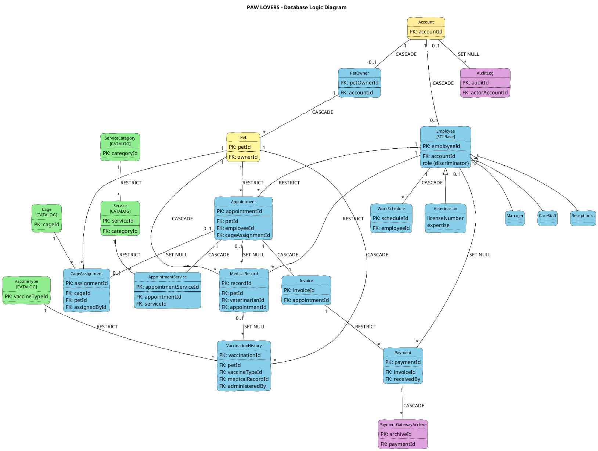

# Chapter 5: Data Design

## PAW LOVERS Pet Care Service Management System

**Version:** 4.0  
**Date:** 28/12/2024  
**Authors:** Group 9

---

## Document Change Record

| Date | Version | Description | Authors |
|------|---------|-------------|---------|
| 16/11/2025 | 1.0 | Initial database schema design | Group 9 |
| 17/11/2025 | 2.0 | OOAD improvements: removed denormalization | Winston |
| 17/11/2025 | 3.0 | Complete redesign following OOAD principles | Winston + Khổ Qua |
| 28/12/2024 | 4.0 | Restructured to match current TypeORM implementation | Auto-generated |

---

## Table of Contents

- [5.1 Logic Diagram](#51-logic-diagram)
- [5.2 Table Specifications](#52-table-specifications)
  - [5.2.1 Identity & Access Tables](#521-identity--access-tables)
  - [5.2.2 Business Tables](#522-business-tables)
  - [5.2.3 Supporting Tables](#523-supporting-tables)
- [5.3 Enum Definitions](#53-enum-definitions)

---

## 5.1 Logic Diagram

The database consists of **22 tables**:
- **Catalog/Parameter Tables** (Green): Reference data for software evolution
- **Operational Tables** (Blue): Daily business operation records

> Tables show only PK and FK columns. Full field details in Section 2.



---

### 5.1.1 Table Categories

| Category | Tables | Purpose |
|----------|--------|---------|
| **Catalog/Parameter** | service_categories, services, vaccine_types, cages | Reference data - add new items without code changes |
| **Identity** | accounts | User authentication |
| **Business** | pet_owners, employees, pets, appointments, appointment_services, work_schedules, medical_records, vaccination_history, cage_assignments, invoices, payments | Core business entities and records |
| **Audit** | audit_logs, payment_gateway_archives | Compliance & history |

---

### 5.1.2 FK Relationship Summary

| Parent Table | Child Table | Relationship | ON DELETE |
|--------------|-------------|--------------|-----------|
| accounts | pet_owners | 1:1 | CASCADE |
| accounts | employees | 1:1 | CASCADE |
| pet_owners | pets | 1:N | CASCADE |
| service_categories | services | 1:N | RESTRICT |
| pets | appointments | 1:N | RESTRICT |
| employees | appointments | 1:N | RESTRICT |
| appointments | appointment_services | 1:N | CASCADE |
| services | appointment_services | 1:N | RESTRICT |
| employees | work_schedules | 1:N | CASCADE |
| pets | medical_records | 1:N | CASCADE |
| employees | medical_records | 1:N | RESTRICT |
| appointments | medical_records | 1:N | SET NULL |
| pets | vaccination_history | 1:N | CASCADE |
| vaccine_types | vaccination_history | 1:N | RESTRICT |
| medical_records | vaccination_history | 1:N | SET NULL |
| employees | vaccination_history | 0..1:N | SET NULL |
| cages | cage_assignments | 1:N | - |
| pets | cage_assignments | 1:N | - |
| cage_assignments | appointments | 0..1:1 | SET NULL |
| appointments | invoices | 1:1 | CASCADE |
| invoices | payments | 1:N | RESTRICT |
| employees | payments | 0..1:N | SET NULL |
| accounts | audit_logs | 0..1:N | SET NULL |
| payments | payment_gateway_archives | 1:N | CASCADE |

---

## 5.2 Table Specifications

### 5.2.1 Identity & Access Tables

#### 5.2.1.1 accounts

| No | Attribute | Data Type | Constraint | Description |
|----|-----------|-----------|------------|-------------|
| 1 | accountId | SERIAL | PK | Auto-increment primary key |
| 2 | email | VARCHAR(100) | NOT NULL, UNIQUE | User email for login |
| 3 | passwordHash | VARCHAR(255) | NOT NULL | Bcrypt hashed password |
| 4 | userType | ENUM | NOT NULL | 'PET_OWNER', 'MANAGER', 'VETERINARIAN', 'CARE_STAFF', 'RECEPTIONIST' |
| 5 | isActive | BOOLEAN | DEFAULT TRUE | Soft delete flag |
| 6 | createdAt | TIMESTAMP | DEFAULT NOW() | Record creation time |
| 7 | updatedAt | TIMESTAMP | AUTO UPDATE | Last modification time |

---

#### 5.2.1.2 pet_owners

| No | Attribute | Data Type | Constraint | Description |
|----|-----------|-----------|------------|-------------|
| 1 | petOwnerId | SERIAL | PK | Auto-increment primary key |
| 2 | accountId | INTEGER | FK → accounts, UNIQUE, NOT NULL | 1:1 link to Account |
| 3 | fullName | VARCHAR(100) | NOT NULL | Owner's full name |
| 4 | phoneNumber | VARCHAR(20) | NOT NULL | Contact phone number |
| 5 | address | VARCHAR(255) | NULL | Mailing address |
| 6 | preferredContactMethod | VARCHAR(50) | DEFAULT 'Email' | Preferred contact method |
| 7 | emergencyContact | VARCHAR(255) | NULL | Emergency contact info |
| 8 | registrationDate | TIMESTAMP | DEFAULT NOW() | Registration timestamp |

---

#### 5.2.1.3 employees

Uses **Single Table Inheritance (STI)** with `role` discriminator column.

| No | Attribute | Data Type | Constraint | Description |
|----|-----------|-----------|------------|-------------|
| 1 | employeeId | SERIAL | PK | Auto-increment primary key |
| 2 | accountId | INTEGER | FK → accounts, UNIQUE, NOT NULL | 1:1 link to Account |
| 3 | role | VARCHAR | NOT NULL | STI discriminator: 'VETERINARIAN', 'CARE_STAFF', 'MANAGER', 'RECEPTIONIST' |
| 4 | fullName | VARCHAR(100) | NOT NULL | Employee's full name |
| 5 | phoneNumber | VARCHAR(20) | NOT NULL | Contact phone number |
| 6 | address | VARCHAR(255) | NULL | Mailing address |
| 7 | hireDate | DATE | NOT NULL | Employment start date |
| 8 | salary | DECIMAL(10,2) | NOT NULL | Monthly salary in VND |
| 9 | isAvailable | BOOLEAN | DEFAULT TRUE | Availability status |
| 10 | createdAt | TIMESTAMP | DEFAULT NOW() | Record creation time |
| 11 | licenseNumber | VARCHAR(100) | NULL | Veterinarian license (VETERINARIAN only) |
| 12 | expertise | TEXT | NULL | Areas of expertise (VETERINARIAN only) |
| 13 | skills | VARCHAR[] | NULL | Skill list (CARE_STAFF only) |

**Employee Subtypes (Single Table Inheritance):**

All employee types share the same `employees` table with the `role` discriminator column. Role-specific columns are nullable and only populated for the relevant role.

| Role | Discriminator | Role-Specific Columns | Description |
|------|---------------|----------------------|-------------|
| Veterinarian | 'VETERINARIAN' | licenseNumber (required), expertise | Licensed veterinary doctors |
| CareStaff | 'CARE_STAFF' | skills (array) | Grooming, bathing, spa staff |
| Manager | 'MANAGER' | (none) | Administrative staff |
| Receptionist | 'RECEPTIONIST' | (none) | Front desk staff |

---

### 5.2.2 Business Tables

#### 5.2.2.1 pets

| No | Attribute | Data Type | Constraint | Description |
|----|-----------|-----------|------------|-------------|
| 1 | petId | SERIAL | PK | Auto-increment primary key |
| 2 | ownerId | INTEGER | FK → pet_owners, NOT NULL | Owner of the pet |
| 3 | name | VARCHAR(100) | NOT NULL | Pet's name |
| 4 | species | VARCHAR(50) | NOT NULL | Species: Dog, Cat, Bird, etc. |
| 5 | breed | VARCHAR(100) | NULL | Breed information |
| 6 | birthDate | DATE | NULL | Pet's birth date |
| 7 | gender | VARCHAR(10) | NOT NULL, DEFAULT 'Unknown' | Male, Female, Unknown |
| 8 | weight | DECIMAL(5,2) | NULL | Weight in kg |
| 9 | color | VARCHAR(100) | NULL | Fur/feather color |
| 10 | initialHealthStatus | TEXT | NULL | Initial health notes |
| 11 | specialNotes | TEXT | NULL | Special care instructions |
| 12 | createdAt | TIMESTAMP | DEFAULT NOW() | Record creation time |
| 13 | updatedAt | TIMESTAMP | AUTO UPDATE | Last modification time |
| 14 | deletedAt | TIMESTAMP | NULL | Soft delete timestamp |

---

#### 5.2.2.2 service_categories

| No | Attribute | Data Type | Constraint | Description |
|----|-----------|-----------|------------|-------------|
| 1 | categoryId | SERIAL | PK | Auto-increment primary key |
| 2 | categoryName | VARCHAR(50) | NOT NULL, UNIQUE | Category name: Grooming, Medical, Boarding, etc. |
| 3 | description | TEXT | NULL | Category description |
| 4 | isActive | BOOLEAN | DEFAULT TRUE | Active status |
| 5 | createdAt | TIMESTAMP | DEFAULT NOW() | Record creation time |
| 6 | updatedAt | TIMESTAMP | AUTO UPDATE | Last modification time |

---

#### 5.2.2.3 services

| No | Attribute | Data Type | Constraint | Description |
|----|-----------|-----------|------------|-------------|
| 1 | serviceId | SERIAL | PK | Auto-increment primary key |
| 2 | serviceName | VARCHAR(100) | NOT NULL, UNIQUE | Service name |
| 3 | categoryId | INTEGER | FK → service_categories, NOT NULL | Category reference |
| 4 | description | TEXT | NULL | Service description |
| 5 | basePrice | DECIMAL(10,2) | NOT NULL | Base price in VND |
| 6 | estimatedDuration | INTEGER | NOT NULL | Duration in minutes |
| 7 | requiredStaffType | VARCHAR(50) | NOT NULL | 'Veterinarian', 'CareStaff', 'Any' |
| 8 | isAvailable | BOOLEAN | DEFAULT TRUE | Availability status |
| 9 | isBoardingService | BOOLEAN | DEFAULT FALSE | Requires cage assignment |
| 10 | createdAt | TIMESTAMP | DEFAULT NOW() | Record creation time |
| 11 | updatedAt | TIMESTAMP | AUTO UPDATE | Last modification time |

---

#### 5.2.2.4 vaccine_types

| No | Attribute | Data Type | Constraint | Description |
|----|-----------|-----------|------------|-------------|
| 1 | vaccineTypeId | SERIAL | PK | Auto-increment primary key |
| 2 | category | ENUM | NOT NULL | 'Core', 'Non-core', 'Optional' |
| 3 | vaccineName | VARCHAR(100) | NOT NULL, UNIQUE | Vaccine name (e.g., Rabies, DHPP) |
| 4 | targetSpecies | VARCHAR(50) | NOT NULL | Dog, Cat, Bird, etc. |
| 5 | manufacturer | VARCHAR(100) | NULL | Default manufacturer |
| 6 | description | TEXT | NULL | Vaccine information |
| 7 | recommendedAgeMonths | INTEGER | NULL | First administration age |
| 8 | boosterIntervalMonths | INTEGER | NULL | Revaccination interval |
| 9 | isActive | BOOLEAN | DEFAULT TRUE | Active status |
| 10 | createdAt | TIMESTAMP | DEFAULT NOW() | Record creation time |
| 11 | updatedAt | TIMESTAMP | AUTO UPDATE | Last modification time |

---

#### 5.2.2.5 cages

| No | Attribute | Data Type | Constraint | Description |
|----|-----------|-----------|------------|-------------|
| 1 | cageId | SERIAL | PK | Auto-increment primary key |
| 2 | cageNumber | VARCHAR(20) | NOT NULL, UNIQUE | Cage identifier |
| 3 | size | ENUM | NOT NULL | 'SMALL', 'MEDIUM', 'LARGE' |
| 4 | location | VARCHAR(50) | NULL | Physical location |
| 5 | status | ENUM | DEFAULT 'AVAILABLE' | 'AVAILABLE', 'OCCUPIED', 'MAINTENANCE', 'RESERVED', 'OUT_OF_SERVICE' |
| 6 | dailyRate | DECIMAL(10,2) | NOT NULL | Daily boarding rate |
| 7 | notes | TEXT | NULL | Cage notes |
| 8 | createdAt | TIMESTAMP | DEFAULT NOW() | Record creation time |
| 9 | updatedAt | TIMESTAMP | AUTO UPDATE | Last modification time |

---

#### 5.2.2.6 appointments

| No | Attribute | Data Type | Constraint | Description |
|----|-----------|-----------|------------|-------------|
| 1 | appointmentId | SERIAL | PK | Auto-increment primary key |
| 2 | petId | INTEGER | FK → pets, NOT NULL | Pet for appointment |
| 3 | employeeId | INTEGER | FK → employees, NOT NULL | Assigned staff |
| 4 | appointmentDate | DATE | NOT NULL | Appointment date |
| 5 | startTime | TIME | NOT NULL | Start time |
| 6 | endTime | TIME | NOT NULL | End time (must be > startTime) |
| 7 | status | ENUM | DEFAULT 'PENDING' | 'PENDING', 'CONFIRMED', 'IN_PROGRESS', 'COMPLETED', 'CANCELLED' |
| 8 | notes | TEXT | NULL | Appointment notes |
| 9 | cancellationReason | TEXT | NULL | Reason if cancelled |
| 10 | estimatedCost | DECIMAL(10,2) | NULL | Estimated total cost |
| 11 | actualCost | DECIMAL(10,2) | NULL | Actual cost after completion |
| 12 | createdAt | TIMESTAMP | DEFAULT NOW() | Record creation time |
| 13 | updatedAt | TIMESTAMP | AUTO UPDATE | Last modification time |
| 14 | cancelledAt | TIMESTAMP | NULL | Cancellation timestamp |
| 15 | cageAssignmentId | INTEGER | FK → cage_assignments, NULL | Boarding cage link |

**Unique Constraint:** `(employeeId, appointmentDate, startTime)` - prevents double booking

---

#### 5.2.2.7 appointment_services (Junction Table)

| No | Attribute | Data Type | Constraint | Description |
|----|-----------|-----------|------------|-------------|
| 1 | appointmentServiceId | SERIAL | PK | Auto-increment primary key |
| 2 | appointmentId | INTEGER | FK → appointments, NOT NULL | Appointment reference |
| 3 | serviceId | INTEGER | FK → services, NOT NULL | Service reference |
| 4 | quantity | INTEGER | DEFAULT 1 | Number of service units |
| 5 | unitPrice | DECIMAL(10,2) | NOT NULL | Historical price at booking |
| 6 | notes | TEXT | NULL | Service-specific notes |
| 7 | createdAt | TIMESTAMP | DEFAULT NOW() | Record creation time |

---

#### 5.2.2.8 work_schedules

| No | Attribute | Data Type | Constraint | Description |
|----|-----------|-----------|------------|-------------|
| 1 | scheduleId | SERIAL | PK | Auto-increment primary key |
| 2 | employeeId | INTEGER | FK → employees, NOT NULL | Employee reference |
| 3 | workDate | DATE | NOT NULL | Work date |
| 4 | startTime | TIME | NOT NULL | Shift start time |
| 5 | endTime | TIME | NOT NULL | Shift end time |
| 6 | breakStart | TIME | NULL | Break start time |
| 7 | breakEnd | TIME | NULL | Break end time |
| 8 | isAvailable | BOOLEAN | DEFAULT TRUE | Override availability |
| 9 | notes | TEXT | NULL | Schedule notes |
| 10 | createdAt | TIMESTAMP | DEFAULT NOW() | Record creation time |
| 11 | updatedAt | TIMESTAMP | AUTO UPDATE | Last modification time |

**Check Constraint:** `endTime > startTime`

---

#### 5.2.2.9 medical_records

| No | Attribute | Data Type | Constraint | Description |
|----|-----------|-----------|------------|-------------|
| 1 | recordId | SERIAL | PK | Auto-increment primary key |
| 2 | petId | INTEGER | FK → pets, NOT NULL | Pet reference |
| 3 | veterinarianId | INTEGER | FK → employees, NOT NULL | Veterinarian who examined |
| 4 | appointmentId | INTEGER | FK → appointments, NULL | Related appointment |
| 5 | examinationDate | TIMESTAMP | NOT NULL | Date and time of exam |
| 6 | diagnosis | TEXT | NOT NULL | Diagnosis details |
| 7 | treatment | TEXT | NOT NULL | Treatment prescribed |
| 8 | medicalSummary | JSONB | NULL | Extensible medical data |
| 9 | followUpDate | DATE | NULL | Scheduled follow-up |
| 10 | createdAt | TIMESTAMP | DEFAULT NOW() | Record creation time |
| 11 | updatedAt | TIMESTAMP | AUTO UPDATE | Last modification time |

---

#### 5.2.2.10 vaccination_history

| No | Attribute | Data Type | Constraint | Description |
|----|-----------|-----------|------------|-------------|
| 1 | vaccinationId | SERIAL | PK | Auto-increment primary key |
| 2 | petId | INTEGER | FK → pets, NOT NULL | Pet vaccinated |
| 3 | vaccineTypeId | INTEGER | FK → vaccine_types, NOT NULL | Vaccine reference |
| 4 | medicalRecordId | INTEGER | FK → medical_records, NULL | Optional record link |
| 5 | batchNumber | VARCHAR(100) | NULL | Vaccine batch for recalls |
| 6 | site | VARCHAR(50) | NULL | Injection site |
| 7 | administeredBy | INTEGER | FK → employees, NULL | Staff who administered |
| 8 | reactions | TEXT | NULL | Adverse reactions |
| 9 | administrationDate | DATE | NOT NULL | Date administered |
| 10 | nextDueDate | DATE | NULL | Next vaccination due |
| 11 | notes | TEXT | NULL | Additional notes |
| 12 | createdAt | TIMESTAMP | DEFAULT NOW() | Record creation time |

---

#### 5.2.2.11 cage_assignments

| No | Attribute | Data Type | Constraint | Description |
|----|-----------|-----------|------------|-------------|
| 1 | assignmentId | SERIAL | PK | Auto-increment primary key |
| 2 | cageId | INTEGER | FK → cages, NOT NULL | Cage reference |
| 3 | petId | INTEGER | FK → pets, NOT NULL | Pet assigned |
| 4 | checkInDate | DATE | NOT NULL | Check-in date |
| 5 | expectedCheckOutDate | DATE | NULL | Expected departure |
| 6 | actualCheckOutDate | DATE | NULL | Actual departure |
| 7 | dailyRate | DECIMAL(10,2) | NOT NULL | Historical daily rate |
| 8 | assignedById | INTEGER | FK → employees, NULL | Staff who assigned |
| 9 | status | ENUM | DEFAULT 'ACTIVE' | 'ACTIVE', 'COMPLETED', 'CANCELLED' |
| 10 | notes | TEXT | NULL | Assignment notes |
| 11 | createdAt | TIMESTAMP | DEFAULT NOW() | Record creation time |
| 12 | updatedAt | TIMESTAMP | AUTO UPDATE | Last modification time |

---

#### 5.2.2.12 invoices

| No | Attribute | Data Type | Constraint | Description |
|----|-----------|-----------|------------|-------------|
| 1 | invoiceId | SERIAL | PK | Auto-increment primary key |
| 2 | appointmentId | INTEGER | FK → appointments, UNIQUE, NOT NULL | 1:1 appointment link |
| 3 | invoiceNumber | VARCHAR(50) | NOT NULL, UNIQUE | Business invoice number (INV-YYYYMMDD-#####) |
| 4 | issueDate | DATE | NOT NULL | Invoice issue date |
| 5 | subtotal | DECIMAL(10,2) | NOT NULL | Amount before discount/tax |
| 6 | discount | DECIMAL(10,2) | DEFAULT 0 | Discount amount |
| 7 | tax | DECIMAL(10,2) | DEFAULT 0 | Tax amount (VAT 10%) |
| 8 | totalAmount | DECIMAL(10,2) | NOT NULL | Final amount |
| 9 | status | ENUM | DEFAULT 'PENDING' | 'PENDING', 'PROCESSING_ONLINE', 'PAID', 'FAILED' |
| 10 | notes | TEXT | NULL | Invoice notes |
| 11 | createdAt | TIMESTAMP | DEFAULT NOW() | Record creation time |
| 12 | updatedAt | TIMESTAMP | AUTO UPDATE | Last modification time |
| 13 | paidAt | TIMESTAMP | NULL | Payment timestamp |

---

#### 5.2.2.13 payments

| No | Attribute | Data Type | Constraint | Description |
|----|-----------|-----------|------------|-------------|
| 1 | paymentId | SERIAL | PK | Auto-increment primary key |
| 2 | invoiceId | INTEGER | FK → invoices, NOT NULL | Invoice reference |
| 3 | paymentMethod | ENUM | NOT NULL | 'CASH', 'BANK_TRANSFER', 'VNPAY', 'MOMO', 'ZALOPAY' |
| 4 | amount | DECIMAL(10,2) | NOT NULL | Payment amount |
| 5 | transactionId | VARCHAR(100) | UNIQUE, NULL | External transaction ID |
| 6 | idempotencyKey | VARCHAR(100) | UNIQUE, NULL | Retry idempotency key |
| 7 | paymentStatus | ENUM | DEFAULT 'PENDING' | 'PENDING', 'PROCESSING', 'SUCCESS', 'FAILED', 'REFUNDED' |
| 8 | paidAt | TIMESTAMP | NULL | Success timestamp |
| 9 | receivedBy | INTEGER | FK → employees, NULL | Staff for cash/transfer |
| 10 | gatewayResponse | JSONB | NULL | Gateway response data |
| 11 | refundAmount | DECIMAL(10,2) | DEFAULT 0 | Refund amount |
| 12 | refundDate | TIMESTAMP | NULL | Refund timestamp |
| 13 | refundReason | TEXT | NULL | Refund reason |
| 14 | notes | TEXT | NULL | Payment notes |
| 15 | createdAt | TIMESTAMP | DEFAULT NOW() | Record creation time |

---

### 5.2.3 Supporting Tables

#### 5.2.3.1 audit_logs

| No | Attribute | Data Type | Constraint | Description |
|----|-----------|-----------|------------|-------------|
| 1 | auditId | SERIAL | PK | Auto-increment primary key |
| 2 | tableName | VARCHAR(50) | NOT NULL | Table being audited |
| 3 | recordId | INTEGER | NOT NULL | Primary key of record |
| 4 | operation | ENUM | NOT NULL | 'INSERT', 'UPDATE', 'DELETE' |
| 5 | changes | JSONB | NULL | Before/after values |
| 6 | actorAccountId | INTEGER | FK → accounts, NULL | User who made change |
| 7 | actorType | ENUM | NULL | 'EMPLOYEE', 'PET_OWNER', 'SYSTEM', 'WEBHOOK' |
| 8 | ipAddress | VARCHAR(45) | NULL | Client IP address |
| 9 | changedAt | TIMESTAMP | DEFAULT NOW() | Timestamp of change |

---

#### 5.2.3.2 payment_gateway_archives

| No | Attribute | Data Type | Constraint | Description |
|----|-----------|-----------|------------|-------------|
| 1 | archiveId | SERIAL | PK | Auto-increment primary key |
| 2 | paymentId | INTEGER | FK → payments, NOT NULL | Payment reference |
| 3 | gatewayName | VARCHAR(50) | NOT NULL | Gateway name (VNPay, Momo, etc.) |
| 4 | gatewayResponse | JSONB | NOT NULL | Full gateway response |
| 5 | transactionTimestamp | TIMESTAMP | NOT NULL | Gateway transaction time |
| 6 | archivedAt | TIMESTAMP | DEFAULT NOW() | Archive creation time |

---

## 5.3 Enum Definitions

### UserType
```
PET_OWNER, MANAGER, VETERINARIAN, CARE_STAFF, RECEPTIONIST
```

### AppointmentStatus
```
PENDING, CONFIRMED, IN_PROGRESS, COMPLETED, CANCELLED
```

### PaymentMethod
```
CASH, BANK_TRANSFER, VNPAY, MOMO, ZALOPAY
```

### PaymentStatus
```
PENDING, PROCESSING, SUCCESS, FAILED, REFUNDED
```

### InvoiceStatus
```
PENDING, PROCESSING_ONLINE, PAID, FAILED
```

### VaccineCategory
```
Core, Non-core, Optional
```

### CageSize
```
SMALL, MEDIUM, LARGE
```

### CageStatus
```
AVAILABLE, OCCUPIED, MAINTENANCE, RESERVED, OUT_OF_SERVICE
```

### CageAssignmentStatus
```
ACTIVE, COMPLETED, CANCELLED
```

### AuditOperation
```
INSERT, UPDATE, DELETE
```

### ActorType
```
EMPLOYEE, PET_OWNER, SYSTEM, WEBHOOK
```
