# Chapter 3: System Analysis

## Pet Care Service Management System

**Version:** 2.0  
**Date:** 28/12/2025  
**Authors:** Group 9

---

## Document Change Record

| Date | Version | Description | Authors |
| ----- | ----- | ----- | ----- |
| 14/10/2025 | 1.0 | Initial analysis document | Group 9 |
| 28/12/2025 | 2.0 | Complete BCE classes, state diagrams, dynamic models | Group 9 |

---

## Table of Contents

- [3.1 Class Diagram](#31-class-diagram)
  - [3.1.1 List of Entity Classes](#311-list-of-entity-classes)
  - [3.1.2 Conceptual Model](#312-conceptual-model)
  - [3.1.3 Class Diagram (Analysis Level)](#313-class-diagram-analysis-level)
  - [3.1.4 List of Classes and Relationships](#314-list-of-classes-and-relationships)
  - [3.1.5 Class Details](#315-class-details)
- [3.2 State Diagram](#32-state-diagram)
  - [3.2.1 Appointment Class](#321-appointment-class)
  - [3.2.2 Invoice Class](#322-invoice-class)
  - [3.2.3 Account Class](#323-account-class)
- [3.3 Dynamic Model](#33-dynamic-model)

---

## 3.1 Class Diagram

### 3.1.1 List of Entity Classes

The system contains **22 entity classes** organized into the following categories:

### Core Business Entities

* **Account:** Manages login credentials and roles for all system users.  
* **PetOwner:** Represents a customer of the pet care center.  
* **Pet:** Represents an animal owned by a PetOwner.  
* **Appointment:** Represents a scheduled booking for services.  
* **AppointmentService:** Junction entity linking appointments to multiple services.  
* **Service:** Represents a service offered by the center (e.g., grooming, examination).  
* **ServiceCategory:** Groups related services into categories.  

### Employee Hierarchy

* **Employee:** Abstract base class for all staff members.  
  * **Manager:** A type of employee with administrative privileges.  
  * **Veterinarian:** A staff member responsible for medical services.  
  * **CareStaff:** A staff member for non-medical care services.  
  * **Receptionist:** A staff member for front-desk and reception tasks.  
* **WorkSchedule:** Represents work shifts and availability of staff.  

### Medical & Care Entities

* **MedicalRecord:** A note or entry in a pet's medical history.  
* **VaccinationHistory:** Tracks vaccination records for pets.  
* **VaccineType:** Defines types of vaccines available.  
* **Cage:** Represents a physical cage for pet boarding/care.  
* **CageAssignment:** Tracks assignment of pets to cages over time.  

### Financial Entities

* **Invoice:** Represents a bill for services rendered.  
* **Payment:** Represents a payment transaction against an invoice.  
* **PaymentGatewayArchive:** Archives responses from payment gateways (e.g., VNPay).  

### System Entities

* **AuditLog:** Tracks system changes for auditing purposes.

### 3.1.2 Conceptual Model

The conceptual model illustrates the 22 entity classes and their relationships:

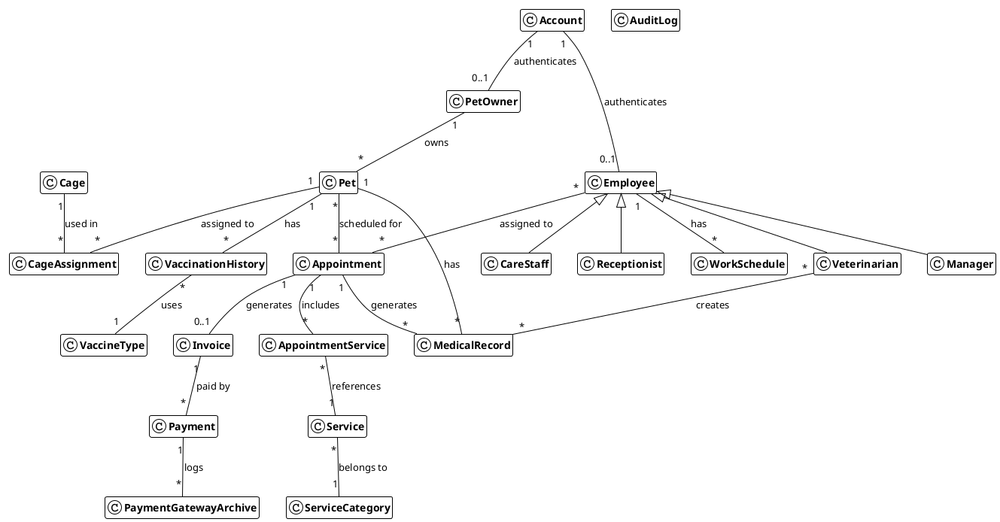

**Legend:**
- `1 -- *` : One-to-Many relationship
- `* -- *` : Many-to-Many relationship  
- `<|--` : Inheritance (extends)
- `0..1` : Zero or one (optional)

### 3.1.3 Class Diagram (Analysis Level)

#### 3.1.3.1 Analysis Model (Pure OOAD)

This diagram represents the **conceptual domain model** following Object-Oriented Analysis principles. Objects have rich behavior with business logic encapsulated inside domain classes. This is the "ideal" OOP model before implementation trade-offs.

> **Note:** The actual implementation uses an anemic domain model (ADR-001: Domain/Persistence Separation) where business logic is delegated to service/controller layers. See section 1.3.2 for the implementation model.

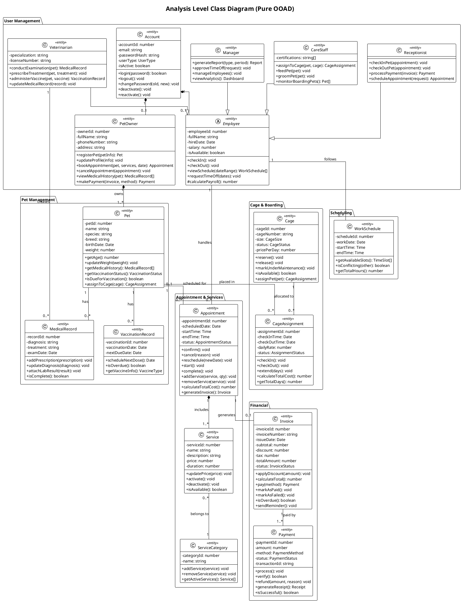

**Key OOAD Principles Applied:**
- **Encapsulation**: Business logic resides inside domain objects
- **Tell, Don't Ask**: Objects perform actions (`pet.assignToCage()`) vs. being queried then manipulated
- **Rich Domain Model**: Objects have behavior, not just data
- **Single Responsibility**: Each class has focused responsibilities

---

#### 3.1.3.2 Implementation Model (Anemic Domain)

> **Architectural Decision (ADR-001):** The implementation uses Domain/Persistence Separation pattern where entities are pure data holders and business logic is delegated to Service/Controller layers. This is a trade-off for TypeORM compatibility and testability.

```plantuml
@startuml Analysis Level Class Diagram
!theme plain
skinparam classAttributeIconSize 0
skinparam linetype ortho

' ========== Legend ==========
legend right
  |= Symbol |= Meaning |
  | + | public |
  | - | private |
  | # | protected |
  | ◆─ | composition |
  | ◇─ | aggregation |
  | ─▷ | inheritance |
  | ─── | association |
endlegend

' ========== BCE Stereotypes ==========
package "«entity» Domain Classes" {
  
  ' ===== Core User Management =====
  class Account <<entity>> {
    +accountId: number
    +email: string
    -passwordHash: string
    +userType: UserType
    +isActive: boolean
    +createdAt: Date
  }
  
  class PetOwner <<entity>> {
    +petOwnerId: number
    +fullName: string
    +phoneNumber: string
    +address: string
    +preferredContactMethod: string
    +registrationDate: Date
  }
  
  abstract class Employee <<entity>> {
    +employeeId: number
    +fullName: string
    +phoneNumber: string
    +hireDate: Date
    +salary: number
    +isAvailable: boolean
  }
  
  class Veterinarian <<entity>> {
    +specialization: string
    +licenseNumber: string
  }
  
  class CareStaff <<entity>> {
    +certifications: string
  }
  
  class Manager <<entity>> {
  }
  
  class Receptionist <<entity>> {
  }
  
  ' ===== Pet Management =====
  class Pet <<entity>> {
    +petId: number
    +name: string
    +species: string
    +breed: string
    +birthDate: Date
    +gender: string
    +weight: number
  }
  
  ' ===== Appointment & Services =====
  class Appointment <<entity>> {
    +appointmentId: number
    +appointmentDate: Date
    +startTime: string
    +endTime: string
    +status: AppointmentStatus
    +notes: string
    +estimatedCost: number
    +actualCost: number
  }
  
  class AppointmentService <<entity>> {
    +appointmentServiceId: number
    +quantity: number
    +unitPrice: number
    +subtotal: number
  }
  
  class Service <<entity>> {
    +serviceId: number
    +serviceName: string
    +description: string
    +price: number
    +duration: number
    +isActive: boolean
  }
  
  class ServiceCategory <<entity>> {
    +categoryId: number
    +categoryName: string
    +description: string
  }
  
  ' ===== Medical Records =====
  class MedicalRecord <<entity>> {
    +recordId: number
    +diagnosis: string
    +treatment: string
    +prescription: string
    +examDate: Date
  }
  
  class VaccinationHistory <<entity>> {
    +vaccinationId: number
    +vaccinationDate: Date
    +nextDueDate: Date
    +batchNumber: string
  }
  
  class VaccineType <<entity>> {
    +vaccineTypeId: number
    +vaccineName: string
    +manufacturer: string
    +dosageInfo: string
  }
  
  ' ===== Cage Management =====
  class Cage <<entity>> {
    +cageId: number
    +cageNumber: string
    +size: CageSize
    +status: CageStatus
    +pricePerDay: number
  }
  
  class CageAssignment <<entity>> {
    +assignmentId: number
    +checkInTime: Date
    +checkOutTime: Date
    +dailyRate: number
    +status: AssignmentStatus
  }
  
  ' ===== Financial =====
  class Invoice <<entity>> {
    +invoiceId: number
    +invoiceNumber: string
    +issueDate: Date
    +subtotal: number
    +discount: number
    +tax: number
    +totalAmount: number
    +status: InvoiceStatus
    +paidAt: Date
    --
    +payByCash(): void
    +startOnlinePayment(): void
    +markPaid(): void
    +markFailed(): void
  }
  
  class Payment <<entity>> {
    +paymentId: number
    +amount: number
    +paymentMethod: PaymentMethod
    +status: PaymentStatus
    +transactionId: string
    +paidAt: Date
    --
    +processCash(): void
    +startOnlinePayment(): void
    +markSuccess(): void
    +refund(): void
  }
  
  class PaymentGatewayArchive <<entity>> {
    +archiveId: number
    +transactionId: string
    +gatewayName: string
    +rawRequest: string
    +rawResponse: string
    +createdAt: Date
  }
  
  ' ===== Scheduling =====
  class WorkSchedule <<entity>> {
    +scheduleId: number
    +workDate: Date
    +startTime: string
    +endTime: string
    +shiftType: string
  }
  
  ' ===== System =====
  class AuditLog <<entity>> {
    +logId: number
    +action: string
    +tableName: string
    +recordId: number
    +oldValue: string
    +newValue: string
    +timestamp: Date
  }
}

' ===== Inheritance Relationships =====
Veterinarian --|> Employee
CareStaff --|> Employee
Manager --|> Employee
Receptionist --|> Employee

' ===== Composition Relationships (lifecycle dependent) =====
Account "1" *-- "0..1" PetOwner : has >
Account "1" *-- "0..1" Employee : has >
PetOwner "1" *-- "0..*" Pet : owns >
Appointment "1" *-- "0..*" AppointmentService : contains >
ServiceCategory "1" *-- "0..*" Service : groups >

' ===== Association Relationships =====
Pet "1" -- "0..*" Appointment : attends >
Employee "1" -- "0..*" Appointment : handles >
Appointment "1" -- "0..1" Invoice : generates >
Invoice "1" -- "0..*" Payment : receives >
Payment "0..*" -- "0..1" Employee : received by >
Payment "1" -- "0..*" PaymentGatewayArchive : logs >

' ===== Medical Associations =====
Pet "1" -- "0..*" MedicalRecord : has >
Pet "1" -- "0..*" VaccinationHistory : has >
Appointment "1" -- "0..*" MedicalRecord : produces >
VaccinationHistory "0..*" -- "1" VaccineType : uses >
Employee "1" -- "0..*" MedicalRecord : creates >

' ===== Junction Table =====
AppointmentService "0..*" -- "1" Service : references >

' ===== Cage Associations =====
Cage "1" -- "0..*" CageAssignment : allocated to >
Pet "1" -- "0..*" CageAssignment : placed in >
Appointment "0..*" -- "0..1" CageAssignment : linked to >

' ===== Schedule & Audit =====
Employee "1" -- "0..*" WorkSchedule : follows >
Account "1" -- "0..*" AuditLog : performs >

@enduml
```

**Notation Guide:**
- **Visibility:** `+` (public), `-` (private), `#` (protected)
- **Relationships:** 
  - `◆` Composition (lifecycle-dependent, e.g., Account owns PetOwner)
  - `─` Association (uses relationship)
  - `▷` Inheritance (Employee hierarchy)
- **Multiplicities:** `1`, `0..1`, `0..*`, `1..*`

### 3.1.4 List of Classes and Relationships

#### 3.1.4.1 BCE Classification

> **Note:** In BCE pattern, "Boundary" represents external interfaces (UI and API endpoints), "Control" represents business logic orchestration (Services), and "Entity" represents domain objects.

| No | Class | Type | Note |
| :---- | :---- | :---- | :---- |
| **Entity Classes** ||||
| 1 | Account, PetOwner, Pet, Employee (Manager, Veterinarian, CareStaff, Receptionist), WorkSchedule, Service, ServiceCategory, Appointment, AppointmentService, MedicalRecord, VaccinationHistory, VaccineType, Invoice, Payment, PaymentGatewayArchive, Cage, CageAssignment, AuditLog | **Entity** | 22 entity classes representing domain objects with data and behavior. |
| **Boundary Classes** ||||
| 2 | LoginForm, RegistrationForm, BookingForm, ScheduleView, ReportUI, PaymentForm, SearchForm, CageManagementForm, PetManagementForm, ServiceManagementForm | **Boundary (UI)** | Frontend UI components through which users interact with the system. |
| 3 | VNPayGatewayInterface | **Boundary (External)** | External payment gateway integration interface. |
| 4 | AccountController, AppointmentController, CageController, EmployeeController, InvoiceController, MedicalRecordController, PaymentController, PetOwnerController, PetController, ReportController, ScheduleController, ServiceCategoryController, ServiceController | **Boundary (API)** | REST API endpoints that receive HTTP requests and delegate to Control (Service) classes. They handle routing, request validation, and response formatting. |
| **Control Classes** ||||
| 5 | AccountService | **Control** | Orchestrates account-related business logic: authentication, registration, password management. |
| 6 | AppointmentService | **Control** | Manages appointment workflow: booking, confirmation, cancellation, status transitions, invoice generation. |
| 7 | AuthService | **Control** | Handles JWT token management, password hashing, and authentication flow. |
| 8 | AuditLogService | **Control** | Manages system audit logging for tracking user actions. |
| 9 | CageService | **Control** | Handles cage availability, reservations, and pet boarding assignments. |
| 10 | EmployeeService | **Control** | Manages employee records, role assignments, and availability. |
| 11 | InvoiceService | **Control** | Orchestrates invoice lifecycle: creation, status tracking, payment linkage. |
| 12 | MedicalRecordService | **Control** | Handles medical record creation, vaccination history, and veterinarian assignments. |
| 13 | PaymentService | **Control** | Manages payment processing: cash/bank/VNPay, gateway integration, refunds. |
| 14 | PetOwnerService | **Control** | Orchestrates pet owner registration, profile updates, and pet-owner relationships. |
| 15 | PetService | **Control** | Manages pet records: profiles, health status, vaccination tracking. |
| 16 | ReportService | **Control** | Generates business reports: revenue, service utilization, appointment statistics. |
| 17 | ScheduleService | **Control** | Manages work schedules: creation, conflict detection, availability checking. |
| 18 | ServiceCategoryService | **Control** | Handles service category management and service grouping. |
| 19 | ServiceService | **Control** | Manages service catalog: pricing, availability, category assignments. |
| 20 | VNPayService | **Control** | Handles VNPay payment gateway integration, URL generation, callback verification. |

---

#### 3.1.4.2 Entity Relationships

This table details all relationships between entity classes, showing the relationship type, multiplicity, and navigation direction.

| No | Source Entity | Relationship | Target Entity | Multiplicity | Description |
| :---: | :--- | :---: | :--- | :---: | :--- |
| **User Management** |||||
| 1 | Account | ← 1:1 → | PetOwner | 1 : 0..1 | An Account may have one PetOwner profile (for customers) |
| 2 | Account | ← 1:1 → | Employee | 1 : 0..1 | An Account may have one Employee profile (for staff) |
| 3 | Employee | ◁─ | Veterinarian | 1 : 1 | Veterinarian inherits from Employee |
| 4 | Employee | ◁─ | CareStaff | 1 : 1 | CareStaff inherits from Employee |
| 5 | Employee | ◁─ | Manager | 1 : 1 | Manager inherits from Employee |
| 6 | Employee | ◁─ | Receptionist | 1 : 1 | Receptionist inherits from Employee |
| **Pet Management** |||||
| 7 | PetOwner | → 1:N | Pet | 1 : 1..* | A PetOwner must have at least one Pet |
| 8 | Pet | → 1:N | MedicalRecord | 1 : 0..* | A Pet can have many MedicalRecords |
| 9 | Pet | → 1:N | VaccinationHistory | 1 : 0..* | A Pet can have many vaccination records |
| 10 | Pet | → 1:N | Appointment | 1 : 0..* | A Pet can have many Appointments |
| 11 | Pet | → 1:N | CageAssignment | 1 : 0..* | A Pet can have many cage assignments (boarding history) |
| **Appointment & Services** |||||
| 12 | Appointment | ← N:1 | Pet | 0..* : 1 | Each Appointment is for one Pet |
| 13 | Appointment | ← N:1 | Employee | 0..* : 1 | Each Appointment is handled by one Employee |
| 14 | Appointment | → 1:N | AppointmentService | 1 : 1..* | An Appointment has at least one selected Service |
| 15 | AppointmentService | ← N:1 | Service | 0..* : 1 | Each AppointmentService references one Service |
| 16 | Appointment | → 1:1 | Invoice | 1 : 0..1 | An Appointment generates one Invoice upon completion |
| 17 | Appointment | → 1:N | MedicalRecord | 1 : 0..* | An Appointment can produce many MedicalRecords |
| 18 | Appointment | ← N:1 | CageAssignment | 0..* : 0..1 | An Appointment may be linked to one CageAssignment |
| 19 | Service | ← N:1 | ServiceCategory | 0..* : 1 | Each Service belongs to one Category |
| **Medical Records** |||||
| 20 | MedicalRecord | ← N:1 | Pet | 0..* : 1 | Each MedicalRecord belongs to one Pet |
| 21 | MedicalRecord | ← N:1 | Appointment | 0..* : 1 | Each MedicalRecord is created during one Appointment |
| 22 | MedicalRecord | ← N:1 | Employee | 0..* : 1 | Each MedicalRecord is created by one Veterinarian |
| 23 | VaccinationHistory | ← N:1 | Pet | 0..* : 1 | Each vaccination record belongs to one Pet |
| 24 | VaccinationHistory | ← N:1 | VaccineType | 0..* : 1 | Each vaccination uses one VaccineType |
| **Cage & Boarding** |||||
| 25 | Cage | → 1:N | CageAssignment | 1 : 0..* | A Cage can have many assignments over time |
| 26 | CageAssignment | ← N:1 | Cage | 0..* : 1 | Each CageAssignment is for one Cage |
| 27 | CageAssignment | ← N:1 | Pet | 0..* : 1 | Each CageAssignment is for one Pet |
| **Financial** |||||
| 28 | Invoice | ← 1:1 | Appointment | 0..1 : 1 | Each Invoice is generated from one Appointment |
| 29 | Invoice | → 1:N | Payment | 1 : 0..* | An Invoice can have multiple payment attempts |
| 30 | Payment | ← N:1 | Invoice | 0..* : 1 | Each Payment is for one Invoice |
| 31 | Payment | ← N:1 | Employee | 0..* : 0..1 | Each Payment may be received by one Employee (cash) |
| 32 | Payment | → 1:N | PaymentGatewayArchive | 1 : 0..* | A Payment can have many gateway transaction logs |
| **Scheduling** |||||
| 33 | Employee | → 1:N | WorkSchedule | 1 : 0..* | An Employee can have many WorkSchedules |
| 34 | WorkSchedule | ← N:1 | Employee | 0..* : 1 | Each WorkSchedule belongs to one Employee |
| **System** |||||
| 35 | Account | → 1:N | AuditLog | 1 : 0..* | An Account performs many audited actions |

**Relationship Notation:**
- `← 1:1 →` = One-to-One (bidirectional)
- `→ 1:N` = One-to-Many (navigation direction)
- `← N:1` = Many-to-One (navigation direction)
- `◁─` = Inheritance (child extends parent)

### 3.1.5 Class Details

This section provides a detailed breakdown of each class identified in the architecture, specifying their attributes and primary responsibilities.

> **Note (OOSDM Model):** This section presents classes following **Object-Oriented Software Development Method (OOSDM)** principles, where domain objects encapsulate both data and behavior. This represents the **conceptual domain model** with rich business logic inside entities.
>
> For the **actual implementation** which uses an **Anemic Domain Model** (entities as data holders with logic in services/controllers), refer to [architecture_design.md](./architecture_design.md) and ADR-001 (Domain/Persistence Separation).

#### 3.1.5.1 Entity Classes

##### ***3.1.5.1.1. Class: Account***

Manages login credentials and user type for all system users. Uses composition pattern with PetOwner and Employee entities.

* **Inheritance:** None.  
* **Attributes:**

| No. | Attribute Name | Visibility / Type | Constraints | Description/Note |
| :---- | :---- | :---- | :---- | :---- |
| 1 | accountId | private number | Not Null, Unique | The unique identifier for the account. |
| 2 | email | private string | Not Null, Unique | The email used for login; max 100 chars. |
| 3 | passwordHash | private string | Not Null | The user's encrypted password (max 255 chars). |
| 4 | userType | private UserType | Not Null | Enum: PET_OWNER, MANAGER, VETERINARIAN, CARE_STAFF, RECEPTIONIST. |
| 5 | isActive | private boolean | Default true | Whether the account is active. |
| 6 | createdAt | private Date | Auto-generated | Account creation timestamp. |
| 7 | updatedAt | private Date | Auto-generated | Last update timestamp. |
| 8 | petOwner | private PetOwner | Nullable | Associated PetOwner profile (if userType is PET_OWNER). |
| 9 | employee | private Employee | Nullable | Associated Employee profile (if userType is staff). |

* **Responsibilities (Methods):**  
  * +login(email, password): boolean - Authenticates user credentials.
  * +logout(): void - Ends the current session.
  * +changePassword(oldPassword, newPassword): void - Updates password after validation.
  * +deactivate(): void - Sets isActive to false, preventing login.
  * +reactivate(): void - Restores account access.
  * +validateCredentials(password): boolean - Verifies password against hash.

##### ***3.1.5.1.2. Class: PetOwner***

Represents a customer of the pet care center. Links to Account via foreign key.

* **Inheritance:** None.  
* **Attributes:**

| No. | Attribute Name | Visibility / Type | Constraints | Description/Note |
| :---- | :---- | :---- | :---- | :---- |
| 1 | petOwnerId | private number | Not Null, Unique | The unique identifier for the pet owner. |
| 2 | accountId | private number | Not Null, Unique, FK | Foreign key to Account. |
| 3 | fullName | private string | Not Null | The full name of the pet owner (max 100 chars). |
| 4 | phoneNumber | private string | Not Null | The contact phone number (max 20 chars). |
| 5 | address | private string | Nullable | Physical address (max 255 chars). |
| 6 | preferredContactMethod | private string | Default 'Email' | Preferred contact method (max 50 chars). |
| 7 | emergencyContact | private string | Nullable | Emergency contact information (max 255 chars). |
| 8 | registrationDate | private Date | Auto-generated | When the owner registered. |
| 9 | account | private Account | Not Null | The associated login account (via accountId). |
| 10 | pets | private List\<Pet\> |  | The list of pets owned by the customer. |

* **Responsibilities (Methods):**  
  * +registerPet(petInfo): Pet - Creates and adds a new pet to the owner's list.
  * +updateProfile(profileData): void - Updates owner's contact information.
  * +bookAppointment(pet, services, date): Appointment - Initiates appointment booking.
  * +cancelAppointment(appointment, reason): void - Cancels an existing appointment.
  * +viewMedicalHistory(pet): MedicalRecord[] - Retrieves pet's medical records.
  * +makePayment(invoice, method): Payment - Processes payment for an invoice.

##### ***3.1.5.1.3. Class: Pet***

Represents an animal owned by a PetOwner. Supports soft delete for data retention.

* **Inheritance:** None.  
* **Attributes:**

| No. | Attribute Name | Visibility / Type | Constraints | Description/Note |
| :---- | :---- | :---- | :---- | :---- |
| 1 | petId | private number | Not Null, Unique | The unique identifier for the pet. |
| 2 | ownerId | private number | Not Null, FK | Foreign key to PetOwner. |
| 3 | name | private string | Not Null | The name of the pet (max 100 chars). |
| 4 | species | private string | Not Null | The species (e.g., Dog, Cat, max 50 chars). |
| 5 | breed | private string | Nullable | The specific breed (max 100 chars). |
| 6 | birthDate | private Date | Nullable | The pet's birth date. |
| 7 | gender | private string | Default 'Unknown' | Gender (max 10 chars). |
| 8 | weight | private number | Nullable | Weight in kg (precision 5,2). |
| 9 | color | private string | Nullable | Coat/fur color (max 100 chars). |
| 10 | initialHealthStatus | private string | Nullable | Initial health condition notes. |
| 11 | specialNotes | private string | Nullable | Special care requirements. |
| 12 | createdAt | private Date | Auto-generated | Record creation timestamp. |
| 13 | updatedAt | private Date | Auto-generated | Last update timestamp. |
| 14 | deletedAt | private Date | Nullable | Soft delete timestamp. |
| 15 | owner | private PetOwner | Not Null | The owner of the pet. |

* **Responsibilities (Methods):**  
  * +getAge(): number - Calculates age from birthDate.
  * +updateWeight(newWeight): void - Records weight change with timestamp.
  * +getMedicalHistory(): MedicalRecord[] - Retrieves all medical records.
  * +getVaccinationStatus(): VaccinationStatus - Checks vaccination compliance.
  * +isDueForVaccination(): boolean - Checks if any vaccines are overdue.
  * +assignToCage(cage): CageAssignment - Creates boarding assignment.

##### ***3.1.5.1.4. Class: Employee (Abstract Class)***

Base class for all staff members. Uses Single Table Inheritance with 'role' discriminator.

* **Inheritance:** Abstract base class. Subclasses: Manager, Veterinarian, CareStaff, Receptionist.  
* **Attributes:**

| No. | Attribute Name | Visibility / Type | Constraints | Description/Note |
| :---- | :---- | :---- | :---- | :---- |
| 1 | employeeId | protected number | Not Null, Unique | The unique identifier for the staff member. |
| 2 | accountId | protected number | Not Null, Unique, FK | Foreign key to Account. |
| 3 | fullName | protected string | Not Null | Full name (max 100 chars). |
| 4 | phoneNumber | protected string | Not Null | Contact phone (max 20 chars). |
| 5 | address | protected string | Nullable | Physical address (max 255 chars). |
| 6 | hireDate | protected Date | Not Null | Employment start date. |
| 7 | salary | protected number | Not Null | Monthly salary (precision 10,2). |
| 8 | isAvailable | protected boolean | Default true | Whether currently available for appointments. |
| 9 | createdAt | protected Date | Auto-generated | Record creation timestamp. |
| 10 | account | protected Account | Not Null | Associated login account. |
| 11 | appointments | protected List\<Appointment\> |  | Appointments handled by this employee. |
| 12 | workSchedules | protected List\<WorkSchedule\> |  | Work schedules for this employee. |

* **Responsibilities (Methods):**  
  * +checkIn(): void - Records start of work shift.
  * +checkOut(): void - Records end of work shift.
  * +viewSchedule(dateRange): WorkSchedule[] - Retrieves work schedules.
  * +requestTimeOff(dates): void - Submits time-off request.
  * +setAvailable(status): void - Updates availability for appointments.
  * #calculatePayroll(): number - Computes salary for pay period.

##### ***3.1.5.1.5. Class: Service***

Represents a service offered by the pet care center. Linked to ServiceCategory.

* **Inheritance:** None.  
* **Attributes:**

| No. | Attribute Name | Visibility / Type | Constraints | Description/Note |
| :---- | :---- | :---- | :---- | :---- |
| 1 | serviceId | private number | Not Null, Unique | The unique identifier for the service. |
| 2 | serviceName | private string | Not Null, Unique | The name of the service (max 100 chars). |
| 3 | categoryId | private number | Not Null, FK | Foreign key to ServiceCategory. |
| 4 | description | private string | Nullable | Detailed description of the service. |
| 5 | basePrice | private number | Not Null | Base price (precision 10,2). |
| 6 | estimatedDuration | private number | Not Null | Duration in minutes. |
| 7 | requiredStaffType | private string | Not Null | Staff type: 'Veterinarian', 'CareStaff', 'Any'. |
| 8 | isAvailable | private boolean | Default true | Whether service is currently available. |
| 9 | isBoardingService | private boolean | Default false | Whether this is a boarding service. |
| 10 | createdAt | private Date | Auto-generated | Record creation timestamp. |
| 11 | updatedAt | private Date | Auto-generated | Last update timestamp. |
| 12 | serviceCategory | private ServiceCategory | Not Null | The category this service belongs to. |

* **Responsibilities (Methods):**  
  * +updatePrice(newPrice): void - Updates the base price.
  * +activate(): void - Makes service available for booking.
  * +deactivate(): void - Removes service from available options.
  * +isAvailable(): boolean - Checks if service can be booked.
  * +getEstimatedDuration(): number - Returns duration in minutes.
  * +requiresSpecificStaff(): boolean - Checks if specific staff type needed.

##### ***3.1.5.1.6. Class: Appointment***

The central entity connecting pets, services, and staff. Manages appointment lifecycle.

* **Inheritance:** None.  
* **Attributes:**

| No. | Attribute Name | Visibility / Type | Constraints | Description/Note |
| :---- | :---- | :---- | :---- | :---- |
| 1 | appointmentId | private number | Not Null, Unique | The unique identifier for the appointment. |
| 2 | petId | private number | Not Null, FK | Foreign key to Pet. |
| 3 | employeeId | private number | Not Null, FK | Foreign key to Employee. |
| 4 | appointmentDate | private Date | Not Null | The scheduled date. |
| 5 | startTime | private string | Not Null | Start time (e.g., "09:00"). |
| 6 | endTime | private string | Not Null | End time (e.g., "10:00"), must be > startTime. |
| 7 | status | private AppointmentStatus | Not Null | Status: PENDING, CONFIRMED, IN_PROGRESS, COMPLETED, CANCELLED. |
| 8 | notes | private string | Nullable | Appointment notes. |
| 9 | cancellationReason | private string | Nullable | Reason if cancelled. |
| 10 | estimatedCost | private number | Nullable | Estimated total cost (precision 10,2). |
| 11 | actualCost | private number | Nullable | Final cost after completion (precision 10,2). |
| 12 | createdAt | private Date | Auto-generated | Record creation timestamp. |
| 13 | updatedAt | private Date | Auto-generated | Last update timestamp. |
| 14 | cancelledAt | private Date | Nullable | When appointment was cancelled. |
| 15 | cageAssignmentId | private number | Nullable, FK | Optional link to CageAssignment for boarding. |
| 16 | pet | private Pet | Not Null | The pet for this appointment. |
| 17 | employee | private Employee | Not Null | The assigned staff member. |
| 18 | appointmentServices | private List\<AppointmentService\> | Not Null | Services included in this appointment. |
| 19 | invoice | private Invoice | Nullable | Generated invoice (after completion). |
| 20 | medicalRecords | private List\<MedicalRecord\> |  | Medical records created during appointment. |

* **Responsibilities (Methods):**  
  * +confirm(): void - Transitions PENDING → CONFIRMED; notifies owner.
  * +cancel(reason): void - Transitions to CANCELLED; records reason.
  * +reschedule(newDate): void - Updates date/time if within policy.
  * +start(): void - Transitions CONFIRMED → IN_PROGRESS; records startTime.
  * +complete(): void - Transitions to COMPLETED; triggers invoice generation.
  * +addService(service, quantity): void - Adds service to appointment.
  * +removeService(service): void - Removes service before confirmation.
  * +calculateTotalCost(): number - Computes estimated/actual cost.
  * +generateInvoice(): Invoice - Creates invoice from completed appointment.

##### ***3.1.5.1.7. Class: MedicalRecord***

Represents a comprehensive medical record for a pet visit.

* **Inheritance:** None.  
* **Attributes:**

| No. | Attribute Name | Visibility / Type | Constraints | Description/Note |
| :---- | :---- | :---- | :---- | :---- |
| 1 | recordId | private number | Not Null, Unique | The unique identifier for the record. |
| 2 | petId | private number | Not Null, FK | Foreign key to Pet. |
| 3 | veterinarianId | private number | Not Null, FK | Foreign key to Veterinarian. |
| 4 | appointmentId | private number | Nullable, FK | Foreign key to Appointment. |
| 5 | examinationDate | private Date | Not Null | When the examination occurred. |
| 6 | diagnosis | private string | Not Null | Diagnosis findings. |
| 7 | treatment | private string | Not Null | Treatment administered or prescribed. |
| 8 | medicalSummary | private object | Nullable | JSONB field for extensible medical data. |
| 9 | followUpDate | private Date | Nullable | Recommended follow-up date. |
| 10 | createdAt | private Date | Auto-generated | Record creation timestamp. |
| 11 | updatedAt | private Date | Auto-generated | Last update timestamp. |
| 12 | pet | private Pet | Not Null | The pet this record is for. |
| 13 | veterinarian | private Veterinarian | Not Null | The veterinarian who created the record. |
| 14 | appointment | private Appointment | Nullable | Associated appointment. |
| 15 | vaccinations | private List\<VaccinationHistory\> |  | Vaccinations recorded in this visit. |

* **Responsibilities (Methods):**  
  * +addPrescription(prescription): void - Adds prescription to record.
  * +updateDiagnosis(diagnosis): void - Updates diagnosis findings.
  * +scheduleFollowUp(date): void - Sets follow-up appointment date.
  * +isComplete(): boolean - Validates all required fields are filled.
  * +addVaccination(vaccineType): VaccinationHistory - Records vaccination.

##### ***3.1.5.1.8. Class: Invoice***

Represents a bill for services rendered.

* **Inheritance:** None.  
* **Attributes:**

| No. | Attribute Name | Visibility / Type | Constraints | Description/Note |
| :---- | :---- | :---- | :---- | :---- |
| 1 | invoiceId | private number | Not Null, Unique | The unique identifier for the invoice. |
| 2 | invoiceNumber | private string | Not Null, Unique | Human-readable invoice number (e.g., INV-2024-0001). |
| 3 | issueDate | private Date | Not Null | The date the invoice was issued. |
| 4 | subtotal | private number |  | The subtotal before discount and tax. |
| 5 | discount | private number | Default 0 | Discount amount applied. |
| 6 | tax | private number | Default 0 | Tax amount applied. |
| 7 | totalAmount | private number | Not Null | The total amount to be paid. |
| 8 | status | private InvoiceStatus | Not Null | Status: PENDING, PROCESSING_ONLINE, PAID, FAILED. |
| 9 | paidAt | private Date | Nullable | Timestamp when payment was completed. |
| 10 | appointment | private Appointment | Not Null | The appointment that generated this invoice. |

* **Responsibilities (Methods):**  
  * payByCash(): Transitions from PENDING → PAID; sets paidAt timestamp.
  * startOnlinePayment(): Transitions from PENDING → PROCESSING_ONLINE.
  * markPaid(): Transitions from PROCESSING_ONLINE → PAID after gateway callback.
  * markFailed(): Transitions from PROCESSING_ONLINE → FAILED after gateway error.
  * applyDiscount(amount): Applies discount and recalculates total.
  * isOverdue(): Returns true if unpaid after 30 days.

---

##### ***3.1.5.1.9. Class: Payment***

Records individual payment transactions for invoices.

* **Inheritance:** None.  
* **Attributes:**

| No. | Attribute Name | Visibility / Type | Constraints | Description/Note |
| :---- | :---- | :---- | :---- | :---- |
| 1 | paymentId | private number | Not Null, Unique | The unique identifier for the payment. |
| 2 | amount | private number | Not Null | The payment amount. |
| 3 | paymentMethod | private PaymentMethod | Not Null | Method: CASH, BANK_TRANSFER, VNPAY. |
| 4 | status | private PaymentStatus | Not Null | Status: PENDING, PROCESSING, SUCCESS, FAILED, REFUNDED. |
| 5 | transactionId | private string | Nullable | Gateway transaction ID (for online payments). |
| 6 | idempotencyKey | private string | Unique | Key to prevent duplicate payments. |
| 7 | gatewayResponse | private object | Nullable | JSONB field storing gateway response for audit. |
| 8 | paidAt | private Date | Nullable | Timestamp when payment was completed. |
| 9 | invoice | private Invoice | Not Null | The invoice this payment is for. |
| 10 | receiver | private Employee | Nullable | Staff who received the payment (for cash). |

* **Responsibilities (Methods):**  
  * processCash(): Transitions PENDING → SUCCESS for cash payments.
  * startOnlinePayment(): Transitions PENDING → PROCESSING for online payments.
  * markSuccess(txnId, response): Transitions PROCESSING → SUCCESS with gateway data.
  * markFailed(response): Transitions PROCESSING → FAILED.
  * refund(amount, reason): Transitions SUCCESS → REFUNDED with refund details.

---

##### ***3.1.5.1.10. Class: Cage***

Represents a physical cage for pet boarding.

* **Inheritance:** None.  
* **Attributes:**

| No. | Attribute Name | Visibility / Type | Constraints | Description/Note |
| :---- | :---- | :---- | :---- | :---- |
| 1 | cageId | private number | Not Null, Unique | The unique identifier for the cage. |
| 2 | cageNumber | private string | Not Null, Unique | Human-readable cage identifier (e.g., "A-01"). |
| 3 | size | private CageSize | Not Null | Size: SMALL, MEDIUM, LARGE, EXTRA_LARGE. |
| 4 | status | private CageStatus | Not Null | Status: AVAILABLE, OCCUPIED, RESERVED, MAINTENANCE. |
| 5 | pricePerDay | private number | Not Null | Daily boarding rate for this cage. |
| 6 | location | private string | Nullable | Physical location description. |
| 7 | notes | private string | Nullable | Additional notes about the cage. |

* **Responsibilities (Methods):**  
  * reserve(): Transitions AVAILABLE → RESERVED.
  * occupy(): Transitions RESERVED → OCCUPIED when pet checks in.
  * release(): Transitions OCCUPIED → AVAILABLE when pet checks out.
  * markMaintenance(): Transitions to MAINTENANCE for cleaning/repair.

---

##### ***3.1.5.1.11. Class: CageAssignment***

Represents a pet's stay in a cage during boarding.

* **Inheritance:** None.  
* **Attributes:**

| No. | Attribute Name | Visibility / Type | Constraints | Description/Note |
| :---- | :---- | :---- | :---- | :---- |
| 1 | assignmentId | private number | Not Null, Unique | The unique identifier for the assignment. |
| 2 | checkInTime | private Date | Not Null | When the pet was checked in. |
| 3 | checkOutTime | private Date | Nullable | When the pet was checked out. |
| 4 | scheduledCheckOut | private Date | Not Null | Expected checkout date. |
| 5 | dailyRate | private number | Not Null | Rate charged per day. |
| 6 | status | private AssignmentStatus | Not Null | Status: RESERVED, ACTIVE, COMPLETED, CANCELLED. |
| 7 | cage | private Cage | Not Null | The cage assigned. |
| 8 | pet | private Pet | Not Null | The pet being boarded. |

* **Responsibilities (Methods):**  
  * activate(): Transitions RESERVED → ACTIVE on pet check-in.
  * complete(): Transitions ACTIVE → COMPLETED on pet check-out.
  * cancel(): Transitions to CANCELLED.
  * extend(days): Extends scheduledCheckOut date.
  * calculateTotalCost(): Computes total boarding cost based on days stayed.

---

##### ***3.1.5.1.12. Class: ServiceCategory***

Groups related services for organization and filtering.

* **Inheritance:** None.  
* **Attributes:**

| No. | Attribute Name | Visibility / Type | Constraints | Description/Note |
| :---- | :---- | :---- | :---- | :---- |
| 1 | categoryId | private number | Not Null, Unique | The unique identifier for the category. |
| 2 | categoryName | private string | Not Null | Category name (e.g., "Grooming", "Medical"). |
| 3 | description | private string | Nullable | Description of the category. |
| 4 | isActive | private boolean | Default true | Whether the category is active. |
| 5 | services | private List\<Service\> |  | Services belonging to this category. |

* **Responsibilities (Methods):**  
  * +addService(service): void - Adds a service to this category.
  * +removeService(service): void - Removes a service from this category.
  * +getActiveServices(): Service[] - Returns only active services.
  * +activate(): void - Makes category available for use.
  * +deactivate(): void - Hides category from service listings.

---

##### ***3.1.5.1.13. Class: VaccinationHistory***

Records pet vaccination events.

* **Inheritance:** None.  
* **Attributes:**

| No. | Attribute Name | Visibility / Type | Constraints | Description/Note |
| :---- | :---- | :---- | :---- | :---- |
| 1 | vaccinationId | private number | Not Null, Unique | The unique identifier. |
| 2 | vaccinationDate | private Date | Not Null | Date vaccination was administered. |
| 3 | nextDueDate | private Date | Nullable | Recommended date for next dose. |
| 4 | batchNumber | private string | Nullable | Vaccine batch number for tracking. |
| 5 | administeredBy | private Employee | Not Null | Veterinarian who administered vaccine. |
| 6 | pet | private Pet | Not Null | Pet that received the vaccination. |
| 7 | vaccineType | private VaccineType | Not Null | Type of vaccine administered. |

* **Responsibilities (Methods):**  
  * +isOverdue(): boolean - Returns true if current date is past nextDueDate.
  * +scheduleNextDose(): Date - Calculates next due date based on vaccine validity.
  * +getVaccineInfo(): VaccineType - Returns the vaccine type details.
  * +getDaysUntilDue(): number - Calculates days remaining until next dose.

---

##### ***3.1.5.1.14. Class: VaccineType***

Catalog of available vaccine types.

* **Inheritance:** None.  
* **Attributes:**

| No. | Attribute Name | Visibility / Type | Constraints | Description/Note |
| :---- | :---- | :---- | :---- | :---- |
| 1 | vaccineTypeId | private number | Not Null, Unique | The unique identifier. |
| 2 | vaccineName | private string | Not Null | Name of the vaccine. |
| 3 | manufacturer | private string | Nullable | Vaccine manufacturer. |
| 4 | dosageInfo | private string | Nullable | Recommended dosage information. |
| 5 | targetSpecies | private string | Nullable | Species this vaccine is for (Dog, Cat, etc.). |
| 6 | validityPeriod | private number | Nullable | Months until next dose is due. |

* **Responsibilities (Methods):**  
  * +isValidForSpecies(species): boolean - Checks if vaccine is appropriate for pet species.
  * +calculateNextDueDate(fromDate): Date - Computes next vaccination date.
  * +getActiveBatches(): string[] - Returns available batch numbers.
  * +isExpired(batchNumber): boolean - Checks if a batch is expired.

---

##### ***3.1.5.1.15. Class: WorkSchedule***

Represents a work shift for an employee.

* **Inheritance:** None.  
* **Attributes:**

| No. | Attribute Name | Visibility / Type | Constraints | Description/Note |
| :---- | :---- | :---- | :---- | :---- |
| 1 | scheduleId | private number | Not Null, Unique | The unique identifier. |
| 2 | workDate | private Date | Not Null | The date of the work shift. |
| 3 | startTime | private string | Not Null | Shift start time (e.g., "08:00"). |
| 4 | endTime | private string | Not Null | Shift end time (e.g., "17:00"). |
| 5 | shiftType | private string | Nullable | Type of shift (Morning, Afternoon, Night). |
| 6 | employee | private Employee | Not Null | The employee this schedule is for. |

* **Responsibilities (Methods):**  
  * +isConflicting(other): boolean - Checks if this schedule overlaps with another.
  * +getTotalHours(): number - Calculates total hours in shift.
  * +getAvailableSlots(): TimeSlot[] - Returns available booking slots during shift.
  * +isWithinShift(time): boolean - Checks if a time falls within this shift.
  * +extendShift(endTime): void - Extends the shift end time.
  * +splitShift(breakStart, breakEnd): WorkSchedule[] - Splits shift around a break.

---

##### ***3.1.5.1.16. Class: AppointmentService***

Junction table linking appointments to services with quantity and pricing.

* **Inheritance:** None.  
* **Attributes:**

| No. | Attribute Name | Visibility / Type | Constraints | Description/Note |
| :---- | :---- | :---- | :---- | :---- |
| 1 | id | private number | Not Null, Unique | The unique identifier. |
| 2 | quantity | private number | Default 1 | Number of times service is performed. |
| 3 | unitPrice | private number | Not Null | Price per unit at time of booking. |
| 4 | subtotal | private number | Not Null | quantity × unitPrice. |
| 5 | notes | private string | Nullable | Special notes for this service. |
| 6 | appointment | private Appointment | Not Null | The parent appointment. |
| 7 | service | private Service | Not Null | The service being performed. |

* **Responsibilities (Methods):**  
  * +calculateSubtotal(): number - Recomputes subtotal from quantity and unitPrice.
  * +updateQuantity(qty): void - Updates quantity and recalculates subtotal.
  * +addNotes(notes): void - Adds special instructions for this service.
  * +getServiceDuration(): number - Returns estimated duration for this service.

---

##### ***3.1.5.1.17. Class: PaymentGatewayArchive***

Audit log for all payment gateway communications.

* **Inheritance:** None.  
* **Attributes:**

| No. | Attribute Name | Visibility / Type | Constraints | Description/Note |
| :---- | :---- | :---- | :---- | :---- |
| 1 | archiveId | private number | Not Null, Unique | The unique identifier. |
| 2 | transactionId | private string | Indexed | Gateway transaction ID. |
| 3 | gatewayName | private string | Not Null | Gateway name (e.g., "VNPay"). |
| 4 | rawRequest | private string | Nullable | Raw request sent to gateway. |
| 5 | rawResponse | private string | Nullable | Raw response from gateway. |
| 6 | responseCode | private string | Nullable | Gateway response code. |
| 7 | createdAt | private Date | Not Null | Timestamp of the transaction. |
| 8 | payment | private Payment | Not Null | Associated payment record. |

* **Responsibilities (Methods):**  
  * This class is an audit/archival entity. No business logic, only data storage.

---

##### ***3.1.5.1.18. Class: AuditLog***

System-wide audit trail for tracking user actions.

* **Inheritance:** None.  
* **Attributes:**

| No. | Attribute Name | Visibility / Type | Constraints | Description/Note |
| :---- | :---- | :---- | :---- | :---- |
| 1 | logId | private number | Not Null, Unique | The unique identifier. |
| 2 | action | private string | Not Null | Action performed (CREATE, UPDATE, DELETE). |
| 3 | tableName | private string | Not Null | Database table affected. |
| 4 | recordId | private number | Nullable | ID of the affected record. |
| 5 | oldValue | private string | Nullable | Previous value (for updates). |
| 6 | newValue | private string | Nullable | New value (for updates). |
| 7 | timestamp | private Date | Not Null | When the action occurred. |
| 8 | actorAccount | private Account | Not Null | Account that performed the action. |

* **Responsibilities (Methods):**  
  * This class is an audit entity. Created automatically by system triggers.

---

##### ***3.1.5.1.19. Class: Veterinarian***

Represents a veterinarian staff member.

* **Inheritance:** Extends Employee.  
* **Attributes:**

| No. | Attribute Name | Visibility / Type | Constraints | Description/Note |
| :---- | :---- | :---- | :---- | :---- |
| 1 | specialization | private string | Nullable | Medical specialization (e.g., "Surgery"). |
| 2 | licenseNumber | private string | Not Null, Unique | Veterinary license number. |

* **Responsibilities (Methods):**  
  * conductExamination(pet): Creates a new MedicalRecord for the pet.
  * administerVaccine(pet, vaccineType): Records vaccination in VaccinationHistory.
  * prescribeTreatment(record, treatment): Updates medical record with treatment.

---

##### ***3.1.5.1.20. Class: CareStaff***

Represents care staff for grooming and boarding.

* **Inheritance:** Extends Employee.  
* **Attributes:**

| No. | Attribute Name | Visibility / Type | Constraints | Description/Note |
| :---- | :---- | :---- | :---- | :---- |
| 1 | skills | private string[] | Nullable | Array of skills (e.g., ['bathing', 'grooming', 'spa', 'nail_trimming']). |

* **Responsibilities (Methods):**  
  * assignPetToCage(pet, cage): Creates a CageAssignment.
  * groomPet(pet): Performs grooming service.
  * monitorBoardingPets(): Checks on pets in cages.

---

##### ***3.1.5.1.21. Class: Manager***

Represents a manager staff member.

* **Inheritance:** Extends Employee.  
* **Attributes:**

| No. | Attribute Name | Visibility / Type | Constraints | Description/Note |
| :---- | :---- | :---- | :---- | :---- |

* **Responsibilities (Methods):**  
  * generateReport(type, period): Creates revenue or service reports.
  * manageEmployees(): Creates and updates employee records.
  * approveTimeOff(request): Approves employee time-off requests.

---

##### ***3.1.5.1.22. Class: Receptionist***

Represents a receptionist staff member.

* **Inheritance:** Extends Employee.  
* **Attributes:**

| No. | Attribute Name | Visibility / Type | Constraints | Description/Note |
| :---- | :---- | :---- | :---- | :---- |

* **Responsibilities (Methods):**  
  * checkInPet(appointment): Updates appointment status to IN_PROGRESS.
  * checkOutPet(appointment): Updates appointment status to COMPLETED.
  * processPayment(invoice): Records payment and marks invoice as paid.
  * scheduleAppointment(request): Creates new appointments for walk-in customers.

#### 3.1.5.2 Boundary Classes

> **Note:** In BCE pattern, Boundary classes represent the system's interface to external actors. In our Next.js frontend implementation, these are React components (forms, modals, pages). In the backend, Controllers act as API boundaries.

**Frontend Components (Next.js/React):**

##### ***3.1.5.2.1. Authentication Forms***

| Component | File | Description | Related UC |
|-----------|------|-------------|------------|
| LoginForm | `LoginForm.jsx` | Handles email/password authentication with error display | UC-05 |
| RegistrationForm | `RegistrationForm.jsx` | Pet owner self-registration with validation | UC-02 |
| ResetPasswordForm | `ResetPasswordForm.jsx` | Password recovery via email | UC-07 |

##### ***3.1.5.2.2. Appointment Management Modals***

| Component | File | Description | Related UC |
|-----------|------|-------------|------------|
| BookAppointmentModal | `BookAppointmentModal.jsx` | Online booking with service/staff/time selection | UC-17 |
| AppointmentDetailModal | `AppointmentDetailModal.jsx` | View full appointment details | UC-21 |
| ConfirmAppointmentModal | `ConfirmAppointmentModal.jsx` | Staff confirms pending appointment | UC-20 |
| CancelAppointmentModal | `CancelAppointmentModal.jsx` | Staff cancels appointment | UC-19 |
| CancelAppointmentOwnerModal | `CancelAppointmentOwnerModal.jsx` | Pet owner cancels own appointment | UC-19 |
| EditAppointmentModal | `EditAppointmentModal.jsx` | Modify appointment details | UC-20 |
| UpdateAppointmentModal | `UpdateAppointmentModal.jsx` | Update appointment status | UC-20 |

##### ***3.1.5.2.3. Pet & Owner Management Modals***

| Component | File | Description | Related UC |
|-----------|------|-------------|------------|
| AddPetModal | `AddPetModal.jsx` | Register new pet with owner link | UC-09 |
| EditPetModal | `EditPetModal.jsx` | Update pet information | UC-09 |

##### ***3.1.5.2.4. Staff & Schedule Management Modals***

| Component | File | Description | Related UC |
|-----------|------|-------------|------------|
| AddStaffModal | `AddStaffModal.jsx` | Create new staff account | UC-01 |
| EditStaffModal | `EditStaffModal.jsx` | Update staff details | UC-01 |
| VetScheduleDetailModal | `VetScheduleDetailModal.jsx` | View veterinarian schedule | UC-14 |

##### ***3.1.5.2.5. Medical Record Modals***

| Component | File | Description | Related UC |
|-----------|------|-------------|------------|
| VetRecordFormModal | `VetRecordFormModal.jsx` | Create/edit medical examination record | UC-29 |
| VetRecordDetailModal | `VetRecordDetailModal.jsx` | View medical record details | UC-31 |
| VetRecordModal | `VetRecordModal.jsx` | Medical record list/selection | UC-29 |
| VetPatientDetailModal | `VetPatientDetailModal.jsx` | View patient (pet) details during examination | UC-29 |

##### ***3.1.5.2.6. Cage & Boarding Management Modals***

| Component | File | Description | Related UC |
|-----------|------|-------------|------------|
| CageFormModal | `CageFormModal.jsx` | Create/edit cage definition | UC-12 |
| CageDetailModal | `CageDetailModal.jsx` | View cage status and history | UC-25 |
| AssignPetModal | `AssignPetModal.jsx` | Assign pet to cage for boarding | UC-26 |
| AddRoomModal | `AddRoomModal.jsx` | Add new cage/room to inventory | UC-12 |

##### ***3.1.5.2.7. Service Management Modals***

| Component | File | Description | Related UC |
|-----------|------|-------------|------------|
| AddServiceModal | `AddServiceModal.jsx` | Create new service | UC-10 |
| EditServiceModal | `EditServiceModal.jsx` | Modify service details/pricing | UC-10 |
| ServiceNoteModal | `ServiceNoteModal.jsx` | Add notes during service execution | UC-23 |
| CareNoteModal | `CareNoteModal.jsx` | Care staff notes for grooming/spa | UC-24 |

##### ***3.1.5.2.8. Payment & Invoice Modals***

| Component | File | Description | Related UC |
|-----------|------|-------------|------------|
| InvoiceDetailModal | `InvoiceDetailModal.jsx` | View invoice with line items | UC-34 |
| PaymentDetailModal | `PaymentDetailModal.jsx` | View/record payment transactions | UC-33 |

**Backend Controllers (NestJS):**

| Controller | File | Endpoints | Description |
|------------|------|-----------|-------------|
| AccountController | `account.controller.ts` | `/accounts/*` | Profile management, password change |
| AppointmentController | `appointment.controller.ts` | `/appointments/*` | Booking lifecycle: create, confirm, cancel, complete |
| CageController | `cage.controller.ts` | `/cages/*` | Cage CRUD, assignments, check-in/check-out |
| EmployeeController | `employee.controller.ts` | `/employees/*` | Staff CRUD (Vet, CareStaff, Manager, Receptionist) |
| InvoiceController | `invoice.controller.ts` | `/invoices/*` | Invoice generation, status updates |
| MedicalRecordController | `medical-record.controller.ts` | `/medical-records/*` | Exam records, vaccination history |
| PaymentController | `payment.controller.ts` | `/payments/*` | Cash/bank/VNPay payment processing |
| PetOwnerController | `pet-owner.controller.ts` | `/pet-owners/*` | Pet owner registration and profile |
| PetController | `pet.controller.ts` | `/pets/*` | Pet CRUD, soft delete, health status |
| ReportController | `report.controller.ts` | `/reports/*` | Revenue, appointments, employee analytics |
| ScheduleController | `schedule.controller.ts` | `/schedules/*` | Work schedules, availability queries |
| ServiceCategoryController | `service-category.controller.ts` | `/service-categories/*` | Service category CRUD |
| ServiceController | `service.controller.ts` | `/services/*` | Service catalog CRUD, pricing |

#### 3.1.5.3 Control Classes (Services)

> **Note:** In BCE pattern, Control classes orchestrate business logic and use case flow. In our NestJS implementation, these are `*Service` classes. Controllers are Boundary classes that handle HTTP routing.

##### ***3.1.5.3.1. Class: AccountService***

Orchestrates business logic for user accounts and authentication.

* **Responsibilities (Methods):**  
  * +login(email, password): AuthToken - Validates credentials against Account entities; fulfills **UC-05**.
  * +logout(token): void - Invalidates session token; fulfills **UC-24**.
  * +registerPetOwner(ownerDetails): PetOwner - Creates Account and PetOwner entities; fulfills **UC-02**.
  * +createEmployeeAccount(staffDetails, role): Employee - Creates Account and Employee entities; fulfills **UC-01**.
  * +validatePassword(account, password): boolean - Verifies password hash.
  * +resetPassword(email): void - Initiates password reset flow.

##### ***3.1.5.3.2. Class: AppointmentService***

Orchestrates the appointment lifecycle and booking workflow.

* **Responsibilities (Methods):**  
  * +getAvailableSlots(date, serviceId): TimeSlot[] - Finds open slots by checking WorkSchedule and existing appointments; fulfills **UC-13**.
  * +createAppointment(bookingDetails): Appointment - Creates and saves a new Appointment; fulfills **UC-14** & **UC-15**.
  * +confirmAppointment(appointmentId): void - Transitions PENDING → CONFIRMED; fulfills **UC-22**.
  * +cancelAppointment(appointmentId, reason): void - Transitions to CANCELLED; fulfills **UC-16**.
  * +startAppointment(appointmentId): void - Transitions CONFIRMED → IN_PROGRESS.
  * +completeAppointment(appointmentId): Invoice - Transitions to COMPLETED and generates invoice.
  * +calculateEstimatedCost(services): number - Computes total from AppointmentService entities.

##### ***3.1.5.3.3. Class: ScheduleService***

Manages work schedule business logic.

* **Responsibilities (Methods):**  
  * +createSchedule(scheduleDetails): WorkSchedule - Creates work shift for employee; fulfills **UC-04**.
  * +getScheduleFor(employeeId, dateRange): WorkSchedule[] - Retrieves schedules for display.
  * +checkConflicts(employeeId, newSchedule): boolean - Detects overlapping schedules.
  * +getAvailableEmployees(date, time): Employee[] - Finds employees available at specified time.

##### ***3.1.5.3.4. Class: PaymentService***

Handles payment processing and gateway integration.

* **Responsibilities (Methods):**  
  * +processCashPayment(invoiceId, amount, receiverId): Payment - Records cash payment; fulfills **UC-21**.
  * +initiateOnlinePayment(invoiceId): PaymentUrl - Creates VNPay payment URL; fulfills **UC-23**.
  * +handleGatewayCallback(transactionData): Payment - Processes gateway callback and updates invoice.
  * +refundPayment(paymentId, reason): Payment - Processes refund for a payment.
  * +getPaymentHistory(invoiceId): Payment[] - Retrieves all payment attempts for an invoice.

##### ***3.1.5.3.5. Class: InvoiceService***

Manages invoice lifecycle and billing.

* **Responsibilities (Methods):**  
  * +generateInvoice(appointmentId): Invoice - Creates invoice from completed appointment.
  * +calculateTotal(invoice): number - Computes total with discount and tax.
  * +markPaid(invoiceId, paymentId): void - Updates invoice status to PAID.
  * +getInvoicesFor(ownerId): Invoice[] - Retrieves billing history; fulfills **UC-22**.

##### ***3.1.5.3.6. Class: ReportService***

Generates business reports and analytics.

* **Responsibilities (Methods):**  
  * +generateServiceReport(dateRange): ServiceReport - Aggregates appointment data by service type.
  * +generateRevenueReport(dateRange): RevenueReport - Aggregates paid invoice data.
  * +generateEmployeePerformanceReport(employeeId, dateRange): PerformanceReport - Employee statistics.
  * +exportToFormat(report, format): File - Exports report to PDF/Excel; fulfills **UC-23**.

##### ***3.1.5.3.7. Class: PetService***

Manages pet records and health tracking.

* **Responsibilities (Methods):**  
  * +registerPet(ownerId, petDetails): Pet - Creates new pet record.
  * +updatePetProfile(petId, updates): Pet - Updates pet information.
  * +getPetHistory(petId): { medicalRecords, vaccinations, appointments } - Retrieves complete history.
  * +checkVaccinationStatus(petId): VaccinationStatus - Returns due/overdue vaccinations.
  * +softDeletePet(petId): void - Marks pet as deleted (retains data).

##### ***3.1.5.3.8. Class: MedicalRecordService***

Handles medical records and vaccination history.

* **Responsibilities (Methods):**  
  * +createMedicalRecord(appointmentId, vetId, recordData): MedicalRecord - Creates exam record.
  * +recordVaccination(petId, vaccineTypeId, vetId): VaccinationHistory - Records vaccination.
  * +getVaccinationSchedule(petId): VaccineSchedule - Returns recommended vaccine schedule.
  * +getRecordsByVeterinarian(vetId, dateRange): MedicalRecord[] - Vet's case history.

##### ***3.1.5.3.9. Class: CageService***

Manages cage availability and boarding assignments.

* **Responsibilities (Methods):**  
  * +getAvailableCages(date, size): Cage[] - Finds cages available for boarding.
  * +reserveCage(cageId, petId, checkIn, checkOut): CageAssignment - Creates boarding reservation.
  * +checkInPet(assignmentId): CageAssignment - Activates assignment on pet arrival.
  * +checkOutPet(assignmentId): CageAssignment - Completes assignment on pet departure.
  * +calculateBoardingCost(assignmentId): number - Computes total boarding charges.

##### ***3.1.5.3.10. Class: PetOwnerService***

Manages pet owner profiles and registration.

* **Responsibilities (Methods):**  
  * +registerOwner(accountId, ownerDetails): PetOwner - Creates pet owner profile.
  * +updateProfile(ownerId, updates): PetOwner - Updates owner contact info.
  * +getOwnerWithPets(ownerId): PetOwner - Retrieves owner with all pets.
  * +getOwnerByAccountId(accountId): PetOwner - Finds owner by account.

##### ***3.1.5.3.11. Class: EmployeeService***

Manages employee records and staff operations.

* **Responsibilities (Methods):**  
  * +createEmployee(accountId, employeeDetails, role): Employee - Creates employee record.
  * +updateEmployee(employeeId, updates): Employee - Updates employee information.
  * +setAvailability(employeeId, available): void - Toggles employee availability.
  * +getEmployeesByRole(role): Employee[] - Finds employees by role type.
  * +getEmployeeSchedule(employeeId, dateRange): WorkSchedule[] - Retrieves work schedules.

##### ***3.1.5.3.12. Class: ServiceService***

Manages the service catalog.

* **Responsibilities (Methods):**  
  * +createService(serviceDetails): Service - Creates new service offering.
  * +updateService(serviceId, updates): Service - Updates service details.
  * +setAvailability(serviceId, available): void - Activates/deactivates service.
  * +getServicesByCategory(categoryId): Service[] - Lists services in category.
  * +getAvailableServices(): Service[] - Returns all bookable services.

##### ***3.1.5.3.13. Class: ServiceCategoryService***

Manages service categories for grouping.

* **Responsibilities (Methods):**  
  * +createCategory(categoryDetails): ServiceCategory - Creates new category.
  * +updateCategory(categoryId, updates): ServiceCategory - Updates category info.
  * +getActiveCategories(): ServiceCategory[] - Returns active categories.
  * +getCategoryWithServices(categoryId): ServiceCategory - Category with its services.

##### ***3.1.5.3.14. Class: AuthService***

Handles authentication and authorization.

* **Responsibilities (Methods):**  
  * +validateToken(token): TokenPayload - Validates JWT token.
  * +generateTokens(account): { accessToken, refreshToken } - Creates auth tokens.
  * +refreshAccessToken(refreshToken): string - Generates new access token.
  * +hashPassword(password): string - Creates password hash.
  * +verifyPassword(password, hash): boolean - Verifies password.

##### ***3.1.5.3.15. Class: VNPayService***

Handles VNPay payment gateway integration.

* **Responsibilities (Methods):**  
  * +createPaymentUrl(invoice, returnUrl): string - Generates VNPay payment URL.
  * +verifyCallback(queryParams): PaymentResult - Validates gateway callback.
  * +getTransactionStatus(transactionId): TransactionStatus - Checks payment status.
  * +logTransaction(payment, request, response): PaymentGatewayArchive - Archives transaction.

##### ***3.1.5.3.16. Class: AuditLogService***

Manages system audit logging.

* **Responsibilities (Methods):**  
  * +log(action, tableName, recordId, actorId, oldValue, newValue): AuditLog - Creates audit entry.
  * +getLogsForRecord(tableName, recordId): AuditLog[] - Gets history for a record.
  * +getLogsByActor(actorId, dateRange): AuditLog[] - Gets actions by user.
  * +getRecentLogs(limit): AuditLog[] - Returns most recent audit entries.
## 3.2 State Diagram

This section presents state diagrams for entities with significant lifecycle behavior. States and transitions are based on the actual implementation in `entity.types.ts`.

---

### 3.2.1 Appointment State Diagram

The Appointment entity has a unified lifecycle with 5 states that cover both booking and service execution.

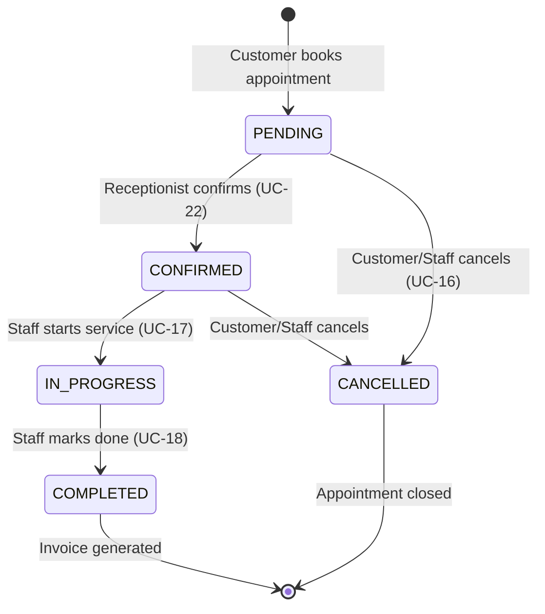

**States (from AppointmentStatus enum):**
- **PENDING**: Initial state after customer books appointment online or via receptionist.
- **CONFIRMED**: Receptionist has confirmed the booking, pet is expected.
- **IN_PROGRESS**: Pet has arrived, service is being performed.
- **COMPLETED**: Service finished, triggers invoice generation.
- **CANCELLED**: Appointment cancelled (with reason stored).

**Key Transitions:**
| From | To | Trigger | Guard | Action |
|------|-----|---------|-------|--------|
| PENDING | CONFIRMED | Receptionist confirms | - | Notify pet owner |
| PENDING | CANCELLED | Customer/staff cancels | Within cancellation policy | Record cancellation reason |
| CONFIRMED | IN_PROGRESS | Staff starts service | Pet has arrived | Record start time |
| IN_PROGRESS | COMPLETED | Staff marks complete | - | Calculate actual cost, generate invoice |

---

### 3.2.2 Invoice State Diagram

The Invoice entity tracks the billing lifecycle from creation to payment.

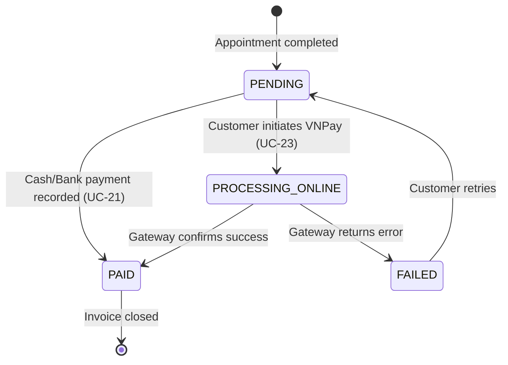

**States (from InvoiceStatus enum):**
- **PENDING**: Invoice created, awaiting payment.
- **PROCESSING_ONLINE**: VNPay or other online gateway processing.
- **PAID**: Payment confirmed and recorded.
- **FAILED**: Online payment failed (allows retry).

**Key Transitions:**
| From | To | Trigger | Guard | Action |
|------|-----|---------|-------|--------|
| PENDING | PAID | Receptionist records cash/bank | Valid amount | Create Payment record |
| PENDING | PROCESSING_ONLINE | Customer chooses VNPay | - | Redirect to gateway |
| PROCESSING_ONLINE | PAID | Gateway callback success | Valid signature | Record transaction ID, create Payment |
| PROCESSING_ONLINE | FAILED | Gateway callback error | - | Log error, allow retry |

---

### 3.2.3 Payment State Diagram

The Payment entity tracks individual payment attempts and their outcomes.

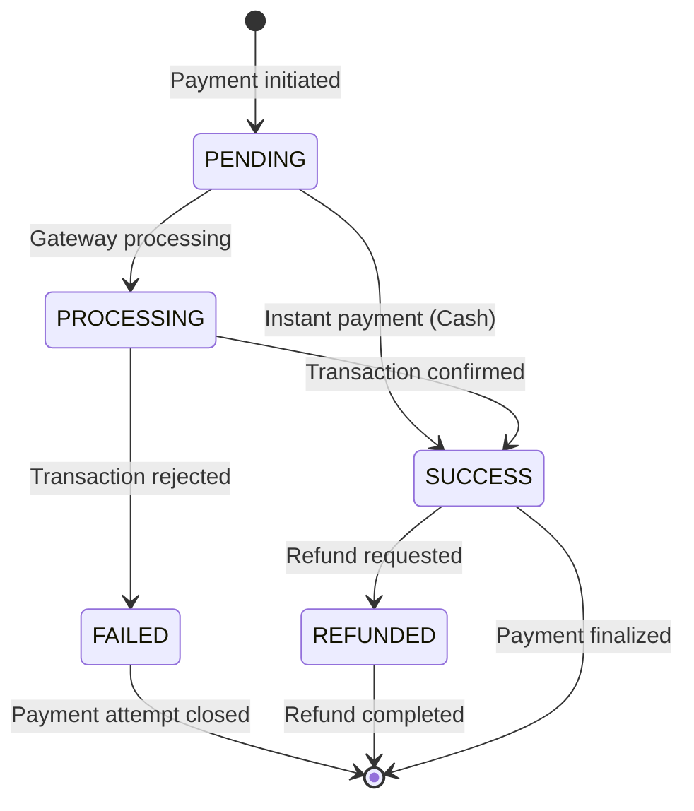

**States (from PaymentStatus enum):**
- **PENDING**: Payment record created, awaiting processing.
- **PROCESSING**: Online gateway is processing the transaction.
- **SUCCESS**: Payment successfully completed.
- **FAILED**: Payment attempt failed.
- **REFUNDED**: Payment was refunded after success.

**Key Transitions:**
| From | To | Trigger | Guard | Action |
|------|-----|---------|-------|--------|
| PENDING | SUCCESS | Cash payment | - | Update invoice status |
| PENDING | PROCESSING | Online payment initiated | - | Create gateway archive |
| PROCESSING | SUCCESS | Gateway confirms | Valid response | Update invoice to PAID |
| SUCCESS | REFUNDED | Refund requested | Valid refund reason | Create reversal transaction |

---

### 3.2.4 Cage State Diagram

The Cage entity tracks the availability and maintenance status of boarding cages.

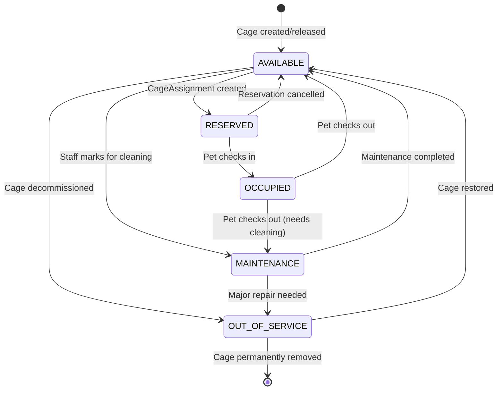

**States (from CageStatus enum):**
- **AVAILABLE**: Cage is ready for new reservations.
- **RESERVED**: Cage is reserved for upcoming boarding.
- **OCCUPIED**: Pet is currently boarding in this cage.
- **MAINTENANCE**: Cage is being cleaned or repaired.
- **OUT_OF_SERVICE**: Cage is temporarily or permanently unavailable.

**Key Transitions:**
| From | To | Trigger | Guard | Action |
|------|-----|---------|-------|--------|
| AVAILABLE | RESERVED | Booking confirmed | Cage size matches pet | Create CageAssignment |
| RESERVED | OCCUPIED | Pet check-in | Appointment IN_PROGRESS | Update assignment |
| OCCUPIED | AVAILABLE | Pet check-out | Assignment completed | Calculate boarding cost |
| OCCUPIED | MAINTENANCE | Pet check-out | Cleaning required | Schedule maintenance |

---

### 3.2.5 CageAssignment State Diagram

The CageAssignment entity tracks a pet's boarding stay from reservation to completion.

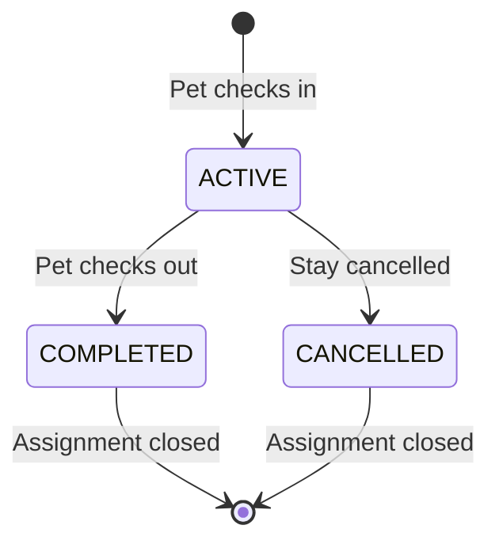

**States (from CageAssignmentStatus enum):**
- **ACTIVE**: Pet is currently staying in the assigned cage.
- **COMPLETED**: Pet has checked out, stay is complete.
- **CANCELLED**: Assignment was cancelled before or during stay.

**Key Transitions:**
| From | To | Trigger | Guard | Action |
|------|-----|---------|-------|--------|
| [*] | ACTIVE | Pet check-in | Cage is RESERVED | Record check-in time, update cage to OCCUPIED |
| ACTIVE | COMPLETED | Pet check-out | - | Record check-out time, calculate total cost |
| ACTIVE | CANCELLED | Cancellation requested | - | Release cage, record reason |

## 3.3 Dynamic Model

This section presents sequence diagrams for key use cases, showing the interaction between actors and system components following the BCE (Boundary-Control-Entity) pattern.

> **Notation Guide (PlantUML BCE Stereotypes):**
> - **boundary** (○─|) = UI/API interfaces
> - **control** (○) = Service/Controller logic
> - **entity** (○─) = Domain objects
> - **Messages:** Solid arrows `->` = synchronous calls, dashed arrows `-->` = return values
> - **BCE Rule:** Actor → Boundary → Control → Entity (Boundary never accesses Entity directly)

**Diagram Order (Logical User Journey):**
1. User Login → 2. Book Appointment → 3. Manage Appointment Status → 4. Assign Pet to Cage → 5. Record Payment → 6. Pay Invoice Online

---

### 3.3.1 User Login (UC-05)

This sequence diagram shows the authentication flow for all user types.

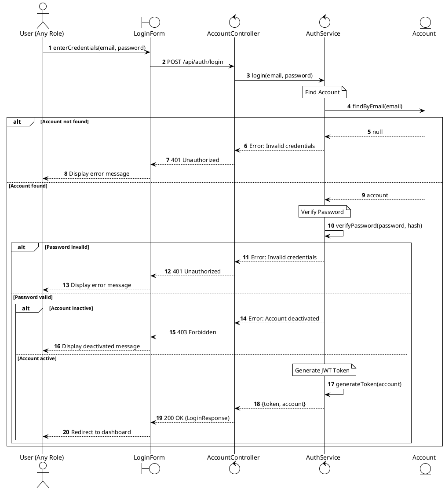

**Flow Description:**

| Step | Actor/Component | Action | Notes |
|------|----------------|--------|-------|
| 1-3 | User → Controller | Submits credentials | Email + password |
| 4-5 | AuthService → Account | Finds account by email | Validates existence |
| 6-8 | Alt: Not found | Returns 401 error | Generic error message |
| 9-10 | AuthService | Verifies password hash | bcrypt comparison |
| 11-13 | Alt: Invalid password | Returns 401 error | Same generic message |
| 14-16 | Alt: Inactive account | Returns 403 error | Account deactivated |
| 17-20 | Success path | Generates JWT token | Returns token + account info |

**Key Security Rules:**
- Error messages are **generic** (don't reveal if email exists)
- Password is verified using **bcrypt** hash comparison
- **Inactive** accounts cannot login (403 Forbidden)
- JWT token contains user role for authorization

---

### 3.3.2 Book Appointment Online (UC-17)

This sequence diagram shows how a Pet Owner books an appointment through the online portal.

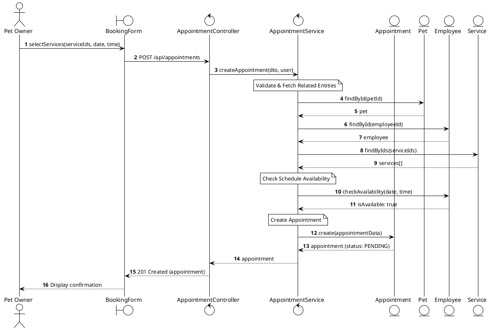

**Flow Description:**

| Step | Actor/Component | Action | Notes |
|------|----------------|--------|-------|
| 1-2 | Pet Owner → BookingForm | Submits booking request | Includes pet, services, date/time, employee |
| 3 | Controller → Service | Delegates to service layer | BCE: Control orchestrates |
| 4-9 | Service ↔ Entities | Validates and fetches related data | Pet, Employee, Services |
| 10-11 | Service → Employee | Checks schedule availability | Prevents double-booking |
| 12-13 | Service → Appointment | Creates new appointment | Initial status: PENDING |
| 14-16 | Return path | Returns confirmation | Appointment ID and details |

**Key Business Rules:**
- Appointment is created in **PENDING** status
- Employee availability must be verified before booking
- Pet must belong to the authenticated Pet Owner

---

### 3.3.3 Manage Appointment Status (UC-20)

This sequence diagram shows the appointment lifecycle from PENDING through CONFIRMED, IN_PROGRESS, to COMPLETED.

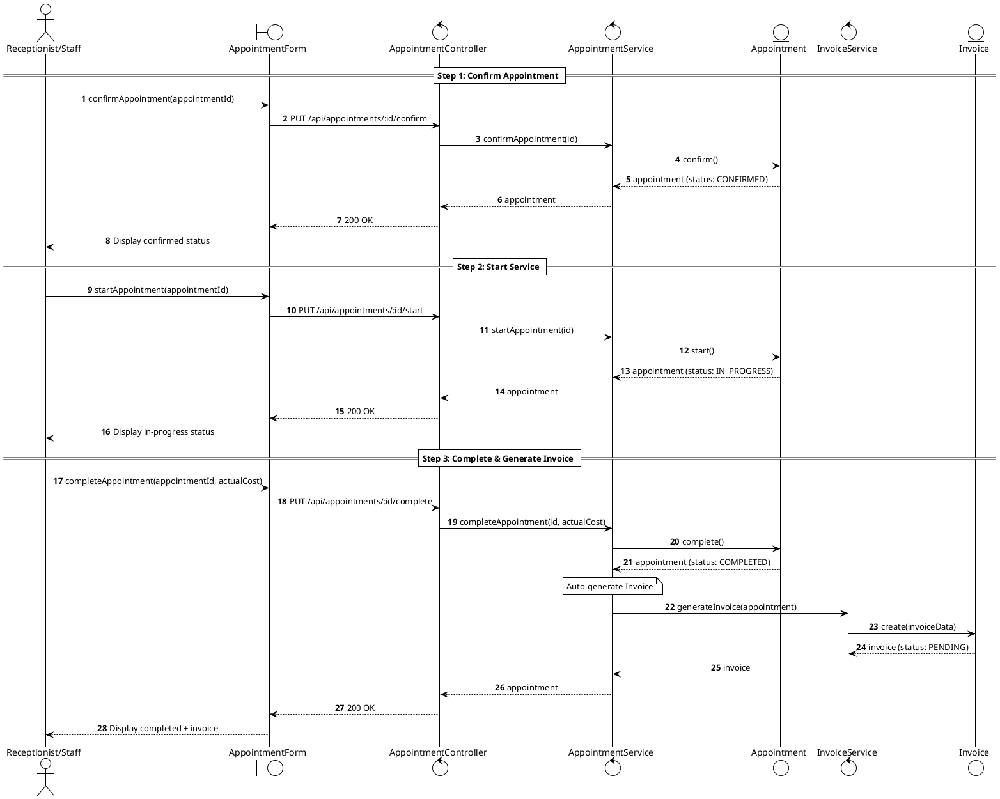

**State Transitions:**

| From | To | Trigger | Effect |
|------|-----|---------|--------|
| PENDING | CONFIRMED | Receptionist confirms | Notify pet owner |
| CONFIRMED | IN_PROGRESS | Staff starts service | Record start time |
| IN_PROGRESS | COMPLETED | Staff completes | Generate invoice |

**Key Business Rules:**
- Only **PENDING** appointments can be confirmed
- Only **CONFIRMED** appointments can be started
- Only **IN_PROGRESS** appointments can be completed
- Invoice is automatically generated upon completion

---

### 3.3.4 Assign Pet to Cage (UC-26)

This sequence diagram shows how a Receptionist assigns a pet to a cage for boarding.

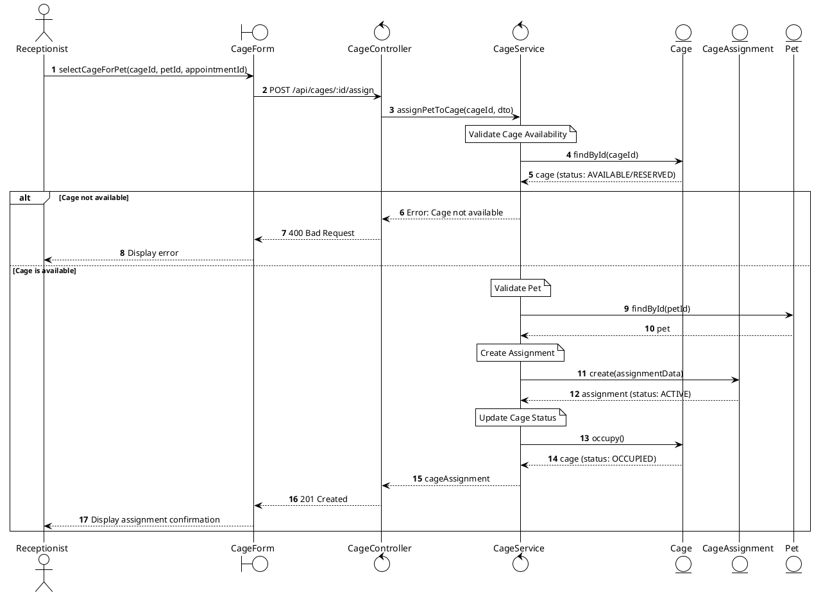

**Flow Description:**

| Step | Actor/Component | Action | Notes |
|------|----------------|--------|-------|
| 1-3 | Receptionist → Controller | Initiates cage assignment | Selects available cage |
| 4-5 | Service → Cage | Validates cage availability | Must be AVAILABLE or RESERVED |
| 6-8 | Alt: Error path | Returns error if unavailable | Cage already occupied |
| 9-10 | Service → Pet | Validates pet exists | Links pet to assignment |
| 11-12 | Service → CageAssignment | Creates active assignment | Records check-in time |
| 13-14 | Service → Cage | Updates cage status | Status: OCCUPIED |
| 15-17 | Return path | Returns success | Assignment details |

**Key Business Rules:**
- Only **AVAILABLE** or **RESERVED** cages can be assigned
- Cage status changes to **OCCUPIED** upon assignment
- CageAssignment is created with **ACTIVE** status
- Assignment links: Pet ↔ Cage ↔ Appointment

---

### 3.3.5 Record Payment (UC-33)

This sequence diagram shows how a Receptionist records a cash or bank transfer payment at the counter.

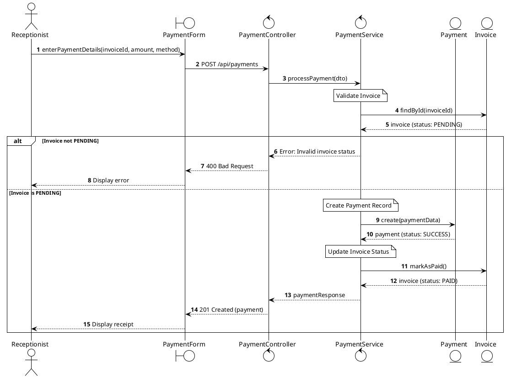

**Flow Description:**

| Step | Actor/Component | Action | Notes |
|------|----------------|--------|-------|
| 1-2 | Receptionist → PaymentForm | Enters payment details | Invoice ID, amount, method (CASH/BANK) |
| 3 | Controller → Service | Delegates to service layer | BCE: Control orchestrates |
| 4-5 | Service → Invoice | Fetches and validates invoice | Must be in PENDING status |
| 6-8 | Alt: Error path | Returns error if invalid | Invoice already paid or failed |
| 9-10 | Service → Payment | Creates payment record | Status: SUCCESS for cash |
| 11-12 | Service → Invoice | Updates invoice status | Status: PENDING → PAID |
| 13-15 | Return path | Returns success | Payment details for receipt |

**Key Business Rules:**
- Only **PENDING** invoices can receive payment
- Cash/Bank payments are immediately marked as **SUCCESS**
- Invoice status changes to **PAID** upon successful payment
- Payment amount must match or exceed invoice total

---

### 3.3.6 Pay Invoice Online - VNPay (UC-35)

This sequence diagram shows how a Pet Owner pays an invoice through the VNPay online payment gateway.

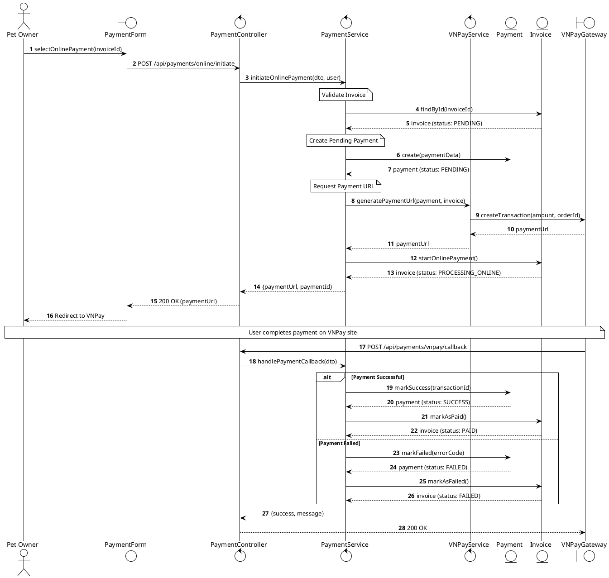

**Flow Description:**

| Step | Actor/Component | Action | Notes |
|------|----------------|--------|-------|
| 1-3 | Pet Owner → Controller | Initiates online payment | Selects VNPay method |
| 4-8 | Service → Entities | Validates invoice, creates pending payment | Payment status: PENDING |
| 9-13 | Service → VNPayService | Generates payment URL | Communicates with VNPay gateway |
| 14-15 | Service → Invoice | Updates invoice status | Status: PROCESSING_ONLINE |
| 16-18 | Return to user | Redirects to VNPay | User completes payment externally |
| 19-26 | Callback processing | VNPay sends result | Updates Payment and Invoice status |

**Key Business Rules:**
- Invoice status changes to **PROCESSING_ONLINE** during payment
- VNPay callback updates both Payment and Invoice status
- Failed payments can be retried (Invoice returns to PENDING)
