# Chapter 4: Architecture Design

## Pet Care Service Management System

**Version:** 2.0  
**Date:** 28/12/2025  
**Authors:** Group 9

---

## Document Change Record

| Date | Version | Description | Authors |
| :- | :- | :- | :- |
| 05/11/2025 | 1.0 | Initial architecture design | Group 9 |
| 01/12/2025 | 1.1 | Aligned with Data_model.md v3.0 OOAD principles | Winston |
| 28/12/2025 | 2.0 | arc42 alignment, C4 diagrams, ADRs, Glossary | Antigravity Agent |

---

## Table of Contents

- [4.1 Introduction and Goals](#41-introduction-and-goals)
- [4.2 Architecture of the System](#42-architecture-of-the-system)
- [4.3 Service Components](#43-service-components)
- [4.4 Glossary](#44-glossary)

---

## 4.1 Introduction and Goals

### 4.1.1 Business Context

The **PAW LOVERS Pet Care Service Management System** is a web-based application designed to digitize and streamline core business operations at PAW LOVERS Center, a pet care facility providing:

- **Veterinary examinations** and medical record management
- **Grooming and spa services** with cage and boarding facilities
- **Vaccination tracking** with automated due date calculation
- **Online appointment booking** with real-time availability
- **Multiple payment methods** including VNPay gateway integration

**Business Drivers:**
- Replace manual paper-based record keeping and spreadsheet tracking
- Enable online self-service for pet owners
- Improve staff scheduling and task management
- Provide comprehensive business analytics and reporting

**Related Documents:**
- [Software Requirements Specification (SRS)](SRS.md) - Complete functional and non-functional requirements
- [Use Case Model](usecase_model.md) - 36 use cases across 11 features
- [Analysis Document](analysis_document.md) - OOAD class, state, and sequence diagrams

---

### 4.1.2 Quality Goals

The top architectural quality goals, derived from SRS Section 6, ordered by priority:

| Priority | Quality Goal | NFR Reference | Architectural Approach |
|----------|--------------|---------------|----------------------|
| 1 | **Security** | NFR-007 to NFR-014 | JWT authentication, bcrypt password hashing, RBAC, HTTPS-only |
| 2 | **Reliability** | NFR-010, NFR-011 | 99% uptime target, daily backups, transaction handling |
| 3 | **Usability** | NFR-001 to NFR-003 | Vietnamese UI, intuitive navigation, clear error messages |
| 4 | **Performance** | NFR-004 to NFR-006 | <2s search queries, <3s page load, 50+ concurrent users |
| 5 | **Maintainability** | Implicit | Layered architecture, separation of concerns, DDD patterns |

---

### 4.1.3 Stakeholders

| Role | Responsibilities | Concerns |
|------|------------------|----------|
| **Center Manager** | System administration, staff management, reporting | Overview dashboards, strategic reports, full system access |
| **Veterinarian** | Medical examinations, diagnosis recording | Medical record access, examination workflow efficiency |
| **Care Staff** | Grooming, spa, boarding services | Task assignment clarity, service status updates |
| **Receptionist** | Appointments, payments, customer service | Easy booking interface, quick payment processing |
| **Pet Owner** | Online booking, pet management, payments | Self-service portal, appointment visibility, payment options |
| **Development Team** | Implementation, testing, deployment | Clear architecture, testable components, maintainable code |
| **VNPay Gateway** | Payment processing (external) | Secure API integration, callback handling |

---

### 4.1.4 Constraints

## Technical Constraints

| Constraint | Description | Rationale |
|------------|-------------|-----------|
| **Backend Framework** | NestJS 11 with TypeScript | Team expertise, strong typing, decorator-based architecture |
| **Database** | PostgreSQL 15 | Relational data model, ACID compliance, JSONB support |
| **ORM** | TypeORM 0.3.28 | TypeScript native, Active Record + Data Mapper patterns |
| **Frontend Framework** | Next.js 14 with React 18 | SSR capabilities, App Router, component-based UI |
| **Authentication** | JWT with 24-hour expiration | Stateless, scalable, industry standard |
| **Payment Gateway** | VNPay (Vietnam) | Local market requirement, sandbox available |

## Organizational Constraints

| Constraint | Description |
|------------|-------------|
| **Language** | User interface must be entirely in Vietnamese (SRS 2.4) |
| **Team Size** | 4 developers (SE100 university project) |
| **Timeline** | Academic semester deadline |
| **Budget** | Free/open-source tools only; VNPay sandbox for development |

## Regulatory Constraints

| Constraint | Description |
|------------|-------------|
| **Data Protection** | Compliance with Vietnamese personal data regulations |
| **Medical Records** | Pet health records must be retained minimum 1 year |
| **Password Security** | Industry-standard hashing required (bcrypt) |

---

## 4.2 Architecture of the System
### <a name="_toc213595806"></a>**4.2.1. Overall Architecture**
The Pet Care Service Management System is built using a **LAYERED ARCHITECTURE** pattern that separates concerns into distinct layers. This architecture demonstrates both **physical deployment** and **logical component organization**.
#### <a name="_toc213595807"></a>**Three-Tier Architecture Overview:**
The system architecture separates the application into three distinct tiers:

**TIER 1: PRESENTATION TIER (Client Layer)**

Web Client (Browser) - PetCareClient (Next.js 14 + React 18)

**47 React Components organized by feature:**
- **Forms:** LoginForm, RegistrationForm, ResetPasswordForm
- **Modals:** AddPetModal, EditPetModal, BookAppointmentModal, InvoiceDetailModal, VetRecordModal, CageFormModal, etc. (25 modals total)
- **Tables:** ServiceTable, StaffTable (with sorting/pagination)
- **Dashboard:** StatsCard, QuickActions, RecentActivity, RevenueChart
- **Layout:** Sidebar, DashboardHeader

**TIER 2: BUSINESS LOGIC TIER (Application Layer)**

PetCareWebService (REST API Layer - NestJS 11)

**14 Controllers (137 endpoints total):**
- AccountController - Authentication, profile management
- EmployeeController - Staff CRUD, role filtering
- PetOwnerController - Customer registration, profile
- PetController - Pet CRUD, medical history refs
- AppointmentController - Booking, status transitions
- ScheduleController - Work schedule management
- ServiceController - Service catalog
- ServiceCategoryController - Category management
- PaymentController - Payment processing, VNPay
- InvoiceController - Invoice management
- MedicalRecordController - Health records, vaccinations
- CageController - Boarding, cage assignments
- ReportController - 8 report types
- AppController - Health check

**17 Services (Business Logic):**
- AccountService, AuthService
- EmployeeService, PetOwnerService
- PetService, AppointmentService
- ScheduleService, ServiceService, ServiceCategoryService
- PaymentService, InvoiceService, VNPayService
- MedicalRecordService, CageService
- ReportService, AuditLogService
- AppService

**TIER 3: DATA TIER (Data Layer)**

**TypeORM Repositories (22 entity repositories):**

**Identity & Access (6 entities):**
- Account (base with userType discriminator)
- Employee (Single Table Inheritance base)
- Veterinarian (extends Employee)
- CareStaff (extends Employee)
- Manager (extends Employee)
- Receptionist (extends Employee)

**Pet Ownership (2 entities):**
- PetOwner
- Pet

**Medical (3 entities):**
- MedicalRecord
- VaccinationHistory
- VaccineType (catalog)

**Services & Appointments (4 entities):**
- ServiceCategory
- Service
- Appointment
- AppointmentService (junction table)

**Workforce & Facility (3 entities):**
- WorkSchedule
- Cage
- CageAssignment

**Financial (3 entities):**
- Invoice
- Payment
- PaymentGatewayArchive

**System (1 entity):**
- AuditLog

**EXTERNAL SERVICES:**

• VNPay Payment Gateway - Online Payment Processing (UC-35)

• Email Service (SMTP) - Notifications & Confirmations

#### <a name="_toc213595808"></a>**Architecture Diagram:**

##### C4 Level 1: System Context Diagram

```plantuml
@startuml C4-Context-PawLovers
!include https://raw.githubusercontent.com/plantuml-stdlib/C4-PlantUML/master/C4_Context.puml

title PAW LOVERS - System Context Diagram (C4 Level 1)

Person(petOwner, "Pet Owner", "Customer who books appointments and manages pets")
Person(manager, "Manager", "Administers staff, services, and reports")
Person(vet, "Veterinarian", "Performs medical examinations")
Person(careStaff, "Care Staff", "Provides grooming and boarding services")
Person(receptionist, "Receptionist", "Handles bookings and payments")

System(pawLovers, "PAW LOVERS System", "Pet Care Service Management System\n[NestJS + Next.js + PostgreSQL]")

System_Ext(vnpay, "VNPay Gateway", "Online payment processing")
System_Ext(email, "Email Service", "SMTP notifications")

Rel(petOwner, pawLovers, "Books appointments, manages pets, pays online")
Rel(manager, pawLovers, "Manages staff, services, views reports")
Rel(vet, pawLovers, "Records examinations, updates medical records")
Rel(careStaff, pawLovers, "Updates service status, manages cages")
Rel(receptionist, pawLovers, "Creates bookings, processes payments")
Rel(pawLovers, vnpay, "Processes online payments", "HTTPS/REST")
Rel(pawLovers, email, "Sends notifications", "SMTP")

@enduml
```

##### C4 Level 2: Container Diagram

```plantuml
@startuml C4-Container-PawLovers
!include https://raw.githubusercontent.com/plantuml-stdlib/C4-PlantUML/master/C4_Container.puml

title PAW LOVERS - Container Diagram (C4 Level 2)

Person(user, "Users", "Pet Owners, Staff, Manager")

System_Boundary(pawLovers, "PAW LOVERS System") {
    Container(frontend, "Web Application", "Next.js 14, React 18, Tailwind CSS", "SPA with SSR for user interfaces")
    Container(backend, "API Server", "NestJS 11, TypeScript", "REST API with 137 endpoints, 14 modules")
    ContainerDb(db, "Database", "PostgreSQL 15", "22 entities with TypeORM")
}

System_Ext(vnpay, "VNPay Gateway", "Payment processing")

Rel(user, frontend, "Uses", "HTTPS")
Rel(frontend, backend, "API calls", "JSON/HTTPS")
Rel(backend, db, "Reads/Writes", "TypeORM")
Rel(backend, vnpay, "Payment requests", "HTTPS/REST")

@enduml
```

##### Three-Tier Layered Architecture

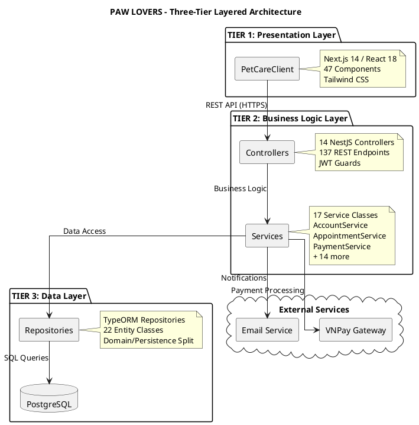

*Figure 1.1: Complete System Architecture - C4 Context, Container, and Layered Views*


### <a name="_toc213595809"></a>**4.2.2. Module and Component List**
#### <a name="_toc213595810"></a>**Complete Component Inventory:**

|**Component**|**Description**|
| :- | :- |
|**PetCareClient**|Next.js 14 SPA with React 18. 47 components for all user roles. Features: login, registration, appointment booking, pet management, medical records, payments, reports. Tailwind CSS styling with responsive design.|
|**Controllers (14)**|NestJS REST controllers handling 137 endpoints. AccountController, EmployeeController, PetOwnerController, PetController, AppointmentController, ScheduleController, ServiceController, ServiceCategoryController, PaymentController, InvoiceController, MedicalRecordController, CageController, ReportController, AppController.|
|**AccountService**|User authentication, registration, and RBAC. JWT token generation/validation, bcrypt password hashing, profile management. Supports 5 user roles: PetOwner, Manager, Veterinarian, CareStaff, Receptionist.|
|**EmployeeService**|Staff CRUD operations with role filtering. Manages Veterinarian, CareStaff, Manager, Receptionist records. Single Table Inheritance pattern for Employee hierarchy.|
|**PetService**|Pet profile CRUD operations. Manages pet info: name, species, breed, age, weight, health notes. Multiple pets per owner. Links to medical records and vaccination history.|
|**AppointmentService**|Booking, cancellation, and status management. Status lifecycle: PENDING → CONFIRMED → IN_PROGRESS → COMPLETED/CANCELLED. Availability checking against WorkSchedule. Multi-service appointments via AppointmentService junction.|
|**ScheduleService**|Staff work schedule management. WorkSchedule CRUD, conflict detection, availability queries. Supports recurring schedule patterns and date range filtering.|
|**ServiceService**|Service catalog management. Categories: Medical, Grooming, Boarding, Spa. CRUD for services with pricing, duration, and category assignment.|
|**MedicalRecordService**|Veterinary examination records. Diagnosis, treatment, prescriptions, follow-up notes. Links to VaccinationHistory. 24-hour edit window for creating veterinarian.|
|**CageService**|Boarding facility management. Cage CRUD with size categories (Small, Medium, Large). CageAssignment handling for pet check-in/check-out. Status tracking: Available, Occupied, Maintenance, Cleaning.|
|**PaymentService**|Payment processing for invoices. Supports Cash, BankTransfer, VNPay methods. Transaction recording with timestamps. Integrates with VNPayService for online payments.|
|**InvoiceService**|Invoice generation from completed appointments. Line items from AppointmentService records. Status tracking: PENDING → PAID/CANCELLED. Links to Payment records.|
|**VNPayService**|VNPay gateway integration (UC-35). Payment URL generation, IPN callback handling, signature verification (HMAC SHA512). Sandbox and production mode support.|
|**ReportService**|8 report types: revenue, appointments, services, staff performance. Date range filtering, aggregation queries. Data from appointments, invoices, payments entities.|
|**AuthService**|JWT token management with Passport.js. 24-hour expiration, role claims in payload. Guards for route protection.|
|**AuditLogService**|System activity logging. Tracks entity changes, user actions, timestamps. Separation of concerns for audit trail.|


### <a name="_toc213595811"></a>**4.2.3. Architectural Patterns and Design Decisions**
#### <a name="_toc213595812"></a>**WHY LAYERED ARCHITECTURE?**
The Pet Care Service Management System employs **Layered Architecture** as the foundational architectural pattern. This decision is based on multiple factors that align with both the system requirements and best practices in software engineering.

**1. SEPARATION OF CONCERNS**

Each layer has a specific, well-defined responsibility:

- Presentation Layer: Handles all user interaction, input validation (client-side), and display logic
- API Layer: Routes requests, validates authentication tokens, and formats responses
- Business Logic Layer: Contains all business rules, workflows, and domain logic
- Data Access Layer: Manages database operations, queries, and transaction management
- This clear separation prevents mixing concerns, making code easier to understand and maintain.

**2. MAINTAINABILITY**

Changes in one layer have minimal impact on other layers:

- Can change UI framework (React to Angular) without touching business logic
- Can modify database schema without changing controllers
- Can add new business rules without modifying data access code
- Reduces regression bugs and makes updates safer
- Clear boundaries make it easier to locate and fix bugs

**3. TESTABILITY**

Each layer can be tested independently using different strategies:

- Business Logic: Unit tests with mock repositories (no database needed)
- Data Access: Integration tests with test database
- API Layer: API tests using tools like Postman or automated testing frameworks
- Presentation: UI tests with Selenium or similar tools
- Allows test-driven development (TDD) and ensures high code coverage


**4. SCALABILITY**

Each layer can scale independently based on specific needs:

- Can deploy multiple business logic servers behind a load balancer
- Can add database replicas (read replicas) without changing application code
- Can use CDN (Content Delivery Network) for presentation layer
- Stateless controllers enable horizontal scaling
- Connection pooling in data layer optimizes resource usage

**5. TEAM COLLABORATION**

Different teams can work on different layers simultaneously:

- Frontend team: Works on Presentation Layer (UI/UX)
- Backend team: Works on Business Logic and API layers
- Database team: Works on Data Access Layer and schema
- Clear interfaces between layers minimize integration issues
- Parallel development reduces project timeline
### <a name="_toc213595813"></a>**4.2.4. Design Patterns Applied**

**DEPENDENCY INJECTION - NestJS**: Built-in IoC container manages component lifecycle. Constructor injection for loose coupling. All 17 services, 14 controllers, guards, and interceptors use DI.

**REPOSITORY PATTERN - TypeORM**: Abstracts database operations via `@InjectRepository()`. Enables unit testing with mocks. Query builders for complex queries. 22 entity repositories.

**SERVICE LAYER PATTERN**: 17 service classes encapsulate business logic. Controllers delegate to services. Single responsibility per service. Enables reuse across controllers.

**FACTORY PATTERN**: 4 factory classes for complex object creation:
- `AccountFactory` - Creates Account entities with hashed passwords
- `EmployeeFactory` - Creates Employee subtypes (Vet, CareStaff, etc.)
- `PetOwnerFactory` - Creates PetOwner with linked Account
- `AppointmentFactory` - Creates Appointment with services

**SINGLE TABLE INHERITANCE (TypeORM)**: Employee hierarchy uses `@TableInheritance()` with `@ChildEntity()` for Veterinarian, CareStaff, Manager, Receptionist. Single `employees` table with `role` discriminator column.

**GUARD PATTERN - NestJS**: `AuthGuard` validates JWT tokens. `RolesGuard` checks user permissions. Applied via `@UseGuards()` decorators on routes.

**INTERCEPTOR PATTERN**: `ResponseInterceptor` standardizes API responses. `RequestLogInterceptor` logs incoming requests. Applied globally via `APP_INTERCEPTOR`.

**DTO PATTERN**: Data Transfer Objects for request/response validation. `class-validator` decorators for runtime validation. Separates API contracts from entities.
### <a name="_toc213595814"></a>**4.2.5. Component Dependencies**
Dependency Flow: Client → WebService → Services → Repositories → Database

**Rule:** Upper layers call lower layers only. No circular dependencies.
### <a name="_toc213595815"></a>**4.2.6. Technology Stack**
Frontend: React/Angular + HTML5/CSS3

Backend: TypeScript/NestJS + TypeORM

Database: PostgreSQL

ORM: TypeORM (Active Record / Data Mapper patterns)

Security: JWT + bcrypt
### <a name="_toc213595816"></a>**4.2.7. Non-Functional Considerations**
PERFORMANCE: Connection pooling, caching, lazy loading

SECURITY: HTTPS, password hashing, RBAC, SQL injection prevention

RELIABILITY: Transaction management, error handling, backups

SCALABILITY: Stateless design, horizontal scaling, load balancing
### <a name="_toc213595817"></a>**4.2.8. Deployment View**
DEVELOPMENT: Single machine (all-in-one)

PRODUCTION: Three-tier (Client machines → Application server cluster → Database server)
### <a name="_toc213595818"></a>**4.2.9. Future Extensibility**
Easy to add: New services, new roles, new notifications, new reports

Easy to modify: Change UI, change database, add business rules

Migration path: Can evolve to microservices if needed

---

## 4.3 Service Components

This section provides comprehensive documentation for all NestJS service components. Each service includes purpose, methods, dependencies, and PlantUML class diagrams.

---

### <a name="_toc213595819"></a>**4.3.1. AccountService**

Handles generic account operations: profile fetching, password management, and account activation.

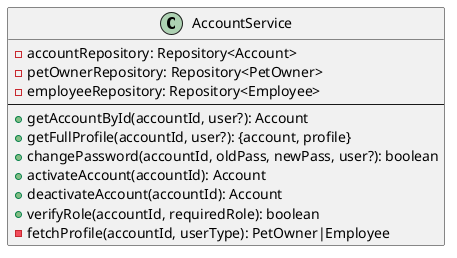

| Dependency | Purpose |
|------------|---------|
| Account Entity | User authentication data |
| PetOwner / Employee | Profile data |
| AccountMapper | Domain model conversion |

---

### <a name="_toc213595820"></a>**4.3.2. AuthService**

Handles authentication: login, logout, JWT token generation.

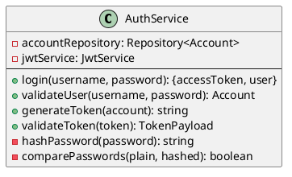

| Dependency | Purpose |
|------------|---------|
| JwtService | Token generation (24h expiry) |
| bcrypt | Password hashing |

---

### <a name="_toc213595821"></a>**4.3.3. EmployeeService**

Manages staff CRUD with Single Table Inheritance (Veterinarian, CareStaff, Manager, Receptionist).

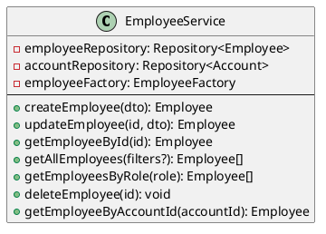

| Pattern | Implementation |
|---------|----------------|
| Single Table Inheritance | `role` discriminator column |
| Factory Pattern | EmployeeFactory creates subtypes |

---

### <a name="_toc213595822"></a>**4.3.4. PetOwnerService**

Manages pet owner registration and profile operations.

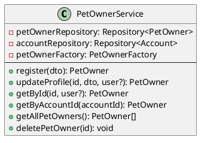

---

### <a name="_toc213595823"></a>**4.3.5. PetService**

Manages pet profiles with DDD pattern using PetDomainModel.

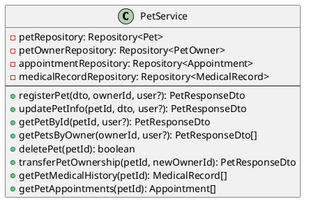

| Pattern | Implementation |
|---------|----------------|
| DDD | PetDomainModel for business logic |
| Soft Delete | TypeORM `@DeleteDateColumn` |

---

### <a name="_toc213595824"></a>**4.3.6. AppointmentService**

Handles appointment lifecycle: PENDING → CONFIRMED → IN_PROGRESS → COMPLETED/CANCELLED.

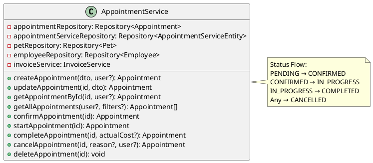

| Feature | Implementation |
|---------|----------------|
| Multi-service | Junction table `appointment_services` |
| Auto Invoice | Creates invoice on COMPLETED |
| Transaction | DataSource for atomic operations |

---

### <a name="_toc213595825"></a>**4.3.7. ScheduleService**

Manages staff work schedules (WorkSchedule entity).

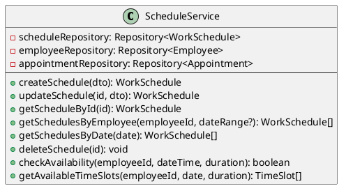

---

### <a name="_toc213595826"></a>**4.3.8. ServiceService**

Manages service catalog (bathing, spa, medical, boarding).

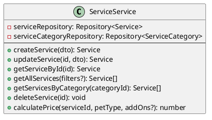

---

### <a name="_toc213595827"></a>**4.3.9. CageService**

Manages boarding cages and pet assignments (check-in/check-out).

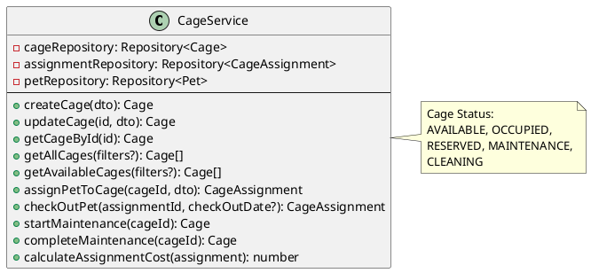

---

### <a name="_toc213595828"></a>**4.3.10. MedicalRecordService**

Manages veterinary examination records and vaccination history.

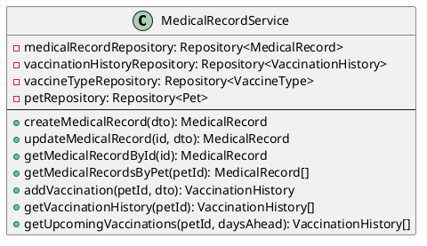

| OOAD Pattern | Implementation |
|--------------|----------------|
| SRP | VaccineType (catalog) vs VaccinationHistory (records) |
| DRY | VaccineType prevents duplication |

---

### <a name="_toc213595829"></a>**4.3.11. InvoiceService**

Manages invoices with status transitions: PENDING → PROCESSING → PAID/FAILED.

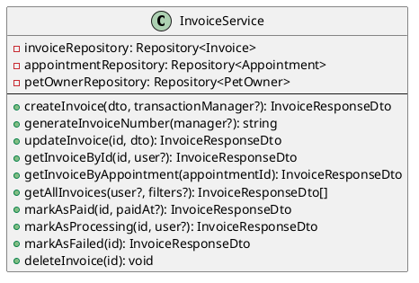

| Feature | Implementation |
|---------|----------------|
| Invoice Number | `INV-YYYYMMDD-00001` format |
| Active Record | Business logic in Invoice entity |

---

### <a name="_toc213595830"></a>**4.3.12. PaymentService**

Handles payment processing (Cash, BankTransfer, VNPay) with gateway integration.

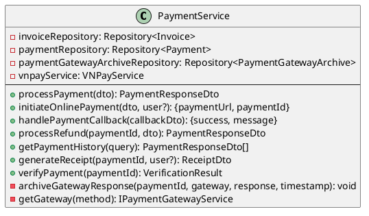

| OOAD Pattern | Implementation |
|--------------|----------------|
| Open/Closed | JSONB `gatewayResponse` for extensibility |
| Strategy | `getGateway()` selects payment provider |
| Audit | PaymentGatewayArchive for compliance |

---

### <a name="_toc213595831"></a>**4.3.13. VNPayService**

VNPay payment gateway integration (sandbox + production).

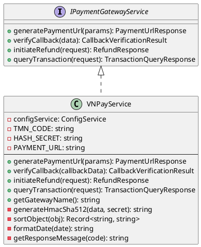

| Security | Implementation |
|----------|----------------|
| Signature | HMAC-SHA512 validation |
| Sandbox | Configurable via environment |

---

### <a name="_toc213595832"></a>**4.3.14. ReportService**

Generates 8 report types for business intelligence.

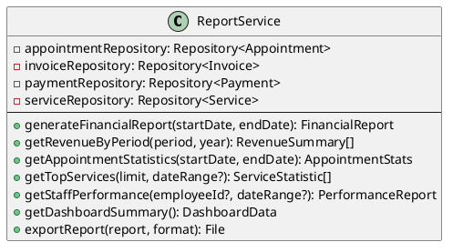

---

### <a name="_toc213595833"></a>**4.3.15. AuditLogService**

System activity logging for audit trail.

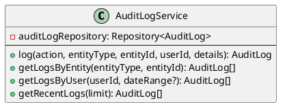

---

### <a name="_toc213595834"></a>**4.3.16. Service Dependency Summary**

```plantuml
@startuml ServiceDependencies
skinparam linetype ortho
skinparam componentStyle rectangle
skinparam defaultFontSize 11

title PAW LOVERS - Service Layer Dependencies

' ========== PRESENTATION LAYER (Green) ==========
package "Presentation Layer" #E8F5E9 {
  [AccountController] as AC #90EE90
  [AuthController] as AuC #90EE90
  [PetController] as PC #90EE90
  [AppointmentController] as ApC #90EE90
  [ScheduleController] as ScC #90EE90
  [ServiceController] as SvC #90EE90
  [CageController] as CaC #90EE90
  [MedicalController] as MC #90EE90
  [InvoiceController] as IC #90EE90
  [PaymentController] as PyC #90EE90
  [ReportController] as RC #90EE90
}

' ========== BUSINESS LOGIC LAYER (Blue) ==========
package "Business Logic Layer" #E3F2FD {
  
  package "Identity Services" #BBDEFB {
    [AccountService] as AS
    [AuthService] as AuS
    [EmployeeService] as ES
    [PetOwnerService] as POS
  }
  
  package "Core Business Services" #90CAF9 {
    [PetService] as PS
    [AppointmentService] as ApS
    [ScheduleService] as ScS
    [ServiceService] as SvS
    [CageService] as CaS
    [MedicalRecordService] as MRS
  }
  
  package "Financial Services" #64B5F6 {
    [InvoiceService] as IS
    [PaymentService] as PyS
    [VNPayService] as VPS
  }
  
  package "Supporting Services" #42A5F5 {
    [ReportService] as RS
    [AuditLogService] as ALS
  }
}

' ========== DATA ACCESS LAYER (Yellow) ==========
package "Data Access Layer" #FFF8E1 {
  
  package "Identity Repositories" #FFE082 {
    [AccountRepository] as AccR
    [PetOwnerRepository] as POR
    [EmployeeRepository] as ER
  }
  
  package "Business Repositories" #FFCC80 {
    [PetRepository] as PetR
    [AppointmentRepository] as ApR
    [AppointmentServiceRepository] as ASR
    [WorkScheduleRepository] as WSR
    [MedicalRecordRepository] as MRR
    [VaccinationHistoryRepository] as VHR
    [CageRepository] as CageR
    [CageAssignmentRepository] as CAR
    [InvoiceRepository] as InvR
    [PaymentRepository] as PayR
  }
  
  package "Catalog Repositories" #FFB74D {
    [ServiceCategoryRepository] as SCR
    [ServiceRepository] as SvcR
    [VaccineTypeRepository] as VTR
  }
  
  package "Audit Repositories" #FFA726 {
    [AuditLogRepository] as ALR
    [PaymentGatewayArchiveRepository] as PGAR
  }
}

' ========== EXTERNAL SYSTEMS (Purple) ==========
cloud "External Systems" #F3E5F5 {
  [VNPay Gateway] as VNG #CE93D8
  [SMTP Server] as SMTP #CE93D8
}

' === Controller to Service Dependencies ===
AC --> AS
AC --> POS
AC --> ES
AuC --> AuS
PC --> PS
ApC --> ApS
ScC --> ScS
SvC --> SvS
CaC --> CaS
MC --> MRS
IC --> IS
PyC --> PyS
RC --> RS

' === Service to Service Dependencies ===
AuS --> AS : validates
ApS --> IS : generates invoice
ApS --> ScS : checks availability
PyS --> IS : updates status
PyS --> VPS : online payments
CaS --> IS : boarding fees
MRS --> PS : pet records

' === Service to Repository Dependencies ===
AS --> AccR
ES --> ER
POS --> POR
PS --> PetR
ApS --> ApR
ApS --> ASR
ScS --> WSR
SvS --> SvcR
SvS --> SCR
CaS --> CageR
CaS --> CAR
MRS --> MRR
MRS --> VHR
MRS --> VTR
IS --> InvR
PyS --> PayR
ALS --> ALR
VPS --> PGAR

' === External System Dependencies ===
VPS --> VNG : HTTPS
AuS --> SMTP : password reset

' === Audit Logging (cross-cutting) ===
AS ..> ALS : logs changes
ApS ..> ALS : logs changes
PyS ..> ALS : logs transactions

@enduml
```

**Diagram Legend:**
- **Green (Presentation Layer):** Controllers handling HTTP requests
- **Blue (Business Logic Layer):** Services with domain logic
- **Yellow (Data Access Layer):** TypeORM repositories for persistence
- **Purple (External Systems):** Third-party integrations
- **Solid arrows:** Direct dependencies
- **Dashed arrows:** Cross-cutting concerns (audit logging)

---

## 4.4 Glossary


## Domain Terms

| Term | Definition |
|------|------------|
| **Appointment** | A scheduled service booking for a specific pet, date, time, and assigned staff |
| **Boarding** | Pet accommodation service using cages for extended stays |
| **Cage** | Physical enclosure for pet boarding, categorized by size (Small, Medium, Large) |
| **Cage Assignment** | Record linking a pet to a cage for a specific boarding period |
| **Care Staff** | Employee providing non-medical services (grooming, spa, boarding) |
| **Invoice** | Billing document generated after appointment completion |
| **Medical Record** | Health documentation for a pet including diagnosis and treatment notes |
| **Payment** | Financial transaction recording funds received for services |
| **Pet Owner** | Customer who owns pets and uses the system for bookings |
| **Receptionist** | Front desk staff handling bookings and payments |
| **Service** | Offered activity (bathing, spa, medical exam, vaccination, boarding) |
| **Service Category** | Classification group for services (Medical, Grooming, Boarding, etc.) |
| **Vaccination History** | Record of vaccines administered to a pet with dates |
| **Veterinarian** | Licensed medical professional performing pet examinations |
| **Work Schedule** | Staff availability definition with shift times and breaks |

## Technical Terms

| Term | Definition |
|------|------------|
| **Active Record** | ORM pattern where entity objects include persistence methods |
| **BCE Pattern** | Boundary-Control-Entity pattern separating UI, logic, and data |
| **Data Mapper** | ORM pattern separating domain objects from database operations |
| **Facade Pattern** | Design pattern providing simplified interface to complex subsystem |
| **Guard (NestJS)** | Middleware component that validates authentication/authorization |
| **IPN** | Instant Payment Notification - VNPay callback for transaction status |
| **Repository Pattern** | Data access abstraction providing collection-like interface |
| **Single Table Inheritance** | ORM strategy storing class hierarchy in one database table |
| **SSR** | Server-Side Rendering - generating HTML on server for SEO/performance |
| **Stateless API** | REST design where server doesn't store client session state |

## Acronyms

| Acronym | Expansion |
|---------|-----------|
| **ADR** | Architecture Decision Record |
| **API** | Application Programming Interface |
| **CRUD** | Create, Read, Update, Delete |
| **DDD** | Domain-Driven Design |
| **DTO** | Data Transfer Object |
| **HTTPS** | Hypertext Transfer Protocol Secure |
| **JWT** | JSON Web Token |
| **ORM** | Object-Relational Mapping |
| **RBAC** | Role-Based Access Control |
| **REST** | Representational State Transfer |
| **SRS** | Software Requirements Specification |
| **SRP** | Single Responsibility Principle |
| **TLS** | Transport Layer Security |
| **UI** | User Interface |
| **UML** | Unified Modeling Language |

