# Chapter 2: Use Case Modeling

## Pet Care Service Management System

**Version:** 2.0  
**Date:** 27/12/2025  
**Authors:** Group 9

---

## Document Change Record

| Date | Version | Description | Author |
| ----- | ----- | ----- | ----- |
| 7/10/2025 | 1.0 | Initial version | Group 9 |
| 11/16/2025 | 1.5 | Added VNPay payment integration use cases | Group 9 |
| 12/27/2025 | 2.0 | Updated to reflect actual implementation | Group 9 |

---

## Table of Contents

- [2.1 Use-case Diagrams](#21-use-case-diagrams)
  - [2.1.1 Level 0: System Context Diagram](#211-level-0-system-context-diagram)
  - [2.1.2 Level 1: Feature Diagrams](#212-level-1-feature-diagrams)
- [2.2 List of Actors](#22-list-of-actors)
- [2.3 List of Use-cases](#23-list-of-use-cases)
- [2.4 Use-case Specifications](#24-use-case-specifications)

---

## 2.1 Use-case Diagrams

This section presents the visual UML Use-Case diagrams for the PAW LOVERS system. The diagrams are organized into two levels of detail: a high-level Level 0 diagram to show the overall system context, and a series of detailed Level 1 diagrams, one for each major feature.  
### **2.1.1 Level 0: System Context Diagram**

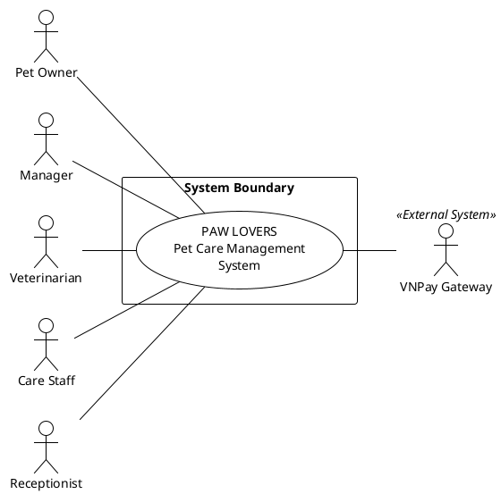

**Description:** The Level 0 System Context Diagram provides the highest-level view of the system per OMG UML 2.5 standards. It shows the entire **PAW LOVERS Pet Care Management System** as a single entity (black box), defining the system boundary and identifying all external actors.

* **System:** PAW LOVERS Pet Care Management System (shown as single use case).
* **Primary Actors (Left):** Pet Owner, Manager, Veterinarian, Care Staff, Receptionist - all users who initiate interactions with the system.
* **Secondary Actor (Right):** VNPay Gateway - external payment system that the application integrates with.
* **Notation:** Solid lines without arrowheads indicate bidirectional communication per UML standards.

### **2.1.2 Level 1: Feature-Level Diagrams** 
These diagrams break down the system into its core features, as defined in the SRS. Each diagram models the specific use cases and actor interactions for one feature.  
#### **2.1.2.1 Feature: Account & Profile Management**

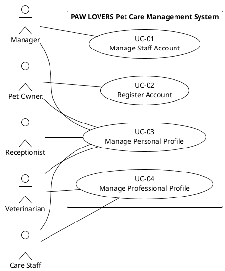

**Description:** This diagram models user account creation and personal/professional profile management.

* **Actors:** Manager, Pet Owner, Staff (Veterinarian, Care Staff, Receptionist).  
* **Use Cases:** UC-01 Manage Staff Account, UC-02 Register Account, UC-03 Manage Personal Profile, UC-04 Manage Professional Profile.  
* **Interactions:**   
  * Manager creates and manages staff accounts.  
  * Pet Owner registers their own account.
  * All users can manage their own personal profile (contact info).
  * Staff members (Vets, Care Staff) can manage their professional profiles (skills, credentials).

#### **2.1.2.2 Feature: Authentication & Security**

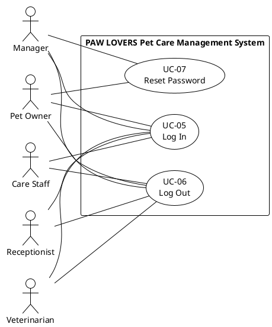

**Description:** This diagram models basic security operations for all authenticated users.

* **Actors:** Manager, Pet Owner, Veterinarian, Care Staff, Receptionist.  
* **Use Cases:** UC-05 Log In, UC-06 Log Out, UC-07 Reset Password.  
* **Interactions:**   
  * All users can authenticate, terminate sessions, and recover credentials.

#### **2.1.2.3 Feature: Pet & Owner Management**

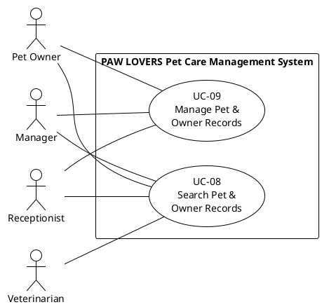

**Description:** This diagram shows CRUD operations for pet and owner data.

* **Actors:** Pet Owner, Manager, Receptionist, Veterinarian.
* **Use Cases:** UC-08 Search Pet & Owner Records, UC-09 Manage Pet & Owner Records.
* **Interactions:**
  * Pet Owner can search and manage their own pet/owner records.
  * Manager and Receptionist have full access to search and manage all records.
  * Veterinarian can only **search/view** records (no create/update access per backend roles).

#### **2.1.2.4 Feature: Center Configuration**

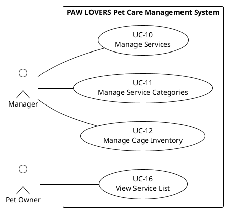

**Description:** This diagram models static system setup including service catalog and facility inventory.

* **Actors:** Manager, Pet Owner.  
* **Use Cases:** UC-10 Manage Services, UC-11 Manage Service Categories, UC-12 Manage Cage Inventory, UC-16 View Service List.  
* **Interactions:**   
  * Manager defines the service catalog, categories, and cage types.
  * Pet Owner can browse the available service list.

#### **2.1.2.5 Feature: Staff Schedule Management**

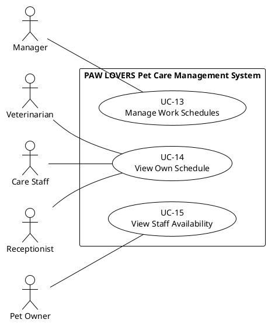

**Description:** This diagram models the creation and viewing of workforce schedules.

* **Actors:** Manager, Staff (Vet, Care Staff, Receptionist), Pet Owner.
* **Use Cases:** UC-13 Manage Work Schedules, UC-14 View Own Schedule, UC-15 View Staff Availability.
* **Interactions:**
  * Manager assigns shifts.
  * Staff check their assigned work.
  * Pet Owners view availability when booking.

#### **2.1.2.6 Feature: Appointment & Booking Management**

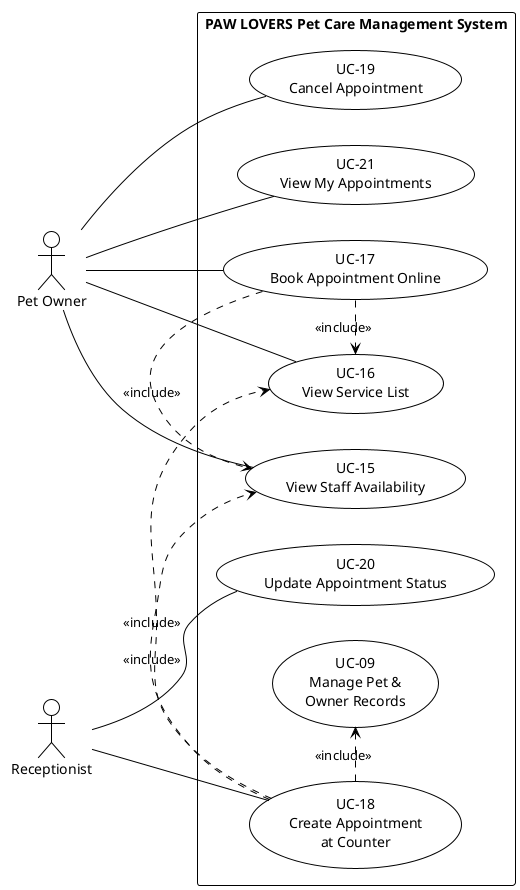

**Description:** This diagram models appointment booking workflows for Pet Owners and Receptionists.

* **Actors:** Pet Owner, Receptionist.
* **Use Cases:** UC-15 View Staff Availability, UC-16 View Service List, UC-17 Book Appointment Online, UC-18 Create Appointment at Counter, UC-19 Cancel Appointment, UC-20 Update Appointment Status, UC-21 View My Appointments.
* **Interactions:**
  * Pet Owner books appointments online (includes viewing services and availability).
  * Pet Owner can view their appointment history and status.
  * Pet Owner can cancel their own appointments.
  * Receptionist creates appointments at counter and updates status.

#### **2.1.2.7 Feature: Service Execution Management**

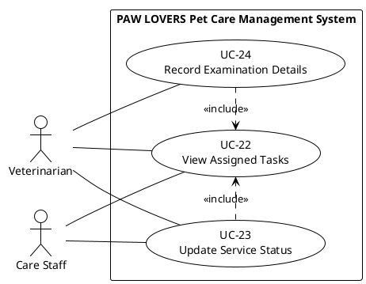

**Description:** This diagram shows how staff execute daily service tasks and track progress.

* **Actors:** Veterinarian, Care Staff.
* **Use Cases:** UC-22 View Assigned Tasks, UC-23 Update Service Status, UC-24 Record Examination Details.
* **Interactions:**
  * Both actors view their assigned daily tasks.
  * Both actors can update service status (start/complete appointment).
  * Veterinarian records examination details (specific to medical services).

#### **2.1.2.8 Feature: Cage & Boarding Management**

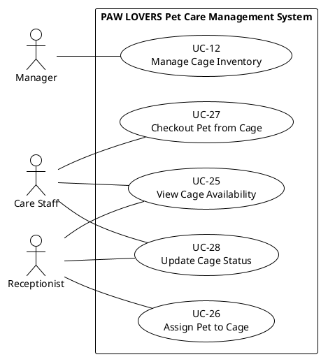

**Description:** This diagram models cage inventory and pet boarding operations.

* **Actors:** Manager, Receptionist, Care Staff.
* **Use Cases:** UC-12 Manage Cage Inventory, UC-25 View Cage Availability, UC-26 Assign Pet to Cage, UC-27 Checkout Pet from Cage, UC-28 Update Cage Status.
* **Interactions:**
  * Manager defines cage types and inventory.
  * Receptionist and Care Staff view cage availability.
  * Receptionist assigns pets to cages (check-in).
  * Care Staff processes checkout and updates cage status.

#### **2.1.2.9 Feature: Medical Record & Vaccination Management**

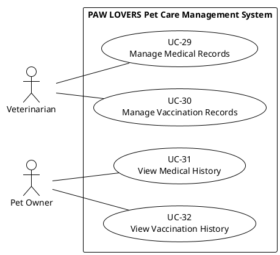

**Description:** This diagram models medical record and vaccination tracking.

* **Actors:** Veterinarian, Pet Owner.
* **Use Cases:** UC-29 Manage Medical Records, UC-30 Manage Vaccination Records, UC-31 View Medical History, UC-32 View Vaccination History.
* **Interactions:**
  * Veterinarian creates/updates medical and vaccination records (CRUD).
  * Pet Owner can view their pet's medical history (read-only).
  * Pet Owner can view their pet's vaccination history (read-only).

#### **2.1.2.10 Feature: Payment & Billing**

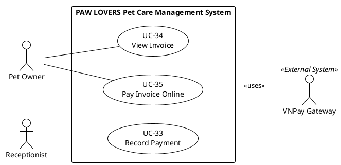

**Description:** This diagram models payment processing with multiple methods.

* **Actors:** Pet Owner, Receptionist, VNPay Payment Gateway (external system).  
* **Use Cases:** UC-33 Record Payment, UC-34 View Invoice, UC-35 Pay Invoice Online.  
* **Interactions:**   
  * Receptionist records payments at counter (cash/bank transfer).  
  * Pet Owner views invoices and pays online via VNPay integration.  
  * UC-35 communicates with VNPay Payment Gateway external system.

#### **2.1.2.11 Feature: Reporting & Analytics**

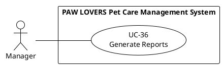

**Description:** This diagram models business performance reporting.

* **Actors:** Manager.
* **Use Cases:** UC-36 Generate Reports.
* **Interactions:**
* Manager generates business reports (financial, revenue, appointments, etc.).

## 2.2 List of Actors

| STT | Actor Name | Meaning/Notes |
| :---: | ----- | ----- |
| 1 | Manager | Responsible for overall system management, including staff, services, schedules, and reports. |
| 2 | Pet Owner | A customer of the pet care center who uses the online portal to manage their pets and appointments. |
| 3 | Veterinarian | A professional staff member responsible for medical examinations and updating pet medical records. |
| 4 | Care Staff | A staff member responsible for non-medical services like grooming and spa treatments. |
| 5 | Receptionist | A staff member who manages the front desk, including appointments and payments. |
| 6 | VNPay Payment Gateway | External system actor for online payment processing via VNPay API (integrated for FR-033: Pay Invoice Online). |

#  

# 

## 2.3 List of Use-cases

| STT | Use-case name | Meaning/Notes |
| :---- | :---- | :---- |
| **Account & Profile Management** |  |  |
| 1 | Manage Staff Account | (Manager) Creates and manages staff accounts. |
| 2 | Register Account | (Pet Owner) Creates a customer account. |
| 3 | Manage Personal Profile | (All Roles) Update own contact and personal information. |
| 4 | Manage Professional Profile | (Staff) Veterinarians/Care Staff update professional skills and expertise. |
| **Authentication & Security** |  |  |
| 5 | Log In | (All Actors) Authenticate to access the system. |
| 6 | Log Out | (All Actors) End the current session and exit the system. |
| 7 | Reset Password | (Pet Owner, Manager) Recover a forgotten password. |
| **Pet & Owner Management** |  |  |
| 8 | Search Pet & Owner Records | (Manager, Receptionist, Veterinarian) Search for pet or owner records. |
| 9 | Manage Pet & Owner Records | (Pet Owner, Manager, Receptionist) Create and update pet/owner records (Owner can only update own records). |
| **Center Configuration** |  |  |
| 10 | Manage Services | (Manager) Defines the services offered by the center. |
| 11 | Manage Service Categories | (Manager) Manages service classification groups. |
| 12 | Manage Cage Inventory | (Manager) Defines cage hardware types and inventory. |
| **Staff Schedule Management** |  |  |
| 13 | Manage Work Schedules | (Manager) Creates and updates staff work schedules. |
| 14 | View Own Schedule | (Staff) Staff check their assigned work shifts. |
| 15 | View Staff Availability | (Pet Owner) Check available times for booking. |
| **Appointment & Booking** |  |  |
| 16 | View Service List | (Pet Owner) Browse available services and prices. |
| 17 | Book Appointment Online | (Pet Owner) Self-service appointment booking. |
| 18 | Create Appointment at Counter | (Receptionist) Books an appointment for a customer. |
| 19 | Cancel Appointment | (Pet Owner) Cancels their own appointment. |
| 20 | Update Appointment Status | (Receptionist) Updates booking status (Confirmed, Pending, Canceled). |
| 21 | View My Appointments | (Pet Owner) View appointment history and status. |
| **Service Execution** |  |  |
| 22 | View Assigned Tasks | (Staff) See the list of tasks for the day. |
| 23 | Update Service Status | (Staff) Update task progress. |
| 24 | Record Examination Details | (Veterinarian) Record diagnosis and treatment. |
| **Cage & Boarding Management** |  |  |
| 25 | View Cage Availability | (Staff) Check real-time cage status. |
| 26 | Assign Pet to Cage | (Receptionist) Check-in pet to a cage. |
| 27 | Checkout Pet from Cage | (Staff) Process checkout and calculate fees. |
| 28 | Update Cage Status | (Staff) Manage cage hygiene/maintenance states. |
| **Medical & Vaccination** |  |  |
| 29 | Manage Medical Records | (Veterinarian) Detailed health records management (CRUD). |
| 30 | Manage Vaccination Records | (Veterinarian) Tracking admin dates and next due dates (CRUD). |
| 31 | View Medical History | (Pet Owner) View pet's medical examination history (read-only). |
| 32 | View Vaccination History | (Pet Owner) View pet's vaccination history (read-only). |
| **Payment & Billing** |  |  |
| 33 | Record Payment | (Receptionist) Confirm payment at counter. |
| 34 | View Invoice | (Pet Owner) View history and invoice details. |
| 35 | Pay Invoice Online | (Pet Owner) Pay via VNPay gateway. |
| **Reporting & Analytics** |  |  |
| 36 | Generate Reports | (Manager) Business performance metrics and analytics. |

# 

## 2.4 Use-case Specifications

### **2.4.1 Use-case Specification "Manage Staff Account"**

| Use Case ID: | UC-01 |  |  |
| ----: | :---- | ----: | :---- |
| Use Case Name: | Manage Staff Account |  |  |
| Created By: | Group 9 | Last Updated By: | Group 9 |
| Date Created: | 10/07/2025 | Date Last Updated: | 10/07/2025 |

| Actor: | Manager |
| ----: | :---- |
| Description: | Allows the Manager to create, view, update, and disable accounts for staff members (Veterinarians, Care Staff, Receptionists). |
| Preconditions: | The Manager must be logged into the system. |
| Postconditions: | A staff account is created, modified, or disabled in the system. |
| Priority: | Must-have |
| Frequency of Use: | Low |
| Normal Course of Events: | 1\. The Manager navigates to the "Staff Management" section.  2. The system displays a list of existing staff accounts.  3. The Manager selects "Create New Staff Account".  4. The system presents a form for staff details. 5. The Manager fills in the details and submits.  6. The system creates the account and confirms success. |
| Alternative Courses: | - **A1:** The Manager selects an existing staff member to update their details.  - **A2:** The Manager selects an existing staff member to disable their account. |
| Exceptions: | - **E1:** If the email for a new account already exists, the system displays an error. |
| Includes: | None |
| Extends | None |
| Special Requirements: | Manager must assign a specific role to each staff account. |
| Assumptions: | The Manager has the necessary personal information for the staff member. |
| Notes and Issues: | None |

### **2.4.2 Use-case Specification "Register Account"**

| Use Case ID: | UC-02 |  |  |
| ----: | :---- | ----: | :---- |
| Use Case Name: | Register Account |  |  |
| Created By: | Group 9 | Last Updated By: | Group 9 |
| Date Created: | 10/07/2025 | Date Last Updated: | 10/07/2025 |

| Actor: | Pet Owner |
| ----: | :---- |
| Description: | Allows a new Pet Owner to create a personal account on the system. |
| Preconditions: | The actor must not be logged in and must not already have an account. |
| Postconditions: | A new Pet Owner account is created. The Pet Owner is automatically logged in. |
| Priority: | Must-have |
| Frequency of Use: | Low (once per customer) |
| Normal Course of Events: | 1\. The Pet Owner selects the "Register" option.  2. The system presents a registration form.  3. The Pet Owner fills out the form and submits it.  4. The system validates the information and creates the account.  5. The system logs the user in and redirects them to their dashboard. |
| Alternative Courses: | None |
| Exceptions: | - **E1:** If the email address already exists, an error message is displayed.  - **E2:** If the password fields do not match, an error message is displayed. |
| Includes: | None |
| Extends | None |
| Special Requirements: | The system must validate the email format. Passwords must meet complexity requirements. |
| Assumptions: | Pet owners are willing to use the online portal. |
| Notes and Issues: | None |

### **2.4.3 Use-case Specification "Manage Personal Profile"**

| Use Case ID: | UC-03 |  |  |
| ----: | :---- | ----: | :---- |
| Use Case Name: | Manage Personal Profile |  |  |
| Created By: | Group 9 | Last Updated By: | Group 9 |
| Date Created: | 12/23/2025 | Date Last Updated: | 12/23/2025 |

| Actor: | Manager, Pet Owner, Veterinarian, Care Staff, Receptionist |
| ----: | :---- |
| Description: | Allows any logged-in user to update their personal contact information, address, and profile picture. |
| Preconditions: | The user is logged into the system. |
| Postconditions: | The user's personal profile information is updated. |
| Priority: | Must-have |
| Frequency of Use: | Low |
| Normal Course of Events: | 1\. The user navigates to "Profile Settings" or "Account Information".  2. The system displays the user's current personal details.  3. The user modifies the desired fields (email, phone, address, etc.). 4. The user submits the changes.  5. The system validates the input and updates the user's record.  6. The system confirms success. |
| Alternative Courses: | None |
| Exceptions: | - **E1:** If the email address format is invalid, the system displays an error. |
| Includes: | None |
| Extends | None |
| Special Requirements: | None |
| Assumptions: | This is separate from professional profile management for staff (UC-04). |

### **2.4.4 Use-case Specification "Manage Professional Profile"**

| Use Case ID: | UC-04 |  |  |
| ----: | :---- | ----: | :---- |
| Use Case Name: | Manage Professional Profile |  |  |
| Created By: | Group 9 | Last Updated By: | Group 9 |
| Date Created: | 12/23/2025 | Date Last Updated: | 12/23/2025 |

| Actor: | Veterinarian, Care Staff |
| ----: | :---- |
| Description: | Allows professional staff (Veterinarians and Care Staff) to manage their professional credentials, biography, and list of skills displayed to customers. |
| Preconditions: | The user is logged in as a staff member with either 'Veterinarian' or 'Care Staff' role. |
| Postconditions: | The staff member's professional profile is updated and visible on the center's staff listing. |
| Priority: | Must-have |
| Frequency of Use: | Low |
| Normal Course of Events: | 1\. The staff member navigates to "Professional Profile".  2. The system displays current professional information (qualifications, skills, bio).  3. The staff member updates their skills (e.g., adding "Feline Surgery" or "Pet Spa Specialties").  4. The staff member saves the changes.  5. The system updates the professional record and confirms success. |
| Alternative Courses: | None |
| Exceptions: | None |
| Includes: | None |
| Extends | None |
| Special Requirements: | Biography text may have character limits. |
| Assumptions: | The staff member's role is correctly assigned in their account (UC-01). |
| Notes and Issues: | This information is used for customer-facing staff availability and service matching. |

### **2.4.5 Use-case Specification "Log In"**

| Use Case ID: | UC-05 |  |  |
| ----: | :---- | ----: | :---- |
| Use Case Name: | Log In |  |  |
| Created By: | Group 9 | Last Updated By: | Group 9 |
| Date Created: | 10/07/2025 | Date Last Updated: | 10/07/2025 |

| Actor: | Manager, Veterinarian, Care Staff, Receptionist, Pet Owner |
| ----: | :---- |
| Description: | Allows an actor to securely authenticate and gain access to the system's functions based on their role. |
| Preconditions: | The actor must have a pre-existing account in the system. |
| Postconditions: | The actor is successfully authenticated and is redirected to their role-specific dashboard. |
| Priority: | Must-have |
| Frequency of Use: | High |
| Normal Course of Events: | 1\. The actor navigates to the login page.  2. The actor enters their username (email) and password.  3. The actor submits the credentials.  4. The system validates the credentials.  5. The system grants access and establishes a session. |
| Alternative Courses: | None |
| Exceptions: | - **E1:** If credentials are invalid, the system displays an error message. |
| Includes: | None |
| Extends | None |
| Special Requirements: | All communication must be over HTTPS. |
| Assumptions: | The user remembers their credentials. |
| Notes and Issues: | None |

### **2.4.6 Use-case Specification "Log Out"**

| Use Case ID: | UC-06 |  |  |
| ----: | :---- | ----: | :---- |
| Use Case Name: | Log Out |  |  |
| Created By: | Group 9 | Last Updated By: | Group 9 |
| Date Created: | 11/16/2025 | Date Last Updated: | 11/16/2025 |

| Actor: | Manager, Veterinarian, Care Staff, Receptionist, Pet Owner |
| ----: | :---- |
| Description: | Allows any logged-in user to securely end their session and exit the system. |
| Preconditions: | The user is currently logged in with an active session. |
| Postconditions: | The user's session is terminated. The user is redirected to the login page or public homepage. |
| Priority: | Must-have |
| Frequency of Use: | High |
| Normal Course of Events: | 1\. The user clicks the "Log Out" button or menu option.  2. The system terminates the user's session.  3. The system clears any session data and authentication tokens.  4. The system redirects the user to the login page or public homepage.  5. The system displays a confirmation message (optional). |
| Alternative Courses: | None |
| Exceptions: | - **E1:** If the session has already expired, the system redirects the user to the login page without additional action. |
| Includes: | None |
| Extends | None |
| Special Requirements: | Session data must be properly cleared to prevent unauthorized access. All authentication tokens must be invalidated. |
| Assumptions: | The user has an active internet connection. |
| Notes and Issues: | This is a security-critical feature to prevent unauthorized access to user accounts. |

### **2.4.7 Use-case Specification "Reset Password"**

| Use Case ID: | UC-07 |  |  |
| ----: | :---- | ----: | :---- |
| Use Case Name: | Reset Password |  |  |
| Created By: | Group 9 | Last Updated By: | Group 9 |
| Date Created: | 10/07/2025 | Date Last Updated: | 10/07/2025 |

| Actor: | Manager, Veterinarian, Care Staff, Receptionist, Pet Owner |
| ----: | :---- |
| Description: | Allows any user who has forgotten their password to reset it securely via their registered email address. |
| Preconditions: | The user is unable to log in. |
| Postconditions: | The user's account password is updated. |
| Priority: | Should-have |
| Frequency of Use: | Low |
| Normal Course of Events: | 1\. The user clicks the "Forgot Password" link.  2. The system prompts for the user's registered email address.  3. The user submits their email.  4\. The system sends a password reset link to that address.  5\. The user clicks the link and is taken to a secure page to enter a new password. 6. The user submits the new password, and the system confirms the update. |
| Alternative Courses: | None |
| Exceptions: | - **E1:** If the email does not exist, a generic message is displayed. |
| Includes: | None |
| Extends | None |
| Special Requirements: | The password reset link must be single-use and expire after a short period. |
| Assumptions: | The user has access to their registered email account. |
| Notes and Issues: | None |

### **2.4.8 Use-case Specification "Search Pet & Owner Records"**

| Use Case ID: | UC-08 |  |  |
| ----: | :---- | ----: | :---- |
| Use Case Name: | Search Pet & Owner Records |  |  |
| Created By: | Group 9 | Last Updated By: | Group 9 |
| Date Created: | 11/16/2025 | Date Last Updated: | 12/27/2025 |

| Actor: | Manager, Receptionist, Veterinarian |
| ----: | :---- |
| Description: | Allows staff to search for pet or owner records using various search criteria (name, phone number, or ID). |
| Preconditions: | The actor is logged in as a staff member. |
| Postconditions: | Matching records are displayed. The actor can select a record for viewing or editing. |
| Priority: | Must-have |
| Frequency of Use: | High |
| Normal Course of Events: | 1\. The actor navigates to the search function.  2. The actor enters search criteria (pet name, owner name, phone number, pet ID, or owner ID).  3. The actor submits the search query.  4. The system searches the database and displays matching results.  5. The actor can select a record from the results to view or edit. |
| Alternative Courses: | - **A1:** The actor can use advanced search filters (e.g., species, breed, registration date).  - **A2:** The actor can sort or filter the search results. |
| Exceptions: | - **E1:** If no records match the search criteria, the system displays a "No results found" message.  - **E2:** If the search query is invalid or empty, the system prompts the user to enter valid criteria. |
| Includes: | None |
| Extends | None |
| Special Requirements: | Search results should be returned within 2 seconds (NFR-004). The search function should support partial matches (e.g., searching "John" finds "Johnson"). |
| Assumptions: | The database contains existing pet and owner records. |
| Notes and Issues: | Pet Owners can view their own pets through their profile, not through this general search function. |

### **2.4.9 Use-case Specification "Manage Pet & Owner Records"**

| Use Case ID: | UC-09 |  |  |
| ----: | :---- | ----: | :---- |
| Use Case Name: | Manage Pet & Owner Records |  |  |
| Created By: | Group 9 | Last Updated By: | Group 9 |
| Date Created: | 10/07/2025 | Date Last Updated: | 12/28/2025 |

| Actor: | Pet Owner, Manager, Receptionist |
| ----: | :---- |
| Description: | Allows actors to create and update information about pets and their owners. Pet Owners can only manage their own records. |
| Preconditions: | The actor is logged in. |
| Postconditions: | The pet and owner database is updated. |
| Priority: | Must-have |
| Frequency of Use: | High |
| Normal Course of Events: | **For Staff (Manager, Receptionist):** 1\. Staff searches for a pet or owner record (UC-08).  2. The system displays the matching record.  3. Staff selects the record and edits the information. 4. The system confirms the update.  **For Pet Owner:** 1\. Pet Owner navigates to "My Pets" section.  2. The system displays the owner's registered pets.  3. Pet Owner selects a pet to view/edit or adds a new pet.  4. The system confirms the update. |
| Alternative Courses: | - **A1 (Staff):** If no record is found, staff can create a new owner/pet record.  - **A2 (Pet Owner):** A Pet Owner can add a new pet to their own account. |
| Exceptions: | - **E1:** If a Manager attempts to delete a record with active appointments, the system displays a warning and requires confirmation. |
| Includes: | None |
| Extends | None |
| Special Requirements: | The system must store detailed pet information (ID, name, species, etc.). |
| Assumptions: | The information provided is accurate. |
| Notes and Issues: | Pet Owners can only view and edit their own records. Staff can manage all records via search (UC-08). |

### **2.4.10 Use-case Specification "Manage Services"**

| Use Case ID: | UC-10 |  |  |
| ----: | :---- | ----: | :---- |
| Use Case Name: | Manage Services |  |  |
| Created By: | Group 9 | Last Updated By: | Group 9 |
| Date Created: | 10/07/2025 | Date Last Updated: | 10/07/2025 |

| Actor: | Manager |
| ----: | :---- |
| Description: | Allows the Manager to add, edit, update prices, and suspend services. |
| Preconditions: | The Manager is logged in. |
| Postconditions: | The list of services available for booking is updated. |
| Priority: | Must-have |
| Frequency of Use: | Low |
| Normal Course of Events: | 1\. The Manager navigates to the "Service Management" section.  2. The Manager selects "Add New Service".  3. The system displays a form for service details.  4. The Manager fills in the details and saves the new service.  5. The system confirms the service has been added. |
| Alternative Courses: | - **A1:** The Manager edits an existing service.  - **A2:** The Manager suspends an existing service. |
| Exceptions: | None |
| Includes: | None |
| Extends | None |
| Special Requirements: | Price changes should not affect already booked appointments. |
| Assumptions: | None |
| Notes and Issues: | None |

### **2.4.11 Use-case Specification "Manage Service Categories"**

| Use Case ID: | UC-11 |  |  |
| ----: | :---- | ----: | :---- |
| Use Case Name: | Manage Service Categories |  |  |
| Created By: | Group 9 | Last Updated By: | Group 9 |
| Date Created: | 12/27/2025 | Date Last Updated: | 12/27/2025 |

| Actor: | Manager |
| ----: | :---- |
| Description: | Allows the Manager to create, update, and manage service categories that classify services into groups (Bathing, Spa, Medical, Vaccination, Boarding). |
| Preconditions: | The Manager is logged in. |
| Postconditions: | Service categories are created or updated, enabling better service organization and reporting. |
| Priority: | Must-have |
| Frequency of Use: | Low |
| Normal Course of Events: | 1\. The Manager navigates to the "Service Category Management" section.  2. The Manager selects "Create New Category".  3. The system displays a form for category details (name, description).  4. The Manager fills in the details and saves the category.  5\. The system confirms the category has been created. |
| Alternative Courses: | - **A1:** The Manager edits an existing category.  - **A2:** The Manager toggles a category's active status.  - **A3:** The Manager soft-deletes a category. |
| Exceptions: | - **E1:** If a category with the same name already exists, the system displays an error. |
| Includes: | None |
| Extends | None |
| Special Requirements: | Categories with associated services cannot be permanently deleted. |
| Assumptions: | None |
| Notes and Issues: | Service categories improve organization and enable category-based reporting. |

### **2.4.12 Use-case Specification "Manage Cage Inventory"**

| Use Case ID: | UC-12 |  |  |
| ----: | :---- | ----: | :---- |
| Use Case Name: | Manage Cage Inventory |  |  |
| Created By: | Group 9 | Last Updated By: | Group 9 |
| Date Created: | 12/27/2025 | Date Last Updated: | 12/27/2025 |

| Actor: | Manager |
| ----: | :---- |
| Description: | Allows the Manager to define cage types (Small, Medium, Large) and manage the inventory of available cages for boarding and recovery services. |
| Preconditions: | The Manager is logged in. |
| Postconditions: | Cage inventory is created or updated, enabling boarding service management. |
| Priority: | Must-have |
| Frequency of Use: | Low |
| Normal Course of Events: | 1\. The Manager navigates to the "Cage Management" section.  2. The Manager selects "Add New Cage".  3. The system displays a form for cage details (cage number, type, daily rate).  4. The Manager fills in the details and saves the cage.  5\. The system confirms the cage has been added to inventory. |
| Alternative Courses: | - **A1:** The Manager edits an existing cage's details.  - **A2:** The Manager deletes a cage from inventory.  - **A3:** The Manager views all cages with their current status. |
| Exceptions: | - **E1:** If a cage number already exists, the system displays an error. |
| Includes: | None |
| Extends | None |
| Special Requirements: | Cage types should have associated daily rates for automatic boarding fee calculation. |
| Assumptions: | The center has physical cages available for boarding services. |
| Notes and Issues: | Cage inventory management enables the boarding feature. |

### **2.4.13 Use-case Specification "Manage Work Schedules"**

| Use Case ID: | UC-13 |  |  |
| ----: | :---- | ----: | :---- |
| Use Case Name: | Manage Work Schedules |  |  |
| Created By: | Group 9 | Last Updated By: | Group 9 |
| Date Created: | 10/07/2025 | Date Last Updated: | 10/07/2025 |

| Actor: | Manager |
| ----: | :---- |
| Description: | Allows the Manager to create and update staff work schedules (shifts) on a weekly or monthly basis. |
| Preconditions: | The Manager is logged in. Staff accounts have been created. |
| Postconditions: | The staff work schedule is updated in the system, affecting staff availability for appointments. |
| Priority: | Must-have |
| Frequency of Use: | Medium (e.g., weekly) |
| Normal Course of Events: | 1\. The Manager navigates to the "Schedule Management" section. 2\. The Manager selects a staff member and a date range.  3. The Manager defines the working shifts (e.g., 9 AM - 5 PM) for the selected period.  4. The Manager saves the schedule.  5. The system confirms the update. |
| Alternative Courses: | - **A1:** The Manager modifies an existing schedule to handle changes or time off. |
| Exceptions: | None |
| Includes: | None |
| Extends | None |
| Special Requirements: | None |
| Assumptions: | All center staff have been added to the system. |
| Notes and Issues: | None |

### **2.4.14 Use-case Specification "View Own Schedule"**

| Use Case ID: | UC-14 |  |  |
| ----: | :---- | ----: | :---- |
| Use Case Name: | View Own Schedule |  |  |
| Created By: | Group 9 | Last Updated By: | Group 9 |
| Date Created: | 10/07/2025 | Date Last Updated: | 10/07/2025 |

| Actor: | Veterinarian, Care Staff, Receptionist |
| ----: | :---- |
| Description: | Allows staff members to view their assigned work schedules, including shifts and appointments. |
| Preconditions: | The actor is logged in as a staff member. A schedule has been created by the Manager. |
| Postconditions: | The staff member is aware of their upcoming work commitments. |
| Priority: | Must-have |
| Frequency of Use: | High (e.g., daily) |
| Normal Course of Events: | 1\. The staff member logs into the system.  2. The staff member navigates to the "My Schedule" section.  3. The system displays their assigned shifts and appointments. |
| Alternative Courses: | - **A1:** The user can navigate to different dates to view past or future schedules. |
| Exceptions: | None |
| Includes: | None |
| Extends | None |
| Special Requirements: | None |
| Assumptions: | The Manager keeps the schedule up-to-date. |
| Notes and Issues: | None |

### **2.4.15 Use-case Specification "View Staff Availability"**

| Use Case ID: | UC-15 |  |  |
| ----: | :---- | ----: | :---- |
| Use Case Name: | View Staff Availability |  |  |
| Created By: | Group 9 | Last Updated By: | Group 9 |
| Date Created: | 10/07/2025 | Date Last Updated: | 10/07/2025 |

| Actor: | Pet Owner |
| ----: | :---- |
| Description: | Allows a Pet Owner to view the available time slots for staff when booking an appointment. |
| Preconditions: | The Pet Owner is in the process of booking an appointment. |
| Postconditions: | The Pet Owner is aware of the available dates and times for a service. |
| Priority: | Must-have |
| Frequency of Use: | Medium |
| Normal Course of Events: | 1\. During appointment booking, the system displays a calendar. 2. The Pet Owner selects a date. 3. The system shows the work schedule for the relevant staff, highlighting available time slots. |
| Alternative Courses: | None |
| Exceptions: | - **E1:** If no staff are available, the system displays a message. |
| Includes: | None |
| Extends | None |
| Special Requirements: | The schedule must be displayed in a clear, easy-to-understand format. |
| Assumptions: | The Manager has set up staff schedules. |
| Notes and Issues: | None |

### **2.4.16 Use-case Specification "View Service List"**

| Use Case ID: | UC-16 |  |  |
| ----: | :---- | ----: | :---- |
| Use Case Name: | View Service List |  |  |
| Created By: | Group 9 | Last Updated By: | Group 9 |
| Date Created: | 10/07/2025 | Date Last Updated: | 10/07/2025 |

| Actor: | Pet Owner |
| ----: | :---- |
| Description: | Allows Pet Owners to view the list of available services with detailed descriptions and pricing. |
| Preconditions: | The actor is on the center's online portal. |
| Postconditions: | The Pet Owner is informed about the services and prices offered. |
| Priority: | Must-have |
| Frequency of Use: | Medium |
| Normal Course of Events: | 1\. The Pet Owner navigates to the "Services" section. 2. The system displays a list of all active services, showing their name, description, and price. |
| Alternative Courses: | None |
| Exceptions: | None |
| Includes: | None |
| Extends | None |
| Special Requirements: | The service list must be up-to-date. |
| Assumptions: | The Manager has already set up the services. |
| Notes and Issues: | None |

### **2.4.17 Use-case Specification "Book Appointment Online"**

| Use Case ID: | UC-17 |  |  |
| ----: | :---- | ----: | :---- |
| Use Case Name: | Book Appointment Online |  |  |
| Created By: | Group 9 | Last Updated By: | Group 9 |
| Date Created: | 10/07/2025 | Date Last Updated: | 10/07/2025 |

| Actor: | Pet Owner |
| ----: | :---- |
| Description: | Allows a logged-in Pet Owner to book an appointment for a specific service. |
| Preconditions: | The Pet Owner is logged in and has at least one pet registered. |
| Postconditions: | An appointment is created, and the time slot is marked as booked. |
| Priority: | Must-have |
| Frequency of Use: | Medium |
| Normal Course of Events: | 1\. The Pet Owner selects "Book Appointment". 2. The Pet Owner chooses a pet and a service. 3. The Pet Owner views staff availability (UC-15) and selects a date and time. 4. The Pet Owner confirms the booking. 5. The system creates the appointment and displays a confirmation. |
| Alternative Courses: | None |
| Exceptions: | - **E1:** If the time slot becomes unavailable, the system prompts the user to choose another. |
| Includes: | "View Service List" (UC-16), "View Staff Availability" (UC-15) |
| Extends | None |
| Special Requirements: | None |
| Assumptions: | None |
| Notes and Issues: | None |

### **2.4.18 Use-case Specification "Create Appointment at Counter"**

| Use Case ID: | UC-18 |  |  |
| ----: | :---- | ----: | :---- |
| Use Case Name: | Create Appointment at Counter |  |  |
| Created By: | Group 9 | Last Updated By: | Group 9 |
| Date Created: | 10/07/2025 | Date Last Updated: | 10/07/2025 |

| Actor: | Receptionist |
| ----: | :---- |
| Description: | Allows the Receptionist to create an appointment for a customer. |
| Preconditions: | The Receptionist is logged in. |
| Postconditions: | An appointment is created in the system. |
| Priority: | Must-have |
| Frequency of Use: | High |
| Normal Course of Events: | 1\. The Receptionist searches for the Pet Owner's record (UC-08). 2. The Receptionist follows the same steps as in "Book Appointment Online" (UC-17) on behalf of the customer. 3. The system creates the appointment. |
| Alternative Courses: | - **A1:** If the customer is new, the Receptionist first performs "Manage Pet & Owner Records" (UC-09) to create an account. |
| Exceptions: | None |
| Includes: | "Manage Pet & Owner Records" (UC-09), "Book Appointment Online" (UC-17) |
| Extends | None |
| Special Requirements: | None |
| Assumptions: | None |
| Notes and Issues: | None |

### **2.4.19 Use-case Specification "Cancel Appointment"**

| Use Case ID: | UC-19 |  |  |
| ----: | :---- | ----: | :---- |
| Use Case Name: | Cancel Appointment |  |  |
| Created By: | Group 9 | Last Updated By: | Group 9 |
| Date Created: | 10/07/2025 | Date Last Updated: | 10/07/2025 |

| Actor: | Pet Owner |
| ----: | :---- |
| Description: | Allows a Pet Owner to cancel an upcoming appointment. |
| Preconditions: | The Pet Owner is logged in and has a future appointment scheduled. |
| Postconditions: | The appointment is removed, and the time slot is made available. |
| Priority: | Should-have |
| Frequency of Use: | Low |
| Normal Course of Events: | 1\. The Pet Owner navigates to their "My Appointments" section. 2. The Pet Owner selects the appointment to cancel. 3. The system asks for confirmation. 4. The Pet Owner confirms. 5. The system removes the appointment and displays a confirmation message. |
| Alternative Courses: | None |
| Exceptions: | None |
| Includes: | None |
| Extends | None |
| Special Requirements: | The system may have a rule preventing cancellation within a certain time frame (e.g., 24 hours) of the appointment. |
| Assumptions: | None |
| Notes and Issues: | None |

### **2.4.20 Use-case Specification "Update Appointment Status"**

| Use Case ID: | UC-20 |  |  |
| ----: | :---- | ----: | :---- |
| Use Case Name: | Update Appointment Status |  |  |
| Created By: | Group 9 | Last Updated By: | Group 9 |
| Date Created: | 11/16/2025 | Date Last Updated: | 11/16/2025 |

| Actor: | Receptionist |
| ----: | :---- |
| Description: | Allows the Receptionist to update the booking status of an appointment (Pending, Confirmed, Canceled). |
| Preconditions: | The Receptionist is logged in. An appointment exists in the system. |
| Postconditions: | The appointment's booking status is updated in the system. |
| Priority: | Must-have |
| Frequency of Use: | High |
| Normal Course of Events: | 1\. The Receptionist searches for and selects an appointment.  2. The system displays the current appointment details and status.  3. The Receptionist selects a new status from the available options (Pending, Confirmed, Canceled).  4. The Receptionist confirms the status change.  5. The system updates the appointment status and displays a confirmation message. |
| Alternative Courses: | - **A1:** The Receptionist can add notes explaining the status change (e.g., reason for cancellation). |
| Exceptions: | - **E1:** If the appointment has already been completed, the system prevents status changes and displays a warning. |
| Includes: | None |
| Extends | None |
| Special Requirements: | Status changes should be logged with timestamp and the staff member who made the change. |
| Assumptions: | The appointment was previously created either online or at the counter. |
| Notes and Issues: | This manages appointment booking status, which is separate from service execution status (UC-23). |

### **2.4.21 Use-case Specification "View My Appointments"**

| Use Case ID: | UC-21 |  |  |
| ----: | :---- | ----: | :---- |
| Use Case Name: | View My Appointments |  |  |
| Created By: | Group 9 | Last Updated By: | Group 9 |
| Date Created: | 12/27/2025 | Date Last Updated: | 12/27/2025 |

| Actor: | Pet Owner |
| ----: | :---- |
| Description: | Allows a Pet Owner to view their appointment history and current appointment status. |
| Preconditions: | The Pet Owner is logged in. |
| Postconditions: | The Pet Owner is informed about their past, current, and upcoming appointments. |
| Priority: | Must-have |
| Frequency of Use: | High |
| Normal Course of Events: | 1\. The Pet Owner navigates to "My Appointments" section.  2. The system displays a list of all appointments (past and upcoming).  3. The Pet Owner can filter by status (Pending, Confirmed, Completed, Cancelled).  4. The Pet Owner can select an appointment to view details (date, time, pet, service, assigned staff). |
| Alternative Courses: | - **A1:** The Pet Owner navigates to different date ranges to view historical appointments. |
| Exceptions: | None |
| Includes: | None |
| Extends | None |
| Special Requirements: | None |
| Assumptions: | The Pet Owner has booked at least one appointment. |
| Notes and Issues: | None |

### **2.4.22 Use-case Specification "View Assigned Tasks"**

| Use Case ID: | UC-22 |  |  |
| ----: | :---- | ----: | :---- |
| Use Case Name: | View Assigned Tasks |  |  |
| Created By: | Group 9 | Last Updated By: | Group 9 |
| Date Created: | 10/07/2025 | Date Last Updated: | 12/27/2025 |

| Actor: | Veterinarian, Care Staff |
| ----: | :---- |
| Description: | Allows staff to view the list of appointments and tasks assigned to them for the day or week. |
| Preconditions: | The actor is logged in as a staff member. |
| Postconditions: | The staff member is aware of their work for the day. |
| Priority: | Must-have |
| Frequency of Use: | High |
| Normal Course of Events: | 1\. The staff member logs in.  2. The system displays a dashboard or "Today's Tasks" list.  3. The list shows all appointments assigned to the staff member. |
| Alternative Courses: | None |
| Exceptions: | None |
| Includes: | None |
| Extends | None |
| Special Requirements: | None |
| Assumptions: | Appointments have been created and assigned to staff members. |
| Notes and Issues: | None |

### **2.4.23 Use-case Specification "Update Service Status"**

| Use Case ID: | UC-23 |  |  |
| ----: | :---- | ----: | :---- |
| Use Case Name: | Update Service Status |  |  |
| Created By: | Group 9 | Last Updated By: | Group 9 |
| Date Created: | 10/07/2025 | Date Last Updated: | 10/07/2025 |

| Actor: | Veterinarian, Care Staff |
| ----: | :---- |
| Description: | A general use case allowing staff to update the status of a service being performed (e.g., Not Started, In Progress, Completed). |
| Preconditions: | The staff member has an assigned task. |
| Postconditions: | The status of the appointment is updated in the system. |
| Priority: | Must-have |
| Frequency of Use: | High |
| Normal Course of Events: | 1\. The staff member selects a task from their list (UC-21).  2. The staff member changes the status (e.g., clicks "Start Service"). 3. The system saves the new status. |
| Alternative Courses: | None |
| Exceptions: | None |
| Includes: | "View Assigned Tasks" (UC-21) |
| Extends | None |
| Special Requirements: | None |
| Assumptions: | None |
| Notes and Issues: | This is a parent use case for UC-23 and UC-24. |

### **2.4.23 Use-case Specification "Record Examination Details"**

| Use Case ID: | UC-23 |  |  |
| ----: | :---- | ----: | :---- |
| Use Case Name: | Record Examination Details |  |  |
| Created By: | Group 9 | Last Updated By: | Group 9 |
| Date Created: | 10/07/2025 | Date Last Updated: | 10/07/2025 |

| Actor: | Veterinarian |
| ----: | :---- |
| Description: | A specific type of status update where a veterinarian records a brief diagnosis during an examination. |
| Preconditions: | The veterinarian has started an examination appointment. |
| Postconditions: | The pet's medical record is updated. The service is marked as "Completed". |
| Priority: | Must-have |
| Frequency of Use: | High |
| Normal Course of Events: | 1\. During an appointment, the veterinarian opens the pet's record.  2. The veterinarian updates the service status to "In Progress".  3. The veterinarian records notes using "Manage Medical Records" (UC-29).  4. The veterinarian updates the service status to "Completed". |
| Alternative Courses: | None |
| Exceptions: | None |
| Includes: | "Manage Medical Records" (UC-29) |
| Extends | None |
| Special Requirements: | None |
| Assumptions: | None |
| Notes and Issues: | This is a specialization of "Update Service Status" (UC-22). |

### **2.4.25 Use-case Specification "View Cage Availability"**

| Use Case ID: | UC-25 |  |  |
| ----: | :---- | ----: | :---- |
| Use Case Name: | View Cage Availability |  |  |
| Created By: | Group 9 | Last Updated By: | Group 9 |
| Date Created: | 12/27/2025 | Date Last Updated: | 12/27/2025 |

| Actor: | Receptionist, Care Staff, Veterinarian |
| ----: | :---- |
| Description: | Allows staff to view real-time cage availability and status (Available, Occupied, Cleaning, Maintenance). |
| Preconditions: | The actor is logged in as a staff member. |
| Postconditions: | Staff member is aware of current cage availability for boarding assignments. |
| Priority: | Must-have |
| Frequency of Use: | High |
| Normal Course of Events: | 1\. The staff member navigates to the "Cage Availability" section.  2. The system displays a list of all cages with their current status.  3. The staff member can filter cages by type (Small, Medium, Large) or status.  4. Available cages are highlighted for easy identification. |
| Alternative Courses: | - **A1:** The staff member can view detailed information about a specific cage.  - **A2:** The staff member can view cage assignment history. |
| Exceptions: | None |
| Includes: | None |
| Extends | None |
| Special Requirements: | Cage status must update in real-time to prevent double bookings. |
| Assumptions: | Cage inventory has been set up by the Manager. |
| Notes and Issues: | Real-time availability prevents overbooking and ensures smooth boarding operations. |

### **2.4.26 Use-case Specification "Assign Pet to Cage"**

| Use Case ID: | UC-26 |  |  |
| ----: | :---- | ----: | :---- |
| Use Case Name: | Assign Pet to Cage |  |  |
| Created By: | Group 9 | Last Updated By: | Group 9 |
| Date Created: | 12/27/2025 | Date Last Updated: | 12/27/2025 |

| Actor: | Receptionist |
| ----: | :---- |
| Description: | Allows the Receptionist to assign a pet to an available cage during boarding check-in, creating a cage assignment record. |
| Preconditions: | The Receptionist is logged in. At least one cage is available. The pet's record exists in the system. |
| Postconditions: | A cage assignment is created. The cage status changes to "Occupied". The pet is linked to the cage. |
| Priority: | Must-have |
| Frequency of Use: | Medium |
| Normal Course of Events: | 1\. The Receptionist searches for the pet's record (UC-08).  2. The Receptionist navigates to "Cage Assignment".  3. The system displays available cages filtered by appropriate size for the pet.  4. The Receptionist selects an available cage (UC-25).  5. The Receptionist enters check-in date and expected checkout date.  6\. The Receptionist confirms the assignment.  7\. The system creates the cage assignment and updates the cage status to "Occupied". |
| Alternative Courses: | - **A1:** The Receptionist can reserve a cage in advance for a future date. |
| Exceptions: | - **E1:** If no cages of the appropriate size are available, the system displays a message. |
| Includes: | "View Cage Availability" (UC-25), "Manage Pet & Owner Records" (UC-09) |
| Extends | None |
| Special Requirements: | The system should suggest appropriate cage sizes based on pet species and weight. |
| Assumptions: | The pet's size information is accurate in the system. |
| Notes and Issues: | Cage assignments create an audit trail for boarding history. |

### **2.4.27 Use-case Specification "Checkout Pet from Cage"**

| Use Case ID: | UC-27 |  |  |
| ----: | :---- | ----: | :---- |
| Use Case Name: | Checkout Pet from Cage |  |  |
| Created By: | Group 9 | Last Updated By: | Group 9 |
| Date Created: | 12/27/2025 | Date Last Updated: | 12/27/2025 |

| Actor: | Receptionist, Care Staff |
| ----: | :---- |
| Description: | Allows staff to process cage checkout when a pet's boarding period ends, automatically calculating boarding fees based on duration and cage type. |
| Preconditions: | The actor is logged in. An active cage assignment exists for the pet. |
| Postconditions: | The cage assignment is marked as checked out. The cage status changes to "Cleaning". Boarding fees are calculated and added to the invoice. |
| Priority: | Must-have |
| Frequency of Use: | Medium |
| Normal Course of Events: | 1\. The staff member navigates to "Active Cage Assignments".  2. The staff member selects the cage assignment to checkout.  3. The system displays the assignment details (check-in date, pet, cage).  4. The staff member clicks "Checkout".  5. The system calculates the number of days stayed and total boarding fee based on the cage's daily rate.  6. The system displays the calculated fee for confirmation.  7. The staff member confirms the checkout.  8. The system marks the assignment as checked out, updates the cage status to "Cleaning", and generates/updates the invoice with boarding fees. |
| Alternative Courses: | - **A1:** The staff member can adjust the checkout date if different from expected. |
| Exceptions: | None |
| Includes: | None |
| Extends | None |
| Special Requirements: | Boarding fee calculation must account for partial days. The system must automatically update the invoice with boarding charges. |
| Assumptions: | Cage daily rates are configured correctly. |
| Notes and Issues: | Automatic fee calculation ensures accurate billing for boarding services. |

### **2.4.28 Use-case Specification "Update Cage Status"**

| Use Case ID: | UC-28 |  |  |
| ----: | :---- | ----: | :---- |
| Use Case Name: | Update Cage Status |  |  |
| Created By: | Group 9 | Last Updated By: | Group 9 |
| Date Created: | 12/27/2025 | Date Last Updated: | 12/27/2025 |

| Actor: | Receptionist, Care Staff |
| ----: | :---- |
| Description: | Allows staff to manually update cage status to Available, Cleaning, or Maintenance as needed for cage management. |
| Preconditions: | The actor is logged in. |
| Postconditions: | The cage's status is updated in the system. |
| Priority: | Must-have |
| Frequency of Use: | High |
| Normal Course of Events: | 1\. The staff member navigates to "Cage Management".  2. The staff member selects a cage.  3. The system displays the current cage status and details.  4. The staff member selects a new status from the dropdown.  5. The staff member confirms the status change.  6. The system updates the cage status and displays confirmation. |
| Alternative Courses: | - **A1:** When marking a cage as "Available" after cleaning, staff can add completion notes.  - **A2:** When marking a cage for "Maintenance", staff can add reason and expected completion date. |
| Exceptions: | - **E1:** If a cage is currently occupied, the system prevents changing status to "Available" or "Maintenance". |
| Includes: | None |
| Extends | None |
| Special Requirements: | Status changes should be logged with timestamp and staff member ID for audit purposes. |
| Assumptions: | None |
| Notes and Issues: | Proper cage status management ensures hygiene and prevents assigning unavailable cages. |

### **2.4.29 Use-case Specification "Manage Medical Records"**

| Use Case ID: | UC-29 |  |  |
| ----: | :---- | ----: | :---- |
| Use Case Name: | Manage Medical Records |  |  |
| Created By: | Group 9 | Last Updated By: | Group 9 |
| Date Created: | 10/07/2025 | Date Last Updated: | 12/28/2025 |

| Actor: | Veterinarian |
| ----: | :---- |
| Description: | Allows a Veterinarian to create, view, update, and manage medical records including diagnosis, treatment, and follow-up notes after an examination. |
| Preconditions: | The Veterinarian is logged in. The pet's record has been located via search (UC-08). |
| Postconditions: | The pet's medical history is updated with a new or modified medical record. |
| Priority: | Must-have |
| Frequency of Use: | High |
| Normal Course of Events: | 1\. The Veterinarian searches for and opens a pet's record (UC-08). 2. The Veterinarian navigates to the "Medical Records" section.  3. The Veterinarian selects "Add New Record". 4. The system provides fields for diagnosis, treatment, and notes.  5. The Veterinarian enters the information and saves the record.  6. The system adds the record to the pet's medical history with a timestamp and veterinarian ID. |
| Alternative Courses: | - **A1:** The Veterinarian can view existing medical records.  - **A2:** The Veterinarian can edit a recent record to make corrections. |
| Exceptions: | None |
| Includes: | "Search Pet & Owner Records" (UC-08) |
| Extends | None |
| Special Requirements: | Records should be timestamped and linked to the Veterinarian who created them. |
| Assumptions: | The examination has already taken place. |
| Notes and Issues: | Pet Owners can view their pet's medical history via UC-31 (read-only). |

### **2.4.30 Use-case Specification "Manage Vaccination Records"**

| Use Case ID: | UC-30 |  |  |
| ----: | :---- | ----: | :---- |
| Use Case Name: | Manage Vaccination Records |  |  |
| Created By: | Group 9 | Last Updated By: | Group 9 |
| Date Created: | 12/27/2025 | Date Last Updated: | 12/27/2025 |

| Actor: | Veterinarian |
| ----: | :---- |
| Description: | Allows a Veterinarian to record vaccination administrations with vaccine type, administration date, and automatically calculated next due dates based on vaccine booster intervals. |
| Preconditions: | The Veterinarian is logged in. The pet's record has been located. Vaccine types have been configured in the system. |
| Postconditions: | A vaccination record is created with administration details and next due date automatically calculated. |
| Priority: | Must-have |
| Frequency of Use: | High |
| Normal Course of Events: | 1\. The Veterinarian searches for and opens a pet's record (UC-08).  2. The Veterinarian navigates to the "Vaccination History" section.  3. The Veterinarian selects "Record New Vaccination".  4. The system displays a form with vaccine type selection, administration date, and notes fields.  5. The Veterinarian selects the vaccine type and enters administration date.  6. The system automatically calculates the next due date based on the vaccine's booster interval.  7. The Veterinarian saves the vaccination record.  8. The system confirms creation and displays the next due date. |
| Alternative Courses: | - **A1:** The Veterinarian can view all vaccination history for the pet.  - **A2:** The Veterinarian can view upcoming vaccinations due.  - **A3:** The Veterinarian can view overdue vaccinations. |
| Exceptions: | None |
| Includes: | "Manage Pet & Owner Records" (UC-09) |
| Extends | None |
| Special Requirements: | The system must automatically calculate next due dates based on vaccine type booster intervals. Overdue vaccinations should be highlighted in reports and pet records. |
| Assumptions: | Vaccine types with booster intervals have been configured by the Manager. |
| Notes and Issues: | Automatic due date calculation helps ensure pets receive timely booster vaccinations. |

### **2.4.31 Use-case Specification "View Medical History"**

| Use Case ID: | UC-31 |  |  |
| ----: | :---- | ----: | :---- |
| Use Case Name: | View Medical History |  |  |
| Created By: | Group 9 | Last Updated By: | Group 9 |
| Date Created: | 12/27/2025 | Date Last Updated: | 12/27/2025 |

| Actor: | Pet Owner |
| ----: | :---- |
| Description: | Allows a Pet Owner to view their pet's medical examination history including diagnosis, treatment notes, and follow-up recommendations. |
| Preconditions: | The Pet Owner is logged in. The pet has at least one medical record. |
| Postconditions: | The Pet Owner is informed about their pet's medical history. |
| Priority: | Must-have |
| Frequency of Use: | Medium |
| Normal Course of Events: | 1\. The Pet Owner navigates to their pet's profile.  2. The Pet Owner selects "Medical History".  3. The system displays a chronological list of all medical examinations.  4. The Pet Owner can select a specific record to view details (diagnosis, treatment, notes, veterinarian name, date). |
| Alternative Courses: | - **A1:** The Pet Owner can filter records by date range. |
| Exceptions: | None |
| Includes: | None |
| Extends | None |
| Special Requirements: | None |
| Assumptions: | Medical records have been created by veterinarians. |
| Notes and Issues: | This is a read-only view of medical records created by veterinarians (UC-29). |

### **2.4.32 Use-case Specification "View Vaccination History"**

| Use Case ID: | UC-32 |  |  |
| ----: | :---- | ----: | :---- |
| Use Case Name: | View Vaccination History |  |  |
| Created By: | Group 9 | Last Updated By: | Group 9 |
| Date Created: | 12/27/2025 | Date Last Updated: | 12/27/2025 |

| Actor: | Pet Owner |
| ----: | :---- |
| Description: | Allows a Pet Owner to view their pet's vaccination history including completed vaccinations, next due dates, and overdue vaccinations. |
| Preconditions: | The Pet Owner is logged in. The pet has at least one vaccination record. |
| Postconditions: | The Pet Owner is informed about their pet's vaccination status and upcoming due dates. |
| Priority: | Must-have |
| Frequency of Use: | Medium |
| Normal Course of Events: | 1\. The Pet Owner navigates to their pet's profile.  2. The Pet Owner selects "Vaccination History".  3. The system displays a list of all vaccinations with their due dates.  4. Upcoming vaccinations (within 30 days) are highlighted.  5. Overdue vaccinations are marked with a warning indicator. |
| Alternative Courses: | - **A1:** The Pet Owner can view only upcoming vaccinations.  - **A2:** The Pet Owner can view only overdue vaccinations. |
| Exceptions: | None |
| Includes: | None |
| Extends | None |
| Special Requirements: | Overdue vaccinations should be clearly visible to encourage timely scheduling. |
| Assumptions: | Vaccination records have been created by veterinarians (UC-30). |
| Notes and Issues: | This helps Pet Owners stay proactive about their pet's health. |

### **2.4.33 Use-case Specification "Record Payment"**

| Use Case ID: | UC-33 |  |  |
| ----: | :---- | ----: | :---- |
| Use Case Name: | Record Payment |  |  |
| Created By: | Group 9 | Last Updated By: | Group 9 |
| Date Created: | 10/07/2025 | Date Last Updated: | 12/27/2025 |

| Actor: | Receptionist |
| ----: | :---- |
| Description: | Allows the Receptionist to confirm and record a payment for an invoice. |
| Preconditions: | The Receptionist is logged in. A service has been marked "Completed", and an invoice has been generated. |
| Postconditions: | The invoice is marked as "Paid". |
| Priority: | Must-have |
| Frequency of Use: | High |
| Normal Course of Events: | 1\. The Receptionist finds the relevant invoice.  2. The system displays the invoice with the total amount due.  3. The Receptionist receives payment from the customer.  4. The Receptionist selects the payment method and marks the invoice as "Paid".  5. The system records the transaction. |
| Alternative Courses: | None |
| Exceptions: | None |
| Includes: | None |
| Extends | None |
| Special Requirements: | None |
| Assumptions: | An invoice is generated automatically by the system. |
| Notes and Issues: | None |

### **2.4.34 Use-case Specification "View Invoice"**

| Use Case ID: | UC-34 |  |  |
| ----: | :---- | ----: | :---- |
| Use Case Name: | View Invoice |  |  |
| Created By: | Group 9 | Last Updated By: | Group 9 |
| Date Created: | 10/07/2025 | Date Last Updated: | 12/27/2025 |

| Actor: | Pet Owner |
| ----: | :---- |
| Description: | Allows a logged-in Pet Owner to view their electronic invoices and transaction history. |
| Preconditions: | The Pet Owner is logged in and has completed at least one service. |
| Postconditions: | The Pet Owner is aware of their past service costs and payment status. |
| Priority: | Must-have |
| Frequency of Use: | Medium |
| Normal Course of Events: | 1\. The Pet Owner logs in and navigates to the "Billing" section.  2. The system displays a list of all their past invoices.  3. The Pet Owner can select an invoice to view its details. |
| Alternative Courses: | None |
| Exceptions: | None |
| Includes: | None |
| Extends | None |
| Special Requirements: | None |
| Assumptions: | None |
| Notes and Issues: | None |

### **2.4.35 Use-case Specification "Pay Invoice Online"**

| Use Case ID: | UC-35 |  |  |
| ----: | :---- | ----: | :---- |
| Use Case Name: | Pay Invoice Online |  |  |
| Created By: | Group 9 | Last Updated By: | Group 9 |
| Date Created: | 11/16/2025 | Date Last Updated: | 12/27/2025 |

| Actor: | Pet Owner |
| ----: | :---- |
| Description: | Allows a Pet Owner to pay an unpaid invoice online using the VNPay payment gateway. |
| Preconditions: | The Pet Owner is logged in. An unpaid invoice exists for a completed service. |
| Postconditions: | The invoice is marked as "Paid" and payment transaction details are recorded in the system. |
| Priority: | Must-have |
| Frequency of Use: | Medium |
| Normal Course of Events: | 1\. The Pet Owner navigates to the "Billing" or "Invoices" section.  2. The system displays a list of invoices, highlighting unpaid ones.  3. The Pet Owner selects an unpaid invoice to view details (UC-34).  4. The Pet Owner clicks "Pay Online".  5\. The system redirects the Pet Owner to the VNPay payment gateway with invoice details.  6. The Pet Owner selects a payment method (ATM card, credit card, QR code, mobile banking) and completes payment.  7. VNPay processes the payment and redirects the Pet Owner back to the system.  8. The system receives payment confirmation from VNPay via callback (IPN).  9. The system updates the invoice status to "Paid" and stores transaction details (transaction ID, payment method, timestamp).  10. The system displays a payment success confirmation to the Pet Owner. |
| Alternative Courses: | - **A1:** If the Pet Owner cancels the payment on the gateway, they are redirected back to the invoice page with the invoice still marked as unpaid. |
| Exceptions: | - **E1:** If payment fails (insufficient funds, technical error), VNPay notifies the system, and the Pet Owner is shown an error message with an option to retry payment.  - **E2:** If the payment callback is not received within a timeout period, the system marks the transaction as "Pending Verification" and notifies staff. |
| Includes: | "View Invoice" (UC-34) |
| Extends | None |
| Special Requirements: | None |
| Assumptions: | VNPay payment gateway API is available and functional. The Pet Owner has a valid payment method. |
| Notes and Issues: | VNPay free sandbox environment will be used for development and testing. Production environment will be used for live transactions. |

### **2.4.36 Use-case Specification "Generate Reports"**

| Use Case ID: | UC-36 |  |  |
| ----: | :---- | ----: | :---- |
| Use Case Name: | Generate Reports |  |  |
| Created By: | Group 9 | Last Updated By: | Group 9 |
| Date Created: | 10/07/2025 | Date Last Updated: | 12/27/2025 |

| Actor: | Manager |
| ----: | :---- |
| Description: | Allows the Manager to generate monthly service and revenue reports. |
| Preconditions: | The Manager is logged in. There is transactional data in the system. |
| Postconditions: | The Manager can view a summary of service volume and revenue. |
| Priority: | Should-have |
| Frequency of Use: | Low (e.g., monthly) |
| Normal Course of Events: | 1\. The Manager navigates to the "Reports" section.  2. The Manager selects the report type (Service or Revenue) and the time period.  3. The Manager clicks "Generate Report".  4. The system processes the data and displays the report. |
| Alternative Courses: | - **A1:** The Manager chooses to export the report to a file (PDF/CSV). |
| Exceptions: | None |
| Includes: | None |
| Extends | None |
| Special Requirements: | Reports should be exportable to PDF or CSV/Excel. |
| Assumptions: | The system has been in use long enough to have data to report on. |
| Notes and Issues: | None |
